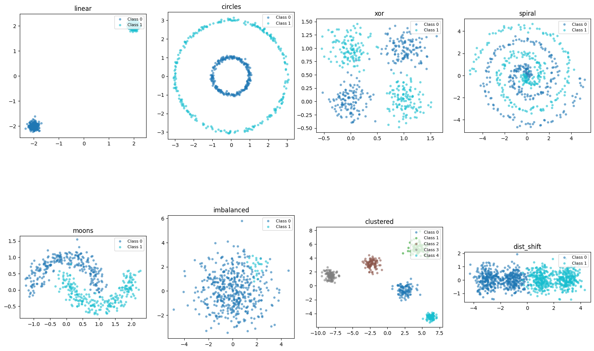
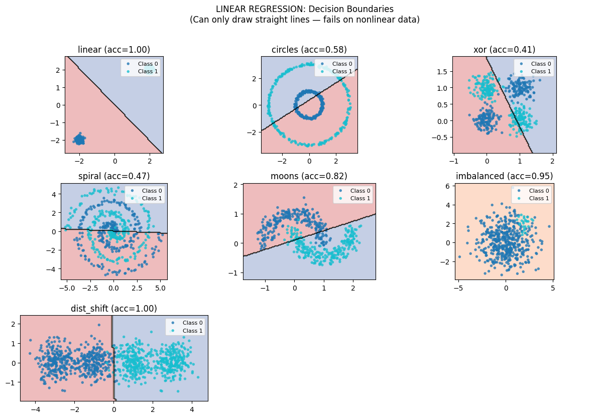
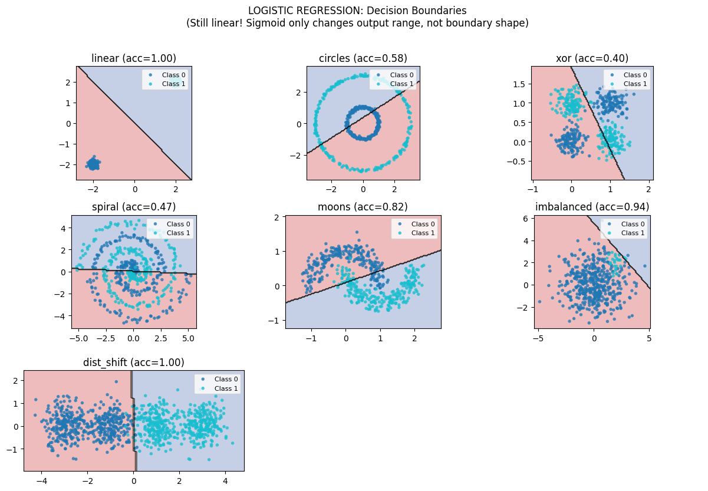
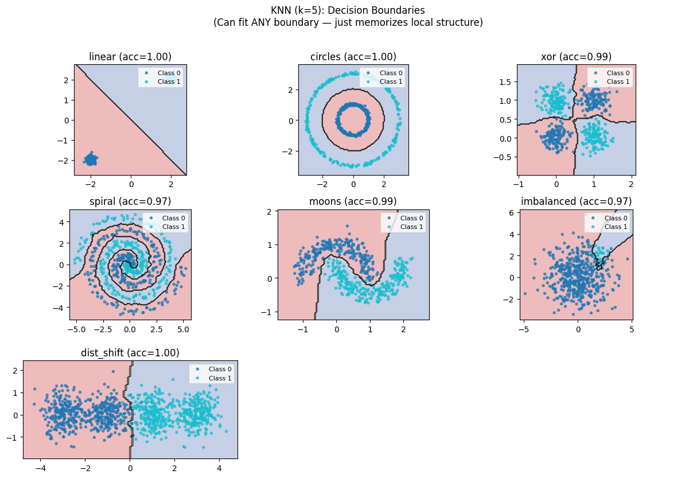
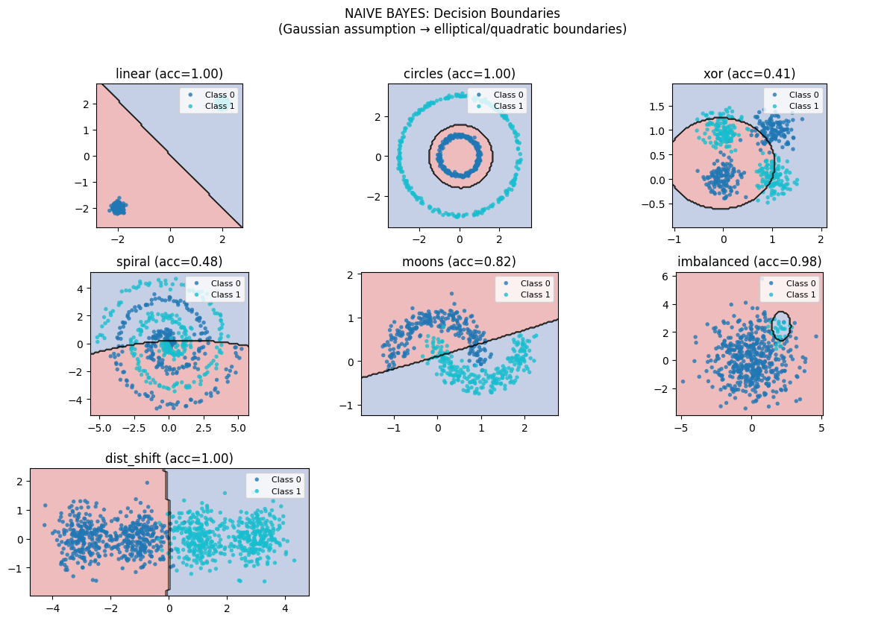

# Phase 1: Foundations — The Four Paradigms of Learning

> **Philosophy**: Before you can understand what makes a model powerful, you must understand what makes it limited. These four algorithms represent fundamentally different approaches to classification, each with distinct inductive biases that determine what they can and cannot learn.

---

## The Big Picture

Every classification algorithm must answer the same question: *Given features X, which class does this belong to?*

But **how** they answer differs fundamentally:

| Algorithm | Paradigm | Core Question |
|-----------|----------|---------------|
| Linear Regression | **PROJECTION** | "Where does X project onto the decision hyperplane?" |
| Logistic Regression | **PROBABILITY** | "What's the probability of each class?" |
| K-Nearest Neighbors | **MEMORY** | "What do similar training examples say?" |
| Naive Bayes | **INDEPENDENCE** | "Which class most likely generated these features?" |

These aren't just different algorithms—they're different **philosophies** of learning:

```
DISCRIMINATIVE (find the boundary)     vs     GENERATIVE (model the data)
├── Linear Regression                         └── Naive Bayes
└── Logistic Regression

PARAMETRIC (fixed # of parameters)     vs     NON-PARAMETRIC (grows with data)
├── Linear Regression                         └── K-Nearest Neighbors
├── Logistic Regression
└── Naive Bayes
```

---

## The Challenge: Seven Datasets That Expose Every Weakness

Every algorithm in this repository faces the same gauntlet. Each dataset is designed to expose specific capabilities and failures:



Look at this carefully. These seven datasets will be our testing ground throughout:

| Dataset | The Challenge | Who Should Win | Who Should Fail |
|---------|---------------|----------------|-----------------|
| **linear** | Can you draw a straight line? | Everyone | Nobody |
| **circles** | Can you find a radial boundary? | KNN, Trees, Neural Nets | Linear models |
| **xor** | Can you learn feature interactions? | Trees, Neural Nets | Single-layer models |
| **spiral** | Can you follow a winding manifold? | Deep models, GPs | Shallow models |
| **moons** | Can you curve around the data? | Most nonlinear models | Linear models |
| **imbalanced** | Can you find the rare class? | Probabilistic models | Accuracy optimizers |
| **dist_shift** | Can you handle distribution shift? | Bayesian, Conformal | Point-estimate models |

**The key insight**: You understand a model by watching where it fails, not where it succeeds.

Now let's see how each of our four foundational algorithms handles this gauntlet.

---

## Algorithm 1: Linear Regression — Paradigm: PROJECTION

### The Core Idea

You believe the world is linear: **y ≈ Xw + b + noise**

Linear regression finds the weights that minimize squared error:

```
w* = argmin_w ||y - Xw||²
```

**Geometrically**: You're projecting y onto the column space of X. The prediction ŷ = Xw is the point in span(X) closest to y.

### The One Equation (Closed Form)

```
w = (X'X)⁻¹ X'y
```

This falls out from setting the gradient to zero:
- dL/dw = -2X'(y - Xw) = 0
- X'Xw = X'y
- w = (X'X)⁻¹ X'y

### The Reality Check: Decision Boundaries

So what happens when we unleash linear regression on our challenge datasets?



**This is the story of a model hitting its walls.**

Look at each panel:

- **linear (acc=1.00)**: Perfect! The data IS linearly separable. This is what linear regression was born to do.

- **circles (acc=0.58)**: Disaster. A straight line trying to separate concentric circles. No matter how you rotate or position that line, you'll always split both classes. This isn't a training failure—it's an architectural impossibility.

- **xor (acc=0.41)**: *Worse than random guessing!* XOR requires understanding that the relationship between features matters—something a linear model fundamentally cannot express. The optimal linear boundary goes through the middle, misclassifying everything.

- **spiral (acc=0.47)**: Near-random. The boundary winds through space in a way no hyperplane can follow.

- **moons (acc=0.82)**: Decent! The curved moons are somewhat separable by a line. But look closely—the boundary cuts through both moons, missing the natural curve.

**The lesson**: No amount of training data, no learning rate tuning, no regularization will help linear regression learn circles or XOR. The limitation is in the hypothesis class itself.

### Inductive Bias

What Linear Regression **assumes**:
1. LINEAR relationship — the decision boundary is a hyperplane
2. GAUSSIAN noise — squared error is MLE under Gaussian assumptions
3. HOMOSCEDASTICITY — error variance is constant
4. NO MULTICOLLINEARITY — X'X must be invertible

What it **cannot see**:
- Curves, circles, spirals — anything nonlinear
- Feature interactions (unless manually added)
- Heteroscedastic data (varying noise levels)

---

## Algorithm 2: Logistic Regression — Paradigm: PROBABILITY

### The Core Idea

Same linear machinery, but squash the output through **sigmoid** to get probabilities:

```
p(y=1|x) = σ(w'x + b) = 1 / (1 + exp(-(w'x + b)))
```

**Critical insight**: The decision boundary is STILL a hyperplane!

```
σ(w'x + b) = 0.5  ⟺  w'x + b = 0
```

The sigmoid doesn't change the shape of the boundary—it only changes the output range.

### Why Sigmoid?

1. Squashes any real number to (0, 1) — interpretable as probability
2. Derivative is simple: σ'(x) = σ(x)(1 - σ(x))
3. Log-odds are LINEAR: log(p/(1-p)) = w'x + b

### Why Cross-Entropy, Not MSE?

With sigmoid output and MSE loss, you get **vanishing gradients**:
- When p ≈ 0 but y = 1, gradient ∝ p(1-p) ≈ 0
- The model is confident and wrong, but the gradient is tiny!

Cross-entropy loss fixes this:
```
L = -[y log(p) + (1-y) log(1-p)]
```

The gradient is beautifully simple: **dL/dw = (p - y) × x**

### The Reality Check: Decision Boundaries



**Notice anything?** The boundaries are nearly identical to Linear Regression!

This is the key insight many miss: **Logistic Regression doesn't solve the nonlinearity problem.** It's still drawing straight lines through feature space.

The improvements over Linear Regression are:
- Outputs are proper probabilities in [0, 1]
- Training dynamics are better (cross-entropy vs MSE)
- Better calibrated confidence estimates

What did NOT improve: The boundary shape. Still linear. Still fails on circles (0.58), XOR (0.40), spiral (0.47).

If you need a nonlinear boundary, logistic regression cannot help you—no matter how much data you throw at it.

---

## Algorithm 3: K-Nearest Neighbors — Paradigm: MEMORY

### The Core Idea

**Don't model anything. Just memorize the data.**

At prediction time:
1. Find the k training points closest to x
2. Return majority class among those k neighbors

The "model" IS the training data. Zero parameters learned.

### The One Equation

```
ŷ(x) = mode({y_i : x_i ∈ N_k(x)})
```

where N_k(x) is the set of k nearest neighbors of x.

### The Reality Check: Decision Boundaries



**Now THIS is different!**

Look at what KNN (k=5) achieves on the same datasets that destroyed linear models:

- **circles (acc=1.00)**: Perfect! KNN doesn't care that the boundary is circular. Nearby points vote, and the circular structure emerges naturally.

- **xor (acc=0.99)**: Near-perfect! Each corner votes with its neighbors. No explicit feature interaction needed—locality handles it.

- **spiral (acc=0.97)**: Excellent! KNN traces along the spiral because nearby points share labels along the curve.

- **moons (acc=0.99)**: Nearly perfect! The curved boundary follows the natural shape of the data.

**The insight**: KNN can fit ANY boundary given enough data—it just memorizes local structure. Where linear models have a fixed hypothesis class (hyperplanes), KNN's hypothesis class is "whatever the data says."

### But k Matters: The Bias-Variance Tradeoff


**This is the bias-variance tradeoff visualized.**

Follow the panels from left to right on the moons dataset:

| k | What's happening | The boundary | The risk |
|---|------------------|--------------|----------|
| **k=1** | Pure memorization. Each point is its own kingdom. | Jagged, follows every training point exactly | Overfits to noise. A single mislabeled point creates a wrong island. |
| **k=3** | Small committee voting | Smoother, but still flexible | Starting to generalize |
| **k=5** | Sweet spot for this data | Smooth AND flexible | Captures the true shape |
| **k=15** | Larger committees | Over-smoothed curves | Starting to blur the boundary |
| **k=30** | Heavy averaging | Losing the curve | Underfitting begins |
| **k=100** | Nearly global voting | Almost a straight line! | Full underfit—we've come full circle to linear |

**The profound insight**: k=1 gives perfect training accuracy but overfits. As k→n (all points), KNN converges to majority class voting—essentially a linear classifier! KNN interpolates between memorization (k=1) and global averaging (k=n).

### The Curse of Dimensionality

KNN's fatal flaw: **In high dimensions, all points become equidistant.**

Consider a unit hypercube [0,1]^d. To capture just 10% of the data:
- In d=1: need edge length 0.1
- In d=10: need edge length 0.79
- In d=100: need edge length 0.977

In 100 dimensions, your "local" neighborhood spans 97.7% of the feature space! "Nearby" becomes meaningless.

```
Low-D (2 features):     High-D (100 features):
Distance range: 0.01-4.5   Distance range: 8.2-15.3
Max/min ratio: 450x        Max/min ratio: 1.9x  ← Everything is equidistant!
```

### Inductive Bias

What KNN **assumes**:
1. SMOOTHNESS: Points close in feature space have similar labels
2. LOCALITY: Only nearby points matter for prediction
3. DISTANCE METRIC: Euclidean assumes features are equally important

What it **cannot handle**:
- High dimensions (curse of dimensionality)
- Irrelevant features (they corrupt distances)
- Fast prediction needed (must scan all data)

---

## Algorithm 4: Naive Bayes — Paradigm: INDEPENDENCE

### The Core Idea

Instead of finding a boundary, **model how each class generates data**.

Generative approach:
1. Learn p(x|y=c) — "how does class c produce features?"
2. Learn p(y=c) — "how common is class c?"
3. Use Bayes rule: p(y=c|x) ∝ p(x|y=c) × p(y=c)

### The One Equation (Bayes Rule)

```
p(y=c|x) = p(x|y=c) × p(y=c) / p(x)

ŷ = argmax_c [ p(x|y=c) × p(y=c) ]
```

### The "Naive" Assumption

Features are **conditionally independent** given class:

```
p(x₁, x₂, ..., xₙ | y) = ∏ᵢ p(xᵢ | y)
```

This is almost always FALSE in reality! But it works anyway because:
1. We only need RANKING, not exact probabilities
2. Independence violations often cancel out
3. Massive parameter reduction: O(d) instead of O(d²)

### The Reality Check: Decision Boundaries



**Something different is happening here.**

Gaussian Naive Bayes produces elliptical/quadratic boundaries (not linear!) because each class is modeled as a Gaussian blob.

Key observations:

- **circles (acc=1.00)**: Perfect! The two classes happen to have different Gaussian shapes that separate them.

- **xor (acc=0.41)**: Fails badly! The independence assumption is fatally violated here. XOR is pure feature interaction—exactly what "naive" independence denies.

- **imbalanced (acc=0.98)**: Excellent! This is where Naive Bayes shines. The prior p(y=c) naturally handles class imbalance. Rare classes get their own Gaussian model.

### Generative vs Discriminative

```
GENERATIVE (Naive Bayes):           DISCRIMINATIVE (Logistic):
├── Models p(x|y)                   ├── Models p(y|x) directly
├── Can generate new samples        ├── Can't generate
├── Strong assumptions              ├── Fewer assumptions
└── Works well with small data      └── Needs more data
```

### Why NB Doesn't Suffer from Curse of Dimensionality

Unlike KNN, Naive Bayes handles high dimensions well because:
- Each feature is modeled independently
- No distance computation
- Parameters scale as O(d), not O(d²)

---

## The Full Picture: Side-by-Side Comparison

| Dataset | Linear Reg | Logistic Reg | KNN (k=5) | Naive Bayes |
|---------|------------|--------------|-----------|-------------|
| linear | 1.00 | 1.00 | 1.00 | 1.00 |
| circles | 0.58 | 0.58 | **1.00** | **1.00** |
| xor | 0.41 | 0.40 | **0.99** | 0.41 |
| spiral | 0.47 | 0.47 | **0.97** | 0.48 |
| moons | 0.82 | 0.82 | **0.99** | 0.82 |
| imbalanced | 0.95 | 0.94 | 0.97 | **0.98** |
| high_dim | ~0.75 | ~0.75 | ~0.55 | **~0.80** |

**The patterns**:
- Linear models (Linear Reg, Logistic) fail identically on nonlinear data—they're the same hypothesis class
- KNN excels on low-dimensional nonlinear problems—it memorizes everything
- KNN fails on high-dimensional data—the curse is real
- Naive Bayes handles high dimensions but fails on feature interactions—independence is a strong assumption

---

## Ablation Insights: What Breaks, What Survives

### Linear Regression: Learning Rate Sensitivity

```
lr=0.001  ████░░░░░░░░░░░░░░░░  slow convergence
lr=0.01   ██████████░░░░░░░░░░  converging
lr=0.1    ████████████████████  ✓ converged
lr=1.0    ████████████████████  not converged (oscillating)
lr=2.0    ████████████████████  DIVERGED!
```

Too low → painfully slow. Too high → overshoots and explodes. This is gradient descent's eternal struggle.

### Linear Regression: Outlier Sensitivity

Outliers **DRAG** the regression line because squared loss heavily penalizes large errors:

```
Clean data:    w=3.0, b=7.0
With outliers: w=1.5, b=15.0  ← Completely different!
```

One outlier can ruin everything. This is why robust regression exists.

### KNN: Feature Scaling Matters

Without scaling, one feature dominates distance calculations:

```
Original features:         accuracy=0.95
First feature scaled 100x: accuracy=0.65  ← Broken!
```

**Lesson**: Always normalize features before using KNN. Euclidean distance assumes all dimensions are equally important.

### Naive Bayes: Probability Calibration

NB probabilities are often **overconfident** due to the independence assumption:

```
Predicted   Actual
  0.05       0.12   ← Should be higher
  0.31       0.38
  0.52       0.50   ← Only calibrated in middle
  0.71       0.62
  0.95       0.88   ← Overconfident!
```

Use NB for ranking/classification, not for probability estimates.

---

## When to Use What

| Scenario | Best Choice | Why |
|----------|-------------|-----|
| Quick baseline needed | Logistic Regression | Fast, interpretable, often surprisingly good |
| Data is clearly linear | Linear/Logistic | Simplest model that fits |
| Low-dim, nonlinear | KNN | Adapts to any boundary shape |
| High-dimensional | Naive Bayes or regularized Logistic | NB doesn't suffer curse; regularization prevents overfit |
| Class imbalance | Naive Bayes | Natural handling via priors |
| Need probabilities | Logistic (calibrated) | NB probabilities are poorly calibrated |
| Fast prediction needed | Logistic or NB | KNN is slow (scans all data) |
| Fast training needed | KNN or NB | KNN has no training; NB is O(nd) |

---

## Key Takeaways

### 1. The Linear Limitation
Both Linear and Logistic Regression can **only** draw hyperplanes. No amount of training will help them learn circles, XOR, or spirals. The limitation is in the hypothesis class, not the optimization.

### 2. Memory vs Model
KNN proves you don't need a model at all—just memorize the data. But this trades training time for prediction time, and fails catastrophically in high dimensions.

### 3. Wrong But Useful
Naive Bayes's independence assumption is almost always wrong, yet it often works. A "wrong" model with fewer parameters can beat a "correct" model with too many. This is the bias-variance tradeoff in action.

### 4. The Curse is Real
In high dimensions, distances become meaningless. KNN drops from 97% to ~55%. Naive Bayes barely notices. Different architectures have different failure modes.

### 5. Different Failures, Different Successes

| Model | Strength | Fatal Weakness |
|-------|----------|----------------|
| Linear/Logistic | Simple, interpretable | Can't learn nonlinear |
| KNN | Learns any boundary | Dies in high dimensions |
| Naive Bayes | Handles high-D, fast | Assumes independence |

---

## Running the Code

```bash
# Run individual algorithms
python algorithms/linear_regression.py
python algorithms/logistic_regression.py
python algorithms/knn.py
python algorithms/naive_bayes.py

# Each script will:
# 1. Run ablation experiments
# 2. Benchmark on all datasets
# 3. Generate visualizations
```

---

## What's Next?

**Phase 2: Bayesian Methods** — Instead of point estimates, maintain distributions over parameters. This gives us **uncertainty quantification**: knowing what we don't know.

- Gaussian Processes: Distributions over functions
- Bayesian Linear Regression: Posterior over weights

The key insight: sometimes being uncertain is more valuable than being confident.
