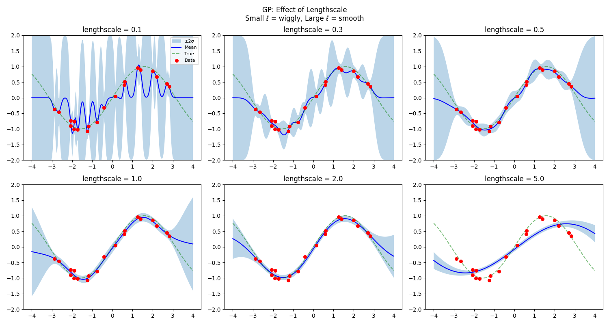
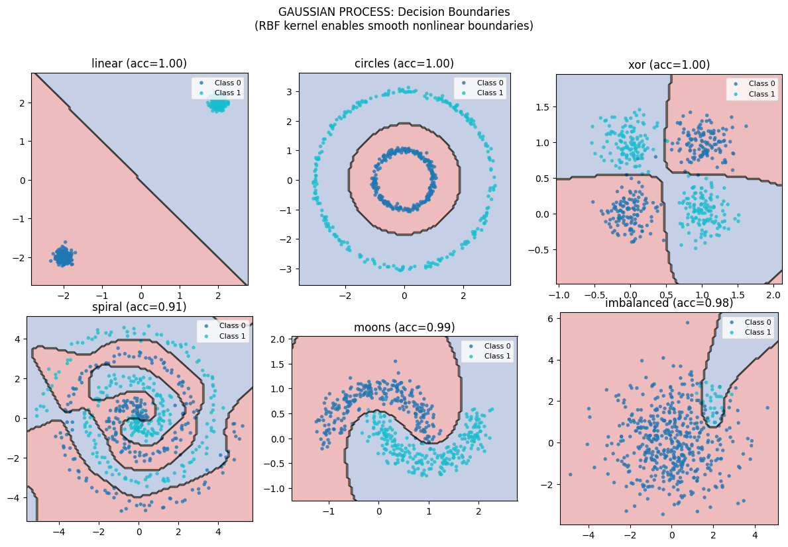
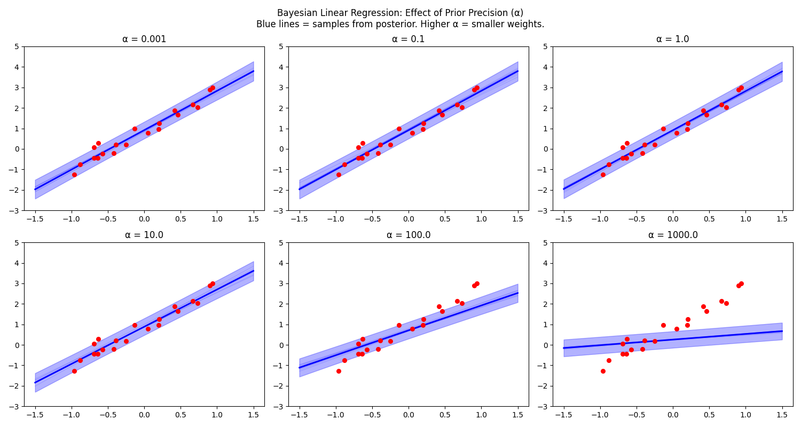

# Phase 2: Bayesian Methods — The Art of Knowing What You Don't Know

> **Philosophy**: A prediction without uncertainty is dangerous. Bayesian methods don't just give you an answer—they tell you how confident you should be in that answer. This is the difference between "the house price is $500,000" and "the house price is $500,000 ± $50,000, and here's why I'm uncertain."

---

## The Big Picture

In Phase 1, all our models gave **point estimates**:
- Linear Regression: "y = 3.2x + 1.5"
- KNN: "This point belongs to class A"
- Naive Bayes: "P(spam) = 0.92"

But none of them told us: **How sure are you?**

Bayesian methods fundamentally change the game:

```
FREQUENTIST (Phase 1)              BAYESIAN (Phase 2)
├── Find ONE best model            ├── Maintain DISTRIBUTION over models
├── Point estimate: ŷ              ├── Distribution: p(y|x)
├── "The answer is 42"             ├── "The answer is 42 ± 5"
└── Overconfident when unsure      └── Knows what it doesn't know
```

| Algorithm | What It Models | Key Insight |
|-----------|---------------|-------------|
| **Gaussian Processes** | Distribution over FUNCTIONS | Infinite-dimensional Bayesian inference |
| **Bayesian Linear Regression** | Distribution over WEIGHTS | Uncertainty in parameters → uncertainty in predictions |

---

## Algorithm 1: Gaussian Processes — Distribution Over Functions

### The Mind-Bending Idea

Instead of finding ONE function f(x), maintain a **DISTRIBUTION over all possible functions**, then condition on observed data.

```
Before seeing data: Prior p(f) = "smooth functions centered at zero"
After seeing data:  Posterior p(f|data) = "smooth functions that pass through the data"
```

At each new point x*, you get:
- **Mean prediction** μ(x*) — the expected value
- **Uncertainty** σ(x*) — how confident you are

This is FULL BAYESIAN INFERENCE over an infinite-dimensional space of functions.

### The One Equation

Given training data (X, y), predict at new point x*:

```
μ(x*) = K(x*, X) [K(X, X) + σ²I]⁻¹ y
σ²(x*) = K(x*, x*) - K(x*, X) [K(X, X) + σ²I]⁻¹ K(X, x*)
```

**Intuition**:
- **K(x*, X)**: How similar is x* to training points?
- **[K(X,X) + σ²I]⁻¹ y**: Optimal weights for combining training outputs
- **σ²(x*)**: High when x* is far from training data (high uncertainty)

### The Kernel Is Everything

The kernel K(x, x') encodes your beliefs about what functions look like:

| Kernel | Formula | What It Assumes |
|--------|---------|-----------------|
| **RBF** | exp(-\|\|x-x'\|\|²/2ℓ²) | Infinitely smooth functions |
| **Linear** | x · x' | Only linear functions |
| **Periodic** | exp(-2sin²(π\|x-x'\|/p)/ℓ²) | Repeating patterns with period p |
| **Matérn** | (complex) | Controllable smoothness |

The **lengthscale** ℓ is crucial—it determines how "wiggly" the function can be.

### The Reality Check: Uncertainty Visualization

Let's see what a GP actually learns:


**This is the magic of Gaussian Processes.**

Look at what's happening:
- **Blue line**: The true underlying function we're trying to learn
- **Red dashed line**: GP's mean prediction
- **Shaded region**: GP's uncertainty (±2 standard deviations)

Key observations:

1. **Near data points**: The shaded region **narrows**. The GP is confident because it has seen nearby evidence.

2. **Between data points**: The shaded region **widens**. The GP knows it's interpolating and appropriately increases uncertainty.

3. **Far from all data**: The shaded region **expands dramatically**. The GP says "I have no idea what happens out here" — and that's exactly right!

4. **The mean passes through the data**: GP is an interpolator (with noise σ²=0, it passes exactly through points).

**Compare to Linear Regression**: A linear model would give you a straight line with no uncertainty bars. It would be equally confident everywhere—even far from the data where it's extrapolating dangerously.

### The Lengthscale Effect

The lengthscale ℓ controls how quickly the function can vary:



**This is the bias-variance tradeoff in kernel space.**

Follow the panels:

| Lengthscale | What happens | The fit |
|-------------|--------------|---------|
| **ℓ = 0.1** (small) | "Points far apart are uncorrelated" | Very wiggly, overfits noise |
| **ℓ = 0.5** | Moderate correlation range | Balanced fit |
| **ℓ = 1.0** | Points within 1 unit are correlated | Smoother, captures trend |
| **ℓ = 2.0** (large) | Almost everything is correlated | Very smooth, may underfit |

**The insight**: Small ℓ = high variance, low bias (wiggly). Large ℓ = low variance, high bias (smooth). The optimal ℓ can be learned by maximizing marginal likelihood!

### Decision Boundaries for Classification

GPs can also do classification. How do they handle our challenge datasets?



**Notice the smooth, curved boundaries**—GPs with RBF kernels naturally produce smooth decision regions.

Key observations:
- **circles**: GP finds a smooth radial boundary
- **xor**: GP can learn the four quadrants with appropriate lengthscale
- **spiral**: The smooth kernel may struggle with the winding boundary
- **moons**: Beautiful curved boundary following the data

### Inductive Bias

What GPs **assume**:
1. Functions are drawn from a Gaussian process prior
2. Smoothness is determined by kernel choice
3. Nearby points should have correlated outputs

What GPs **cannot do**:
- Scale beyond ~10,000 points (O(n³) matrix inversion)
- Handle very high-dimensional inputs (kernel design becomes hard)
- Discrete outputs directly (classification requires approximations)

---

## Algorithm 2: Bayesian Linear Regression — Uncertainty in Weights

### The Core Idea

Instead of finding ONE weight vector w, maintain a **DISTRIBUTION over w**.

```
Before data: p(w) = N(0, α⁻¹I)         Prior: "weights are probably small"
After data:  p(w|X,y) = N(μ_N, Σ_N)    Posterior: "updated beliefs about w"
```

At prediction time:
- **Mean**: E[y*] = μ_N' x*
- **Variance**: Var[y*] = β⁻¹ + x*' Σ_N x*

The variance has **two parts**:
1. **β⁻¹**: Irreducible noise (data is inherently noisy)
2. **x*' Σ_N x***:  Epistemic uncertainty (we're unsure about w)

### The Key Equations

```
Posterior covariance: Σ_N = (αI + βX'X)⁻¹
Posterior mean:       μ_N = βΣ_N X'y
```

where:
- α = prior precision (larger → stronger prior, smaller weights)
- β = noise precision (larger → trust data more)

### Connections to What You Know

```
As α → 0:  Bayesian → OLS (no regularization)
As β → ∞:  Posterior collapses to point estimate

MAP estimate = Ridge regression with λ = α/β

Bayesian Linear Regression with linear kernel = Gaussian Process!
```

### The Reality Check: Posterior Visualization


**This shows the Bayesian update in action.**

What you're seeing:
- **Data points**: The training observations
- **Red line**: Posterior mean prediction (like regular linear regression)
- **Shaded region**: Posterior uncertainty (±2σ)

Key observations:

1. **Uncertainty is NOT constant**: Unlike OLS which assumes constant variance, Bayesian LR knows that predictions far from the data centroid are more uncertain.

2. **The "funnel" shape**: Uncertainty is smallest near the center of the data and grows as you move away. This makes sense—we're most confident where we have the most evidence.

3. **Extrapolation warning**: The growing uncertainty bands are a built-in warning: "Don't trust predictions far from training data!"

### The Prior Precision Effect (α)

The prior precision α controls how strongly we believe weights should be small:



**This is regularization with uncertainty quantification.**

| α (prior precision) | Effect on weights | Effect on uncertainty |
|--------------------|-------------------|----------------------|
| **α = 0.001** (weak prior) | Weights can be large | Wide uncertainty bands |
| **α = 0.1** | Moderate regularization | Medium uncertainty |
| **α = 1.0** | Weights pulled toward zero | Tighter uncertainty |
| **α = 10** (strong prior) | Strong shrinkage | Very tight bands |

**The insight**: Strong priors (high α) act like regularization AND reduce posterior uncertainty. But if the prior is wrong, you'll be confidently wrong!

### Why Bayesian Linear Regression?

```
Regular Linear Regression:
├── Gives you: ŷ = 3.2x + 1.5
├── Confidence: None
└── Extrapolation: Blindly extends the line

Bayesian Linear Regression:
├── Gives you: ŷ = 3.2x + 1.5
├── Confidence: σ(x) = 0.3 near data, 2.1 far away
└── Extrapolation: "I'm very uncertain out there"
```

---

## The Deep Connection: GP = Infinite Bayesian Linear Regression

Here's the beautiful insight that connects these two methods:

```
Bayesian Linear Regression with polynomial features of degree d
                            ↓
                    As d → ∞
                            ↓
                   Gaussian Process
```

**Proof sketch**:
- BLR: y = w'φ(x), where φ(x) is a feature mapping
- GP: y ~ GP(0, K), where K(x,x') = φ(x)'Σ_prior φ(x')
- With infinite features, the kernel becomes continuous

**What this means**: GPs are Bayesian linear regression in a (possibly infinite-dimensional) feature space. The kernel implicitly defines that feature space.

---

## Comparison: When to Use Which?

| Aspect | Gaussian Process | Bayesian Linear Regression |
|--------|------------------|---------------------------|
| **Expressiveness** | Any function (kernel-dependent) | Linear only |
| **Scalability** | O(n³) — struggles past 10k points | O(d³) — scales with features |
| **Uncertainty** | Exact | Exact |
| **Interpretability** | Black box (kernel matters) | Weights are interpretable |
| **Hyperparameters** | Kernel choice, lengthscale, noise | Prior precision, noise precision |

### Decision Guide

```
Is the relationship linear?
├── Yes → Bayesian Linear Regression
│         (interpretable, scales well)
└── No  → Is n < 10,000?
          ├── Yes → Gaussian Process
          │         (flexible, exact uncertainty)
          └── No  → Sparse GP or Deep Ensembles
                    (approximations needed)
```

---

## Key Takeaways

### 1. Uncertainty is a Feature, Not a Bug
Point estimates are dangerous. Knowing you don't know is valuable. A model that says "I'm 90% confident" when it should say "I'm 50% confident" will make bad decisions.

### 2. The Prior Matters
Bayesian methods require you to specify prior beliefs. This is both a feature (incorporate domain knowledge) and a bug (wrong priors = wrong answers). Be thoughtful about your priors.

### 3. Computation is the Bottleneck
GPs are beautiful but O(n³). For large datasets, you need approximations (sparse GPs, variational inference). Bayesian methods trade computation for principled uncertainty.

### 4. Everything is Connected
- Bayesian Linear Regression IS a GP with linear kernel
- Ridge regression IS the MAP estimate of Bayesian Linear Regression
- GPs ARE kernel machines with uncertainty

---

## Running the Code

```bash
# Run Gaussian Process
python algorithms/gaussian_process.py

# Run Bayesian Linear Regression
python algorithms/bayesian_linear_regression.py

# Each script will:
# 1. Demonstrate uncertainty quantification
# 2. Show effect of hyperparameters
# 3. Compare to frequentist counterparts
```

---

## What's Next?

**Phase 3: Trees and Ensembles** — What if, instead of drawing smooth boundaries, we made axis-aligned splits? Decision trees are the most interpretable nonlinear models. And by combining many trees, we get the most powerful general-purpose algorithms: Random Forests and Gradient Boosting.

The key insight: a single tree overfits, but many trees together are remarkably robust.
