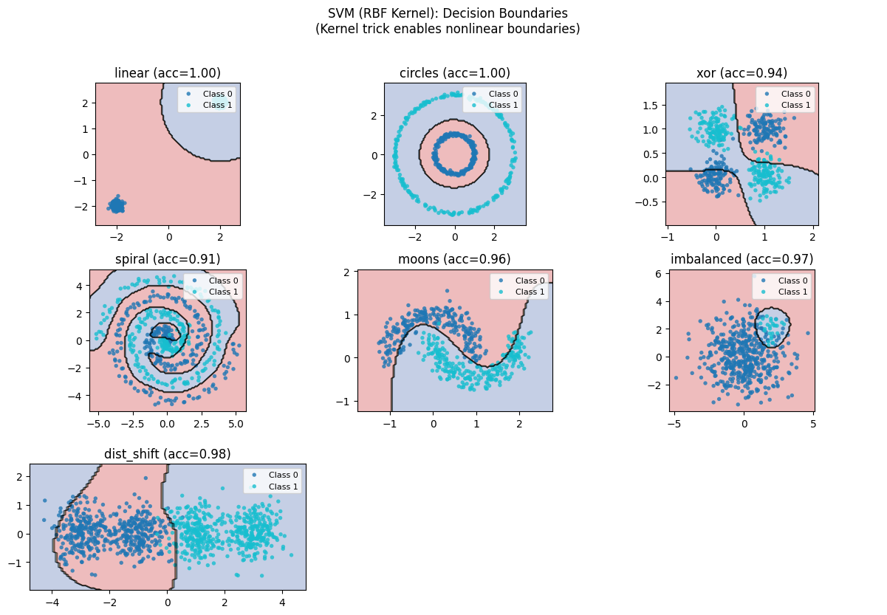
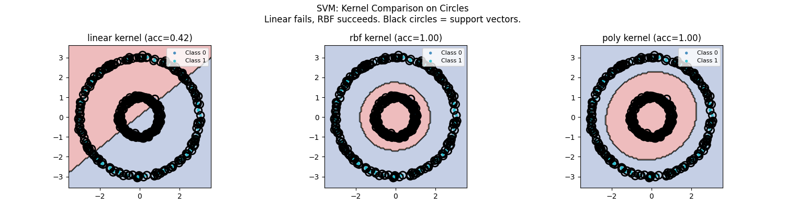
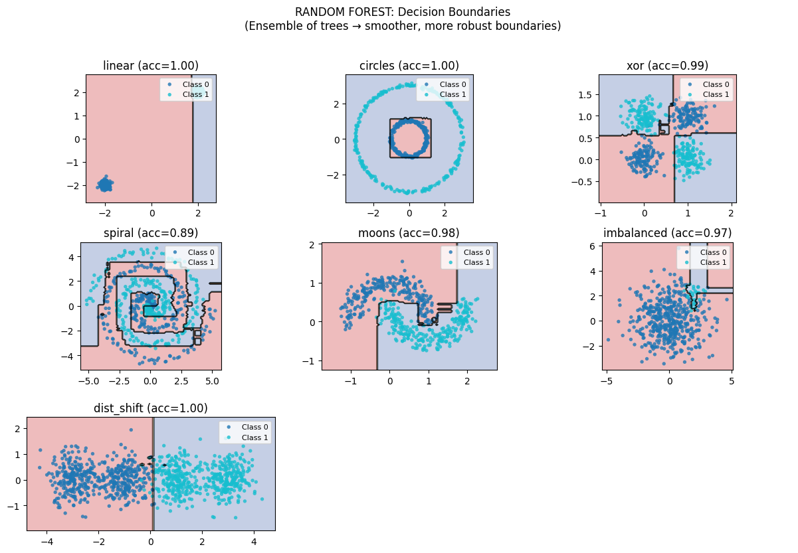

# Phase 3: Trees and Ensembles — From Single Splits to Forest Wisdom

> **Philosophy**: Instead of finding a smooth function, recursively partition the space into boxes. A single tree is interpretable but fragile. Many trees together become remarkably robust. This is the power of ensembles.

---

## The Big Picture

This phase introduces two revolutionary ideas:

### 1. Recursive Partitioning (Trees)
Instead of fitting a continuous function, **chop the space into boxes** and make constant predictions in each box.

```
Linear Model:  ŷ = w₁x₁ + w₂x₂ + b     (one equation everywhere)

Decision Tree: if x₁ < 0.5:            (different rules for different regions)
                   if x₂ < 0.3: ŷ = 0
                   else: ŷ = 1
               else: ŷ = 1
```

### 2. Ensemble Methods
**Combine many weak models into one strong model.**

| Method | Strategy | What It Reduces |
|--------|----------|-----------------|
| **Bagging** (Random Forest) | Train independently, average | Variance |
| **Boosting** (GBM, AdaBoost) | Train sequentially on errors | Bias |

```
Single Tree:  Powerful but unstable (high variance)
              ↓ add randomness + averaging
Random Forest: Powerful AND stable

Weak Learner: Simple but biased (high bias)
              ↓ add sequential correction
Boosting:     Powerful AND accurate
```

---

## Algorithm 1: Decision Trees — Paradigm: AXIS-ALIGNED SPLITS

### The Core Idea

Recursively ask yes/no questions about features:

```
Is income > $50k?
├── Yes: Is age > 35?
│        ├── Yes: APPROVE loan
│        └── No:  DENY loan
└── No:  DENY loan
```

Each split divides the space with an **axis-aligned** cut. The tree grows until leaves are pure or a stopping criterion is met.

### The Splitting Criterion

At each node, choose the split that maximizes **information gain** (or minimizes impurity):

**Gini Impurity**:
```
Gini(S) = 1 - Σ pᵢ²
```
Where pᵢ is the proportion of class i. Gini = 0 means pure node.

**Information Gain**:
```
Gain = H(parent) - Σ (nᵢ/n) × H(childᵢ)
```
Where H is entropy. Choose the split with highest gain.

### The Reality Check: Decision Boundaries


**Look at those boundaries—they're all rectangles!**

This is the inductive bias of decision trees: boundaries are always parallel to axes. Notice:

- **linear**: Even a simple diagonal line requires multiple staircase splits
- **circles**: The tree approximates the circle with many rectangular regions
- **xor**: Perfect! XOR is naturally axis-aligned
- **spiral**: Many small boxes approximate the curve
- **moons**: Rectangular approximation of smooth curves

The tree can fit ANY boundary given enough depth—but the approximation is always axis-aligned boxes.

### The Depth Effect: Bias-Variance Tradeoff


**This is the bias-variance tradeoff in tree form.**

Follow the panels as depth increases:

| Depth | What's happening | The boundary | The risk |
|-------|------------------|--------------|----------|
| **depth=1** | One split—a "stump" | Single line | Massive underfit |
| **depth=2** | Four regions maximum | Two perpendicular cuts | Still underfit |
| **depth=5** | 32 regions maximum | Getting complex | Starting to capture structure |
| **depth=10** | 1024 regions maximum | Very detailed | Risk of overfitting |
| **depth=∞** | One point per leaf | Perfect on training | Massive overfit |

**The insight**: Shallow trees underfit (high bias), deep trees overfit (high variance). But here's the magic: **ensemble methods fix this!**

### Inductive Bias

What Decision Trees **assume**:
1. AXIS-ALIGNED splits are sufficient
2. Piecewise constant predictions (constant in each box)
3. Important features should be split on first

What they **cannot do**:
- Diagonal boundaries (need many splits to approximate)
- Smooth predictions (always piecewise constant)
- Extrapolate (predictions are bounded by training data)

---

## Algorithm 2: Support Vector Machines — Paradigm: MAXIMUM MARGIN

### The Core Idea

Find the hyperplane that maximizes the **margin**—the distance to the nearest points (support vectors).

```
Not just ANY separating hyperplane...
...the one with MAXIMUM distance to both classes!
```

### The Optimization Problem

```
Maximize:  margin = 2/||w||
Subject to: yᵢ(w·xᵢ + b) ≥ 1  for all i

Equivalently:
Minimize:  (1/2)||w||²
Subject to: yᵢ(w·xᵢ + b) ≥ 1
```

**The dual form** reveals that the solution depends only on **support vectors**—points exactly on the margin boundary.

### The Kernel Trick

Linear SVM can only draw hyperplanes. But with the **kernel trick**, we can operate in higher dimensions without computing them!

```
K(x, x') = φ(x)·φ(x')
```

Compute dot products in high-dimensional space without explicitly transforming.

### The Reality Check: SVM Boundaries



**Notice how SVM finds the "widest street" between classes.**

Linear SVM draws hyperplanes with maximum margin. On linearly separable data, SVM finds the optimal separator.

- **linear**: Perfect hyperplane with wide margin
- **circles**: Linear SVM fails—can't separate with a hyperplane
- **moons**: Linear SVM gets a reasonable but imperfect boundary

### The Kernel Effect



**Kernels transform the feature space—watch how boundaries change!**

| Kernel | Formula | What It Does |
|--------|---------|--------------|
| **Linear** | x·x' | Hyperplanes only |
| **RBF** | exp(-γ\|\|x-x'\|\|²) | Local, smooth boundaries |
| **Polynomial** | (x·x' + c)^d | Polynomial curves |

Look at each column:
- **Linear kernel**: Straight lines everywhere
- **RBF kernel**: Smooth, curved boundaries that adapt locally
- **Polynomial kernel**: Curved boundaries, but globally defined

**The RBF kernel** makes SVM incredibly flexible—it can fit almost any boundary.

---

## Algorithm 3: Random Forest — Paradigm: BAGGING

### The Core Idea

**Don't rely on one tree—grow a forest!**

```
1. Create B bootstrap samples (random subsets with replacement)
2. Grow a tree on each sample
3. At each split, only consider m random features
4. Average all predictions
```

The magic is in **two sources of randomness**:
1. **Bootstrap sampling**: Different trees see different data
2. **Feature bagging**: Different trees consider different features

### Why Does Averaging Help?

If trees make independent errors with variance σ²:
- Single tree: variance = σ²
- Average of B trees: variance = σ²/B

**Variance drops with more trees!** (Assuming independence)

### The Reality Check: Single Tree vs Forest


**This is why Random Forests work.**

Compare the two panels:
- **Left (Single Tree)**: Jagged, irregular boundaries. Highly dependent on which exact points were sampled. Different random seeds give wildly different trees.
- **Right (Random Forest)**: Smooth, stable boundaries. The average of many jagged boundaries becomes smooth!

Key observations:
1. Single trees have **high variance**—small data changes cause big boundary changes
2. Random Forest **averages out the variance**—stable despite data perturbations
3. The ensemble captures the **true structure** better than any single tree

### Random Forest Boundaries



**Notice how Random Forest handles all datasets well.**

- **circles**: Smooth approximation of the circular boundary
- **xor**: Clean quadrant separation
- **spiral**: Follows the winding path
- **moons**: Smooth curved boundary

Random Forest is often the **best out-of-the-box** algorithm for tabular data.

### Inductive Bias

What Random Forest **assumes**:
1. Averaging trees improves predictions
2. Trees should be deep (low bias) and diverse (decorrelated)
3. Bootstrap + feature bagging creates sufficient diversity

What it **cannot do**:
- Extrapolate beyond training data range
- Provide smooth/continuous predictions
- Give interpretable single model

---

## Algorithm 4: Gradient Boosting — Paradigm: SEQUENTIAL CORRECTION

### The Core Idea

Instead of averaging independent trees, **sequentially fit trees to the residuals**:

```
F₀(x) = initial guess (e.g., mean)
F₁(x) = F₀(x) + η × h₁(x)    where h₁ fits residuals of F₀
F₂(x) = F₁(x) + η × h₂(x)    where h₂ fits residuals of F₁
...
Fₘ(x) = Fₘ₋₁(x) + η × hₘ(x)  where hₘ fits residuals of Fₘ₋₁
```

**Each tree corrects the mistakes of the ensemble so far.**

### The Gradient Descent Connection

Gradient boosting is **gradient descent in function space**:

```
Function space gradient: -∂L/∂F(xᵢ)
For MSE loss: gradient = residual = yᵢ - F(xᵢ)
```

Fitting a tree to residuals ≈ taking a gradient step in function space!

### The Reality Check: Gradient Boosting


**Watch how the ensemble improves iteration by iteration.**

What you're seeing:
- **Top row**: Decision boundaries at different iterations
- **Bottom row**: Residuals being fit at each stage

Key observations:
1. **Early iterations**: Coarse approximation, high residuals
2. **Middle iterations**: Capturing main patterns
3. **Late iterations**: Fine-tuning details, risk of overfitting

**The learning rate η is crucial**: Too high → overshoot and overfit. Too low → need too many iterations.

### Gradient Boosting vs Random Forest

```
Random Forest:                    Gradient Boosting:
├── Independent trees             ├── Sequential trees
├── Deep trees (low bias)         ├── Shallow trees (high bias)
├── Reduces variance              ├── Reduces bias
├── Hard to overfit               ├── Easy to overfit
└── Embarrassingly parallel       └── Inherently sequential
```

---

## Algorithm 5: AdaBoost — Paradigm: REWEIGHTING

### The Core Idea

Instead of fitting residuals, **reweight the training data**:

```
1. Initialize weights uniformly: wᵢ = 1/n
2. Fit weak learner to weighted data
3. Increase weights on misclassified points
4. Repeat
```

**Hard examples get more attention over time.**

### The Exponential Loss Connection

AdaBoost minimizes **exponential loss**:

```
L = Σ exp(-yᵢ F(xᵢ))
```

This penalizes misclassifications exponentially—much harsher than squared error!

### The Reality Check: AdaBoost


**Watch how hard examples drive the learning.**

What you're seeing:
- **Point sizes**: Weight of each sample (larger = more important)
- **Decision boundary**: Evolving as new weak learners are added

Key observations:
1. Initially all points have equal weight
2. Misclassified points grow larger (higher weight)
3. Subsequent learners focus on the hard cases
4. Final boundary correctly classifies the difficult points

**The magic**: Even very weak learners (stumps) can combine to form a powerful classifier!

### AdaBoost vs Gradient Boosting

| Aspect | AdaBoost | Gradient Boosting |
|--------|----------|-------------------|
| **Correction** | Reweight samples | Fit residuals |
| **Loss** | Exponential | Any differentiable |
| **Sensitivity** | Very sensitive to outliers | Less sensitive |
| **Flexibility** | Binary classification focus | Regression/classification |

---

## The Ensemble Philosophy: Why Combining Works

### Bias-Variance Decomposition

```
Error = Bias² + Variance + Irreducible Noise

High Bias:  Model too simple (underfit)
High Variance: Model too sensitive to data (overfit)
```

**Ensembles attack different components**:

| Method | Individual Model | Ensemble Effect |
|--------|------------------|-----------------|
| **Bagging** | High variance (deep trees) | Averaging reduces variance |
| **Boosting** | High bias (shallow trees) | Sequential fitting reduces bias |

### The Wisdom of Crowds

For bagging to work, trees must be **diverse** (make different errors):
- Bootstrap gives different training sets
- Feature bagging gives different splits
- When errors are uncorrelated, they average out

For boosting to work, each learner must **improve on previous**:
- Each tree fits what the ensemble got wrong
- Learning rate controls the step size
- Regularization prevents overfitting

---

## Comparison: All Five Algorithms

| Algorithm | Boundary Type | Strength | Weakness |
|-----------|--------------|----------|----------|
| **Decision Tree** | Axis-aligned boxes | Interpretable | Unstable, overfits |
| **SVM (RBF)** | Smooth, kernel-defined | Good margins | Slow with large n |
| **Random Forest** | Averaged boxes | Robust, parallel | No extrapolation |
| **Gradient Boosting** | Sequential boxes | Very accurate | Easy to overfit |
| **AdaBoost** | Weighted combination | Focuses on hard cases | Outlier sensitive |

---

## When to Use What

| Scenario | Best Choice | Why |
|----------|-------------|-----|
| **Need interpretability** | Single Decision Tree | Can show exact rules |
| **Tabular data, quick baseline** | Random Forest | Works well out-of-box |
| **Maximum accuracy needed** | Gradient Boosting (XGBoost/LightGBM) | State-of-art on tabular |
| **Small dataset, nonlinear** | SVM with RBF kernel | Good generalization |
| **Weak learners available** | AdaBoost | Combines weak to strong |
| **Feature importance needed** | Random Forest or GBM | Built-in importance |
| **Must avoid overfitting** | Random Forest | Hard to overfit |

---

## Key Takeaways

### 1. Trees Are Axis-Aligned
Decision trees can only make splits parallel to feature axes. This is both a strength (interpretable) and weakness (diagonal boundaries need many splits).

### 2. Ensemble = Wisdom of Crowds
Single trees are powerful but unstable. Combining many trees:
- **Bagging**: Average to reduce variance
- **Boosting**: Sequence to reduce bias

### 3. Random Forest is Your Friend
For most tabular data problems, Random Forest is an excellent starting point:
- Works out of the box
- Few hyperparameters
- Hard to overfit
- Handles mixed feature types

### 4. Gradient Boosting is the Performance King
When you need maximum accuracy on tabular data:
- XGBoost, LightGBM, CatBoost dominate Kaggle
- But requires careful tuning to avoid overfitting
- More hyperparameters than Random Forest

### 5. SVM Shines with Small Data
When you have limited data and need good generalization:
- Maximum margin principle is elegant
- Kernel trick enables nonlinearity
- But doesn't scale to millions of points

---

## Running the Code

```bash
# Run individual algorithms
python algorithms/decision_tree.py
python algorithms/svm.py
python algorithms/random_forest.py
python algorithms/gradient_boosting.py
python algorithms/adaboost.py

# Each script will:
# 1. Show decision boundaries
# 2. Demonstrate depth/hyperparameter effects
# 3. Compare ensemble vs single model
```

---

## What's Next?

**Phase 4: Neural Networks** — What if we could LEARN the feature transformations? Neural networks replace hand-crafted features with learned representations. From MLPs to CNNs to Transformers, we'll see how deep learning achieves state-of-the-art on images, sequences, and beyond.

The key insight: enough layers can approximate any function, but the architecture encodes what we believe about the data.
