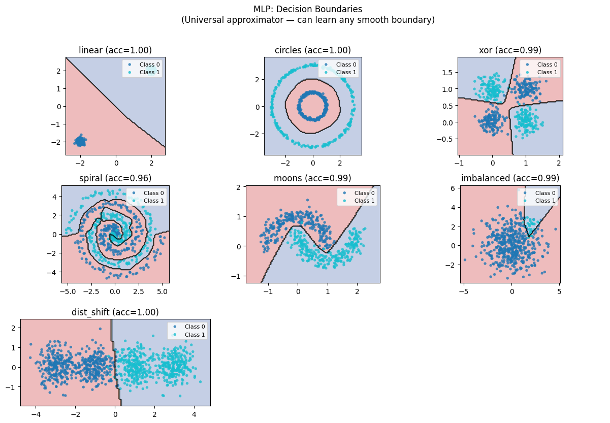
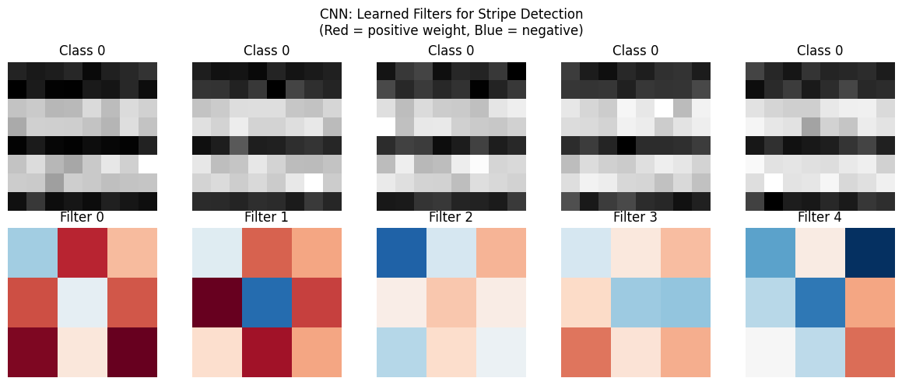

# Phase 4: Neural Networks — Learning Representations

> **Philosophy**: Instead of hand-crafting features or using fixed kernels, let the model learn the features themselves. Stack simple differentiable operations; let gradient descent find useful representations. This is the power of deep learning.

---

## The Big Picture

Neural networks represent a paradigm shift from everything we've seen:

| Previous Methods | Neural Networks |
|------------------|-----------------|
| Hand-craft features, then learn weights | Learn features AND weights together |
| Fixed kernel/basis functions | Learned representations |
| Shallow (1-2 transformations) | Deep (many layers of composition) |
| Domain expertise required | Let data speak |

The evolution of neural architectures reflects what we believe about different data types:

```
MLP:         "I make no assumptions—let me learn everything"
             ↓ add spatial structure
CNN:         "Nearby pixels matter together, patterns repeat"
             ↓ add temporal structure
RNN/LSTM:    "Order matters, context persists"
             ↓ add parallel attention
Transformer: "Everything can attend to everything"
```

---

## Algorithm 1: Multi-Layer Perceptron (MLP) — Paradigm: LEARNED FEATURES

### The Core Idea

Stack linear transformations with nonlinear activations:

```
Input → Linear → Activation → Linear → Activation → ... → Output
   x  →   W₁x+b₁  →   σ(·)    →  W₂·+b₂  →   σ(·)    → ... →   ŷ
```

The nonlinearity is crucial! Without it:
```
W₂(W₁x + b₁) + b₂ = W₂W₁x + W₂b₁ + b₂ = W'x + b'
```
Multiple linear layers collapse to one. The activation function is what gives depth its power.

### The Universal Approximation Theorem

A single hidden layer MLP with enough neurons can approximate any continuous function on a compact set.

**But**: "can approximate" ≠ "can learn". The theorem says nothing about:
- How many neurons you need
- Whether gradient descent will find the solution
- Whether the solution will generalize

### The Reality Check: MLP Decision Boundaries



**Finally—smooth, curved boundaries that aren't axis-aligned!**

Look at what the MLP achieves:
- **circles**: Smooth circular boundary—no rectangular approximation
- **xor**: Clean diagonal boundaries through the corners
- **spiral**: Follows the winding path smoothly
- **moons**: Natural curved separation

Compare to decision trees (rectangular), SVM (kernel-dependent), or linear models (hyperplanes). The MLP learns whatever boundary the data needs.

### The Activation Function Effect


**Different activations create different learning dynamics.**

| Activation | Formula | Gradient | Character |
|------------|---------|----------|-----------|
| **Sigmoid** | 1/(1+e⁻ˣ) | σ(1-σ) → vanishes | Smooth, bounded [0,1] |
| **Tanh** | (eˣ-e⁻ˣ)/(eˣ+e⁻ˣ) | 1-tanh² → vanishes | Smooth, bounded [-1,1] |
| **ReLU** | max(0,x) | 0 or 1 | Sparse, no vanishing |
| **LeakyReLU** | max(0.01x,x) | 0.01 or 1 | No dead neurons |

What you're seeing in the visualization:
- **Sigmoid/Tanh**: Smooth boundaries but slow training (vanishing gradients)
- **ReLU**: Piecewise linear boundaries, fast training
- Different activations → different decision boundary shapes

**The ReLU revolution**: ReLU's simple max(0,x) enabled training very deep networks by avoiding the vanishing gradient problem.

### Inductive Bias

What MLPs **assume**:
1. Smooth function (via smooth activations or ReLU's piecewise linearity)
2. All inputs are equally important (no spatial/temporal structure)
3. Training distribution matches test distribution

What they **cannot do** (efficiently):
- Exploit spatial structure (use CNN instead)
- Handle variable-length sequences natively (use RNN/Transformer)
- Extrapolate beyond training distribution

---

## Algorithm 2: Convolutional Neural Network (CNN) — Paradigm: SPATIAL HIERARCHY

### The Core Idea

**Parameter sharing + local connectivity** for spatial data:

```
Instead of:  Full connection (every pixel to every neuron)
Use:         Local filters that slide across the image

Filter: [1 0 -1]
        [1 0 -1]  ← Same filter applied everywhere
        [1 0 -1]
```

This encodes two key assumptions:
1. **Translation invariance**: A cat is a cat whether it's in the corner or center
2. **Locality**: Nearby pixels are more related than distant ones

### The CNN Architecture

```
Input Image
    ↓
[Conv → ReLU → Pool] × N    ← Feature extraction
    ↓
[Flatten → FC → ReLU] × M   ← Classification
    ↓
Output
```

- **Convolution**: Detect local patterns (edges, textures)
- **Pooling**: Reduce spatial size, gain invariance
- **Deeper layers**: Combine simple features into complex concepts

### The Reality Check: CNN Visualization



**Watch how CNNs build hierarchical features.**

What you're seeing:
- **Early layers**: Edge detectors, color blobs, simple textures
- **Middle layers**: Parts, shapes, combinations of edges
- **Late layers**: Object parts, semantic concepts

The key insight: CNNs learn a **feature hierarchy** automatically:
```
Pixels → Edges → Textures → Parts → Objects → Scenes
```

Each layer combines features from the previous layer into more abstract representations.

### Why CNNs Work for Images

| Property | How CNN Exploits It |
|----------|---------------------|
| **Local structure** | Small filters see local patterns |
| **Translation invariance** | Same filter everywhere |
| **Compositionality** | Hierarchy of features |
| **Spatial relationships** | Preserved through layers |

### Inductive Bias

What CNNs **assume**:
1. Local patterns are meaningful
2. Patterns can appear anywhere (translation invariance)
3. Hierarchy exists (simple → complex)

What they **cannot do**:
- Handle non-grid data (use Graph NNs)
- Model long-range dependencies easily (limited receptive field)
- Handle variable-size inputs without modification

---

## Algorithm 3: RNN & LSTM — Paradigm: SEQUENTIAL MEMORY

### The Core Idea (RNN)

Process sequences by maintaining a **hidden state**:

```
hₜ = tanh(Wₓₓ xₜ + Wₕₕ hₜ₋₁ + b)
yₜ = Wₕᵧ hₜ
```

The same weights W are used at every timestep—**parameter sharing across time**.

```
x₁ → [RNN] → h₁ → [RNN] → h₂ → [RNN] → h₃ → ...
       ↑            ↑            ↑
     same W       same W       same W
```

### The Vanishing Gradient Problem

When training on long sequences, gradients must flow through many timesteps:

```
∂L/∂W = ∂L/∂hₜ × ∂hₜ/∂hₜ₋₁ × ... × ∂h₁/∂W
              ↑_____multiplied T times_____↑
```

If |∂hₜ/∂hₜ₋₁| < 1 consistently, gradients vanish exponentially.
If |∂hₜ/∂hₜ₋₁| > 1 consistently, gradients explode.

### The LSTM Solution

**Gated memory** that can persist information:

```
Forget gate:  fₜ = σ(Wf·[hₜ₋₁, xₜ])     "What to forget"
Input gate:   iₜ = σ(Wi·[hₜ₋₁, xₜ])     "What to remember"
Cell update:  c̃ₜ = tanh(Wc·[hₜ₋₁, xₜ])  "New candidate"
Cell state:   cₜ = fₜ⊙cₜ₋₁ + iₜ⊙c̃ₜ      "Updated memory"
Output gate:  oₜ = σ(Wo·[hₜ₋₁, xₜ])     "What to output"
Hidden:       hₜ = oₜ⊙tanh(cₜ)          "Filtered output"
```

**The cell state cₜ is the highway**: gradients can flow through unchanged if gates allow.

### The Reality Check: RNN/LSTM Visualization


**Watch how memory enables sequence understanding.**

What you're seeing:
- **Hidden state evolution**: How the internal representation changes over time
- **Gate activations**: When the LSTM chooses to remember/forget/output
- **Long-range dependencies**: Information preserved across many timesteps

Key observations:
1. **Vanilla RNN**: Struggles with long sequences (gradient vanishing)
2. **LSTM**: Maintains information over long distances via gating
3. **Gate patterns**: Different gates activate for different sequence structures

### Inductive Bias

What RNN/LSTM **assume**:
1. Order matters (sequential processing)
2. Recent context is more relevant (though LSTM extends this)
3. Same computation at each timestep (parameter sharing)

What they **cannot do**:
- Parallelize across timesteps (inherently sequential)
- Attend to arbitrary positions efficiently
- Handle very long sequences (even LSTM has limits)

---

## Algorithm 4: Transformer — Paradigm: ATTENTION

### The Core Idea

**Replace recurrence with attention**. Every position can attend to every other position in parallel.

```
RNN:         Process sequentially: x₁ → x₂ → x₃ → ...
Transformer: Process in parallel:  [x₁, x₂, x₃, ...] all at once
```

### The Attention Mechanism

```
Attention(Q, K, V) = softmax(QKᵀ/√d) V
```

- **Query (Q)**: "What am I looking for?"
- **Key (K)**: "What do I contain?"
- **Value (V)**: "What do I provide?"

The dot product QKᵀ measures relevance. Softmax normalizes. V provides the content.

### Self-Attention

In self-attention, Q, K, V all come from the same sequence:

```
Q = XWQ    K = XWK    V = XWV
```

Every position can attend to every other position—no sequential bottleneck!

### Multi-Head Attention

Run attention multiple times with different projections:

```
MultiHead(X) = Concat(head₁, ..., headₕ) Wₒ
where headᵢ = Attention(XWQⁱ, XWKⁱ, XWVⁱ)
```

Different heads can focus on different types of relationships.

### The Reality Check: Transformer Visualization


**This is why Transformers dominate modern AI.**

What you're seeing:
- **Attention patterns**: Which positions attend to which
- **Multi-head diversity**: Different heads capture different relationships
- **Layer progression**: Earlier layers = local patterns, later = global

Key observations:
1. **Attention is interpretable**: You can see what the model focuses on
2. **Global context**: Any position can attend to any other
3. **Parallel computation**: All positions processed simultaneously

### Why Transformers Won

| RNN/LSTM | Transformer |
|----------|-------------|
| Sequential computation | Parallel computation |
| O(n) path length for distant tokens | O(1) path length via attention |
| Fixed hidden size bottleneck | Direct attention between all pairs |
| Gradient must flow through time | Direct gradient paths |

The Transformer's O(1) path length means gradients and information can flow directly between any two positions.

### Inductive Bias

What Transformers **assume**:
1. Positional information must be explicitly added (no inherent order)
2. All-to-all attention is useful
3. Attention patterns are learnable

What they **cannot do** (efficiently):
- Very long sequences (O(n²) attention complexity)
- Tasks requiring strict sequential reasoning
- Handle streaming data naturally

---

## The Evolution of Architectures

```
1986: Backprop → MLPs become trainable
1998: LeNet → CNNs for images
2012: AlexNet → Deep CNNs + GPUs
2014: GRU/LSTM → Better sequence modeling
2017: Transformer → Attention is all you need
2020+: GPT/BERT → Transformers dominate NLP/vision/everything
```

Each architecture encodes different assumptions:

| Architecture | Assumption | Best For |
|--------------|------------|----------|
| **MLP** | No structure | Tabular, simple patterns |
| **CNN** | Spatial locality | Images, grids |
| **RNN/LSTM** | Sequential, order matters | Time series, language |
| **Transformer** | Everything can relate | Language, vision, multimodal |

---

## When to Use What

| Data Type | First Try | Why |
|-----------|-----------|-----|
| **Tabular** | MLP (or gradient boosting) | No spatial/temporal structure |
| **Images** | CNN | Spatial hierarchy, translation invariance |
| **Short sequences** | LSTM | Good for moderate lengths |
| **Long sequences** | Transformer | Parallel, no gradient bottleneck |
| **Language** | Transformer | State-of-art across NLP |
| **Mixed modalities** | Transformer | Flexible attention across modalities |

---

## Key Takeaways

### 1. Depth Enables Learning Representations
Each layer transforms the representation. Deep networks can learn hierarchical features that shallow networks cannot.

### 2. Architecture Encodes Assumptions
- MLP: "Everything connects to everything"
- CNN: "Local patterns, translation invariance"
- RNN: "Order matters, memory persists"
- Transformer: "Attention is all you need"

### 3. The Gradient Flow Matters
- Sigmoid → vanishing gradients → ReLU
- RNN → vanishing over time → LSTM gates
- Deep networks → skip connections (ResNet)

### 4. Attention Changed Everything
Transformers can:
- Process in parallel (faster training)
- Attend to any position directly (no bottleneck)
- Scale to massive datasets and models

### 5. More Data + More Compute = Better
Neural networks are hungry for data. The deep learning revolution was enabled by:
- Big data (ImageNet, web-scale text)
- GPUs (parallel matrix operations)
- Better architectures (ReLU, BatchNorm, Transformers)

---

## Running the Code

```bash
# Run individual algorithms
python algorithms/mlp.py
python algorithms/cnn.py
python algorithms/rnn_lstm.py
python algorithms/transformer.py

# Each script will:
# 1. Build the architecture from scratch
# 2. Train on appropriate data
# 3. Visualize learned representations
```

---

## What's Next?

**Phase 5: Generative Models** — So far we've learned to discriminate (classify) or regress (predict). But what if we want to generate new data? Generative models learn the underlying distribution p(x) and can sample from it. From GMMs to VAEs, we'll see how to create, not just classify.

The key insight: to generate well, you must understand the data deeply.
