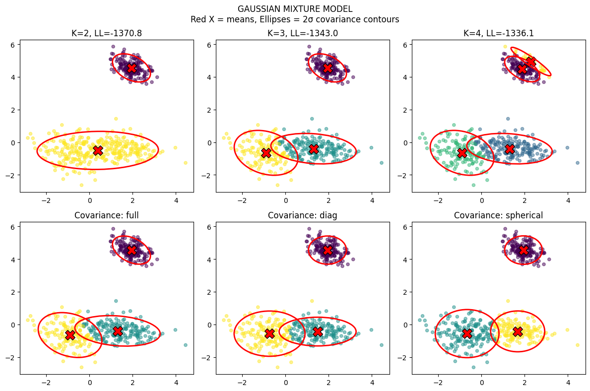
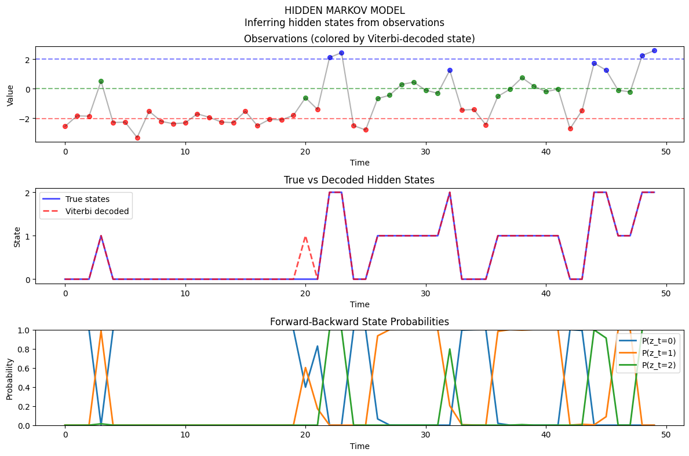
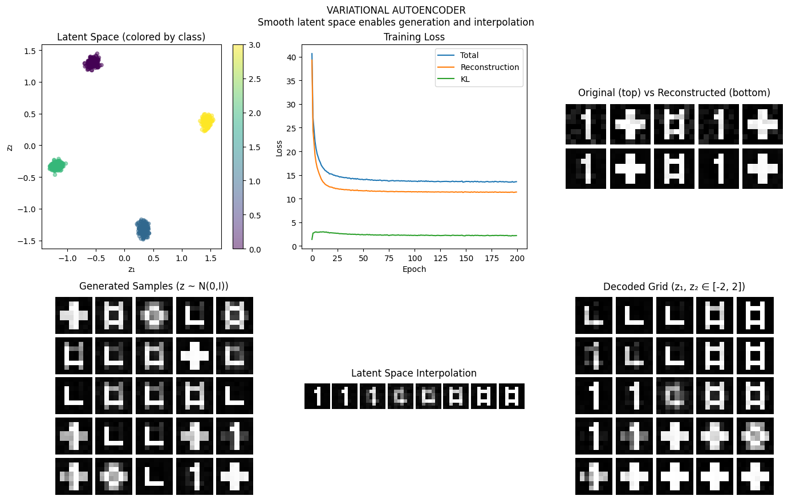

# Phase 5: Generative Models — Creating, Not Just Classifying

> **Philosophy**: Instead of learning to discriminate (p(y|x)), learn to generate (p(x)). Model how the data was created. This enables sampling new data, density estimation, and understanding the underlying structure.

---

## The Big Picture

All our previous models were **discriminative**—they learned boundaries or mappings:
- "Given this image, what class is it?"
- "Given these features, what's the output?"

**Generative models** flip the question:
- "What does the data look like?"
- "How was this data generated?"
- "Can I create more data like this?"

```
DISCRIMINATIVE:                 GENERATIVE:
Learn p(y|x)                    Learn p(x) or p(x,y)
├── Decision boundary           ├── Full data distribution
├── Can classify                ├── Can classify AND generate
└── "Which class?"              └── "What does data look like?"
```

| Algorithm | What It Models | Latent Structure |
|-----------|---------------|------------------|
| **GMM** | Mixture of Gaussians | Cluster assignment |
| **HMM** | Sequential observations | Hidden state sequence |
| **VAE** | Complex distributions | Continuous latent space |

---

## Algorithm 1: Gaussian Mixture Model (GMM) — Paradigm: MIXTURE

### The Core Idea

The data comes from **K Gaussian clusters**, but we don't know which point came from which cluster.

```
p(x) = Σₖ πₖ N(x | μₖ, Σₖ)
```

- πₖ = probability of cluster k (mixing weights)
- μₖ = mean of cluster k
- Σₖ = covariance of cluster k

### The EM Algorithm

We can't directly maximize likelihood (which cluster generated each point?), so we iterate:

**E-step**: Estimate cluster responsibilities
```
γₙₖ = p(zₙ=k | xₙ) = πₖ N(xₙ|μₖ,Σₖ) / Σⱼ πⱼ N(xₙ|μⱼ,Σⱼ)
```
"How likely is point n to belong to cluster k?"

**M-step**: Update parameters given responsibilities
```
μₖ = Σₙ γₙₖ xₙ / Σₙ γₙₖ
Σₖ = Σₙ γₙₖ (xₙ-μₖ)(xₙ-μₖ)ᵀ / Σₙ γₙₖ
πₖ = Σₙ γₙₖ / N
```
"Given responsibilities, what are the best parameters?"

### The Reality Check: GMM Visualization



**Watch the EM algorithm converge to the clusters.**

What you're seeing:
- **Contours**: The Gaussian components (ellipses = covariance)
- **Colors**: Cluster assignments (soft assignments from responsibilities)
- **Iteration progression**: How EM refines the clusters

Key observations:
1. **Soft clustering**: Each point has a probability of belonging to each cluster
2. **Covariance shapes**: GMM can fit elliptical clusters (unlike K-means which assumes spherical)
3. **EM convergence**: Alternating E and M steps monotonically increase likelihood

### GMM vs K-Means

| K-Means | GMM |
|---------|-----|
| Hard assignment (0 or 1) | Soft assignment (probability) |
| Spherical clusters | Elliptical clusters |
| Distance-based | Probability-based |
| No density estimate | Full density p(x) |
| Fast | Slower (covariance computation) |

**GMM is K-means with uncertainty!**

---

## Algorithm 2: Hidden Markov Model (HMM) — Paradigm: SEQUENTIAL LATENT STATES

### The Core Idea

Observations come from a sequence of **hidden states** that follow Markov dynamics:

```
Hidden states:    z₁ → z₂ → z₃ → z₄ → ...  (Markov chain)
                   ↓    ↓    ↓    ↓
Observations:     x₁   x₂   x₃   x₄   ...  (emitted from states)
```

Three key components:
1. **Initial distribution** π: p(z₁)
2. **Transition matrix** A: p(zₜ | zₜ₋₁)
3. **Emission distribution** B: p(xₜ | zₜ)

### The Three HMM Problems

1. **Evaluation**: p(x₁:T) — What's the probability of this sequence?
   → **Forward algorithm** (dynamic programming)

2. **Decoding**: argmax p(z₁:T | x₁:T) — What's the most likely hidden sequence?
   → **Viterbi algorithm** (max instead of sum)

3. **Learning**: argmax p(x₁:T | θ) — What parameters explain the data?
   → **Baum-Welch** (EM for HMMs)

### The Reality Check: HMM Visualization



**Watch how hidden states explain observed sequences.**

What you're seeing:
- **Top**: Observed sequence (what we see)
- **Bottom**: Inferred hidden states (what generated it)
- **Transitions**: How states flow through time

Key observations:
1. **State segmentation**: HMM segments the sequence into hidden regimes
2. **Temporal patterns**: Transitions capture sequential structure
3. **Emission variety**: Same state can emit different observations

### Applications

| Domain | Hidden States | Observations |
|--------|---------------|--------------|
| **Speech** | Phonemes | Acoustic features |
| **Finance** | Market regimes | Returns |
| **Biology** | Gene regions | DNA bases |
| **NLP** | POS tags | Words |

---

## Algorithm 3: Variational Autoencoder (VAE) — Paradigm: DEEP LATENT VARIABLES

### The Core Idea

Learn a **latent space** where similar data points are nearby, then decode from this space:

```
Encoder: x → z (compress to latent)
Decoder: z → x' (reconstruct from latent)
```

But VAE makes this **probabilistic**:
- Encoder outputs a distribution: q(z|x) = N(μ(x), σ²(x))
- Sample z ~ q(z|x)
- Decoder reconstructs: p(x|z)

### The ELBO (Evidence Lower Bound)

We want to maximize p(x), but it's intractable. Instead, maximize:

```
ELBO = E[log p(x|z)] - KL(q(z|x) || p(z))
         ↑                    ↑
    Reconstruction      Regularization
    "Decode well"       "Stay close to prior"
```

**Two competing objectives**:
1. Reconstruct accurately (make z informative)
2. Keep z close to standard normal (make z structured)

### The Reparameterization Trick

Can't backprop through sampling? Reparameterize!

```
Instead of: z ~ N(μ, σ²)
Use:        z = μ + σ × ε,  where ε ~ N(0,1)
```

Now gradients flow through μ and σ!

### The Reality Check: VAE Visualization



**Watch how VAE learns a structured latent space.**

What you're seeing:
- **Latent space**: 2D visualization of learned representations
- **Reconstructions**: Original vs decoded images
- **Interpolations**: Walking through latent space generates smooth transitions

Key observations:
1. **Organized latent space**: Similar items cluster together
2. **Smooth interpolation**: Moving in latent space = meaningful variation
3. **Generation capability**: Sampling from prior p(z) creates new data

### VAE vs Autoencoder

| Autoencoder | VAE |
|-------------|-----|
| Deterministic z | Probabilistic z |
| No structure in latent | Structured (prior) |
| Can only reconstruct | Can generate new samples |
| May have holes in latent | Continuous, smooth latent |

---

## The Generative Philosophy

### Why Learn p(x)?

1. **Generation**: Sample new data from learned distribution
2. **Density estimation**: Detect anomalies (low p(x) = unusual)
3. **Latent discovery**: Find underlying factors of variation
4. **Data augmentation**: Generate more training data
5. **Understanding**: Model the data-generating process

### The Latent Variable Framework

All three models share a structure:

```
Latent z → Observed x

GMM:  z is discrete cluster assignment
HMM:  z is sequence of discrete states
VAE:  z is continuous vector
```

**Latent variables** capture hidden structure that explains the observations.

---

## When to Use What

| Scenario | Best Choice | Why |
|----------|-------------|-----|
| **Clustering with uncertainty** | GMM | Soft assignments, elliptical clusters |
| **Sequential data with regimes** | HMM | Temporal dynamics, discrete states |
| **Image/complex generation** | VAE | Deep, continuous latent space |
| **Anomaly detection** | GMM or VAE | Low p(x) = anomaly |
| **Need interpretable states** | HMM | States have meaning |
| **Need smooth latent space** | VAE | Continuous, structured |

---

## Key Takeaways

### 1. Generative vs Discriminative
Generative models learn the data distribution p(x), enabling both classification AND generation. They're more powerful but harder to train.

### 2. Latent Variables Are Powerful
Hidden structure (clusters, states, embeddings) explains observed data. Learning what's hidden reveals the true patterns.

### 3. EM Is Universal
The Expectation-Maximization algorithm handles latent variables:
- E-step: Infer latent given data
- M-step: Update parameters given latent

### 4. VAEs Bridge Deep Learning and Probabilistic Models
VAEs combine:
- Neural network flexibility (encoder/decoder)
- Probabilistic structure (latent prior)
- Variational inference (ELBO)

### 5. Trade-off: Reconstruction vs Regularization
VAE's ELBO balances two goals:
- Reconstruct well (use latent fully)
- Stay regular (match prior)

---

## Running the Code

```bash
# Run individual algorithms
python algorithms/gmm.py
python algorithms/hmm.py
python algorithms/vae.py

# Each script will:
# 1. Fit the generative model
# 2. Visualize latent structure
# 3. Generate new samples
```

---

## What's Next?

**Phase 6: Uncertainty Quantification** — How confident should we be in our predictions? Beyond point estimates, we need to know when to trust our models. From conformal prediction to calibration, we'll learn to quantify and communicate uncertainty.

The key insight: a model that knows what it doesn't know is more useful than one that's confidently wrong.
