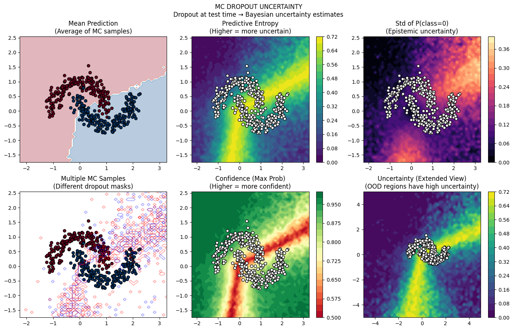
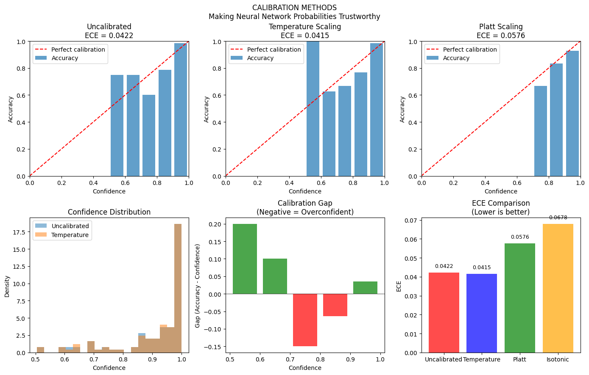

# Phase 6: Uncertainty & Adaptation — Knowing What You Don't Know

> **Philosophy**: A prediction without uncertainty is incomplete. A model that can't adapt is obsolete. This phase covers methods to make models honest about their confidence and able to learn continuously.

---

## The Big Picture

Most ML models output a single answer: "The image is a cat" or "The price will be $500,000."

But in the real world, we need to know:
- **How confident is this prediction?**
- **What if the model has never seen this type of input?**
- **Can the model adapt when the world changes?**

```
POINT PREDICTION:           UNCERTAINTY-AWARE:
ŷ = 42                      ŷ = 42 ± 5 (90% confidence)
├── No idea of confidence   ├── Quantified uncertainty
├── Overconfident on OOD    ├── Higher uncertainty on unfamiliar
└── "Trust me"              └── "Here's how sure I am"
```

| Method | What It Provides | Key Insight |
|--------|-----------------|-------------|
| **Conformal Prediction** | Guaranteed coverage | Distribution-free, finite-sample |
| **MC Dropout** | Bayesian approximation | Dropout as inference |
| **Calibration** | Honest probabilities | Match confidence to accuracy |
| **Online Learning** | Streaming adaptation | Learn from one example at a time |
| **MAML** | Fast adaptation | Learn how to learn |

---

## Algorithm 1: Conformal Prediction — Paradigm: COVERAGE GUARANTEE

### The Core Idea

**Prediction sets with guaranteed coverage**—no distributional assumptions!

Instead of predicting a single value, output a **set** that contains the true answer with probability 1-α:

```
P(Y ∈ C(X)) ≥ 1 - α
```

If you want 90% coverage, you get sets that contain the truth at least 90% of the time.

### How It Works

1. **Calibration set**: Hold out data to measure conformity
2. **Nonconformity score**: How "strange" is this (x, y) pair?
3. **Quantile**: Find threshold that gives desired coverage
4. **Prediction set**: Include all y values below threshold

For classification:
```
Nonconformity = 1 - p(y|x)  (model's probability)
Include y in set if: 1 - p(y|x) ≤ q_{1-α}
```

### The Reality Check: Conformal Prediction


**Watch how conformal sets adapt to uncertainty.**

What you're seeing:
- **Confident regions**: Small prediction sets (model is sure)
- **Uncertain regions**: Large prediction sets (model hedges)
- **Coverage guarantee**: Exactly 90% of true labels fall in sets

Key observations:
1. **Near decision boundary**: Sets include multiple classes
2. **Far from boundary**: Sets are singletons (one class)
3. **Finite-sample guarantee**: Works without assumptions!

### Why Conformal Prediction Matters

| Traditional ML | Conformal Prediction |
|----------------|---------------------|
| "Class A" | "{A, B}" (if uncertain) |
| No coverage guarantee | Guaranteed 90% coverage |
| Assumes model is calibrated | Works even if model is wrong |
| Point prediction | Set prediction |

**The guarantee holds for ANY model—even a bad one!** Bad models just give larger sets.

---

## Algorithm 2: MC Dropout — Paradigm: APPROXIMATE BAYESIAN

### The Core Idea

**Dropout at test time = approximate Bayesian inference!**

During training, dropout randomly zeros neurons. At test time, normally dropout is off.

MC Dropout: Keep dropout ON at test time, run multiple forward passes, measure variance.

```
For t = 1 to T:
    ŷₜ = model_with_dropout(x)

Mean prediction: μ = (1/T) Σₜ ŷₜ
Uncertainty: σ² = (1/T) Σₜ (ŷₜ - μ)²
```

### Why Does This Work?

Dropout training ≈ Variational inference with Bernoulli-distributed weights.

Each dropout mask is like sampling from the posterior over networks:
```
Different masks → Different models → Model uncertainty
```

### The Reality Check: MC Dropout



**Watch how dropout captures uncertainty.**

What you're seeing:
- **Multiple forward passes**: Different predictions with different dropout masks
- **Mean**: Average prediction (best estimate)
- **Variance**: How much predictions disagree (uncertainty)

Key observations:
1. **High variance**: Model is uncertain (unfamiliar input)
2. **Low variance**: Model is confident (seen similar data)
3. **Epistemic uncertainty**: "I don't know because I haven't seen this"

### MC Dropout vs Ensembles

| MC Dropout | Deep Ensemble |
|------------|---------------|
| Single model, multiple passes | Multiple models |
| Free (just add dropout) | Expensive (train N models) |
| Approximation | Better uncertainty |
| Fast | Slow |

MC Dropout is "poor man's ensemble"—good uncertainty estimates at low cost.

---

## Algorithm 3: Calibration — Paradigm: HONEST PROBABILITIES

### The Core Idea

**When a model says "90% confident," it should be right 90% of the time.**

```
Calibrated:     P(correct | confidence = 0.9) = 0.9
Overconfident:  P(correct | confidence = 0.9) = 0.7  ← Says 90%, actually 70%
Underconfident: P(correct | confidence = 0.9) = 0.95 ← Says 90%, actually 95%
```

Modern neural networks are often **overconfident**—they say 99% when they should say 70%.

### Temperature Scaling

Simple fix: divide logits by temperature T before softmax.

```
p_calibrated = softmax(logits / T)

T > 1: Softer probabilities (less confident)
T < 1: Sharper probabilities (more confident)
T = 1: Original
```

Find T that minimizes calibration error on validation set.

### The Reality Check: Calibration



**The reliability diagram tells the truth about your model.**

What you're seeing:
- **X-axis**: Model's confidence (binned)
- **Y-axis**: Actual accuracy in that bin
- **Diagonal**: Perfect calibration (confidence = accuracy)
- **Below diagonal**: Overconfident
- **Above diagonal**: Underconfident

Key observations:
1. **Before calibration**: Model is overconfident (below diagonal)
2. **After temperature scaling**: Much closer to diagonal
3. **ECE (Expected Calibration Error)**: Single number summarizing calibration

### Why Calibration Matters

In high-stakes decisions:
- Medical diagnosis: "90% cancer" should mean 90% chance
- Autonomous vehicles: Confidence affects action
- Finance: Risk management depends on honest probabilities

An overconfident model is **dangerous**—it doesn't know what it doesn't know.

---

## Algorithm 4: Online Learning — Paradigm: STREAMING ADAPTATION

### The Core Idea

Learn from data **one example at a time**, without storing all data.

```
Traditional:          Online:
Collect all data      See one example
Train batch           Update immediately
Fixed model           Continuously adapt
```

### Online Gradient Descent

```
For each (xₜ, yₜ):
    Make prediction ŷₜ = f(xₜ; wₜ)
    Suffer loss Lₜ = L(ŷₜ, yₜ)
    Update: wₜ₊₁ = wₜ - η ∇L(wₜ)
```

**Regret**: How much worse than best fixed model in hindsight?
```
Regret = Σₜ Lₜ(wₜ) - min_w Σₜ Lₜ(w)
```

Good algorithms have sublinear regret: Regret/T → 0.

### The Reality Check: Online Learning


**Watch the model adapt in real-time.**

What you're seeing:
- **Streaming data**: Points arrive one at a time
- **Model updates**: Decision boundary shifts after each example
- **Regret curve**: Cumulative regret over time

Key observations:
1. **Initial exploration**: High regret early (learning)
2. **Convergence**: Regret growth slows (getting better)
3. **Non-stationarity**: Can track changing distributions

### When Online Learning Shines

| Scenario | Why Online? |
|----------|-------------|
| **Data stream** | Can't store everything |
| **Concept drift** | Distribution changes over time |
| **Real-time** | Need immediate adaptation |
| **Resource constrained** | Limited memory |

---

## Algorithm 5: MAML — Paradigm: LEARNING TO LEARN

### The Core Idea

Learn an initialization that can **quickly adapt** to new tasks with few examples.

```
Standard learning: Random init → Many examples → Good model
MAML:              Learned init → Few examples → Good model
```

The meta-learning objective:
```
θ* = argmin_θ Σₜ L(U(θ, Dₜ), D'ₜ)
                   ↑           ↑
              After adaptation  Test on new data
```

"Find θ such that ONE gradient step on a new task gives good performance."

### The MAML Algorithm

```
For each task t:
    1. Sample support set (few examples)
    2. Take gradient step: θ'ₜ = θ - α∇L(θ)
    3. Evaluate on query set with θ'ₜ

Meta-update: θ ← θ - β∇Σₜ L(θ'ₜ)
```

**Key insight**: We're optimizing for "adaptability," not performance on any single task.

### The Reality Check: MAML Visualization


**Watch how MAML enables rapid adaptation.**

What you're seeing:
- **Before adaptation**: Initial model (meta-learned)
- **After 1 gradient step**: Already good on new task!
- **Task variety**: Same init works for different tasks

Key observations:
1. **Fast adaptation**: 1-5 gradient steps suffice
2. **Few-shot learning**: Works with 1-5 examples per class
3. **Transfer**: Single initialization transfers to many tasks

### MAML vs Transfer Learning

| Transfer Learning | MAML |
|-------------------|------|
| Pretrain → Fine-tune | Meta-train → Adapt |
| Good init for similar tasks | Good init for FAST adaptation |
| May need many examples | Works with few examples |
| Task-agnostic features | Adaptation-optimized features |

---

## When to Use What

| Scenario | Best Choice | Why |
|----------|-------------|-----|
| **Need guaranteed coverage** | Conformal Prediction | Distribution-free guarantee |
| **Want uncertainty cheaply** | MC Dropout | Just run multiple times |
| **Probabilities must be accurate** | Calibration | Temperature scaling |
| **Streaming data** | Online Learning | Continuous adaptation |
| **Few-shot new tasks** | MAML | Learned fast adaptation |
| **High stakes decisions** | Calibration + Conformal | Honest and guaranteed |

---

## Key Takeaways

### 1. Uncertainty Comes in Types
- **Aleatoric**: Inherent randomness (can't reduce with more data)
- **Epistemic**: Model ignorance (reducible with more data)

MC Dropout captures epistemic; calibration ensures honest aleatoric.

### 2. Conformal Prediction is Magic
No assumptions. Finite-sample guarantees. Works with any model. Just gives bigger sets when uncertain.

### 3. Modern Networks Are Overconfident
Deep learning produces overconfident probabilities. Always calibrate before trusting confidence scores.

### 4. Adaptation Beats Static Models
The world changes. Online learning tracks drift. MAML enables fast adaptation to new scenarios.

### 5. Know What You Don't Know
The most valuable uncertainty is **knowing when you don't know**. This lets you:
- Defer to humans
- Request more data
- Avoid catastrophic errors

---

## Running the Code

```bash
# Run individual algorithms
python algorithms/conformal_prediction.py
python algorithms/mc_dropout.py
python algorithms/calibration.py
python algorithms/online_learning.py
python algorithms/maml.py

# Each script will:
# 1. Demonstrate the uncertainty method
# 2. Visualize uncertainty estimates
# 3. Show adaptation dynamics
```

---

## What's Next?

**Phase 7: Reinforcement Learning** — So far we've learned from labeled data (supervised) or data structure (unsupervised). But what if we must learn from interaction? RL agents learn to act by trial and error, maximizing reward through experience. From bandits to policy gradients to PPO, we'll see how agents learn to make sequential decisions.

The key insight: in RL, the data distribution depends on your actions—you must explore to learn.
