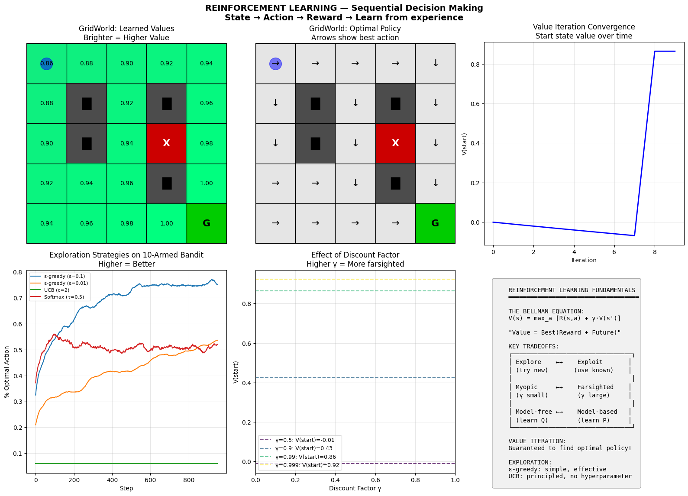
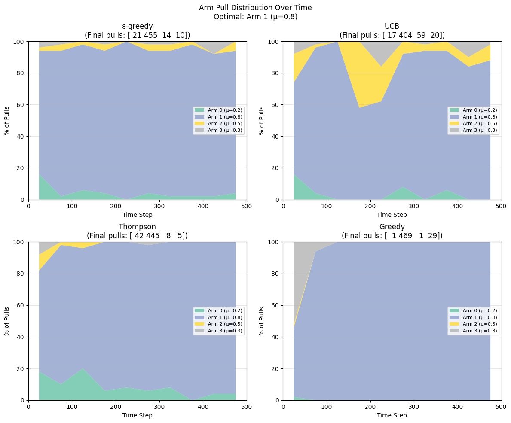
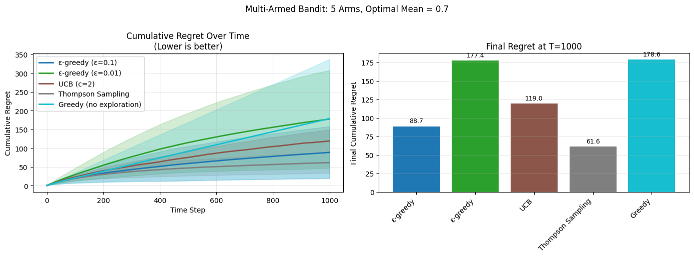
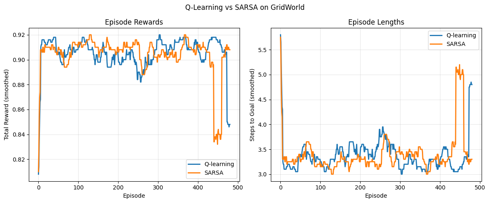
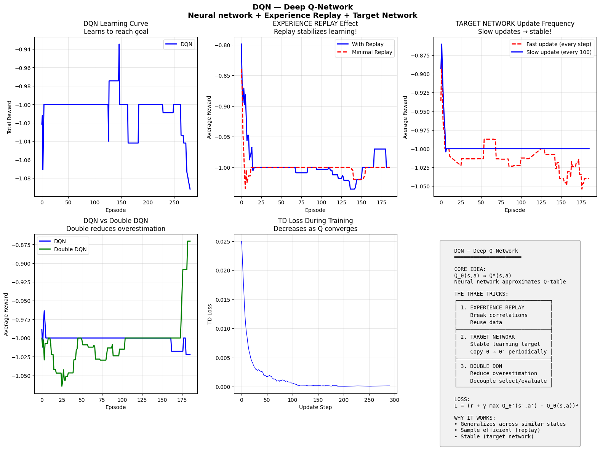
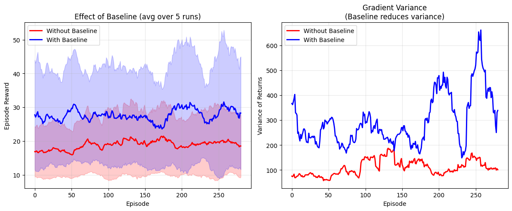
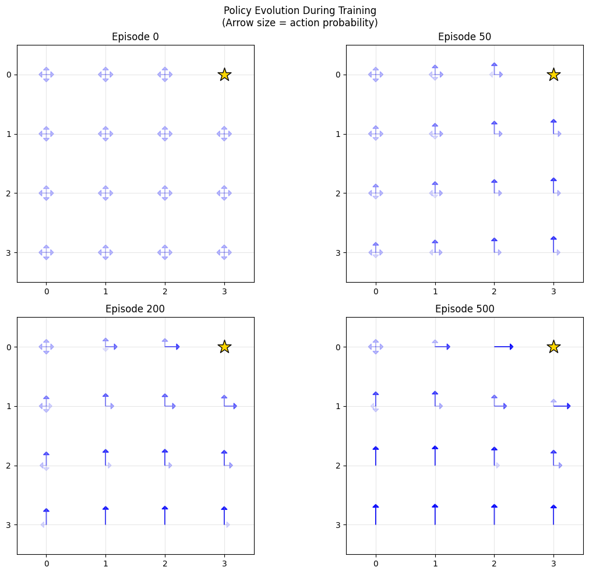
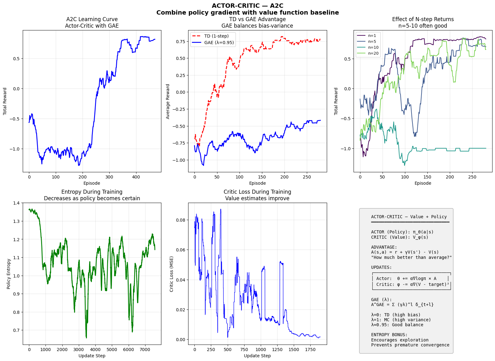
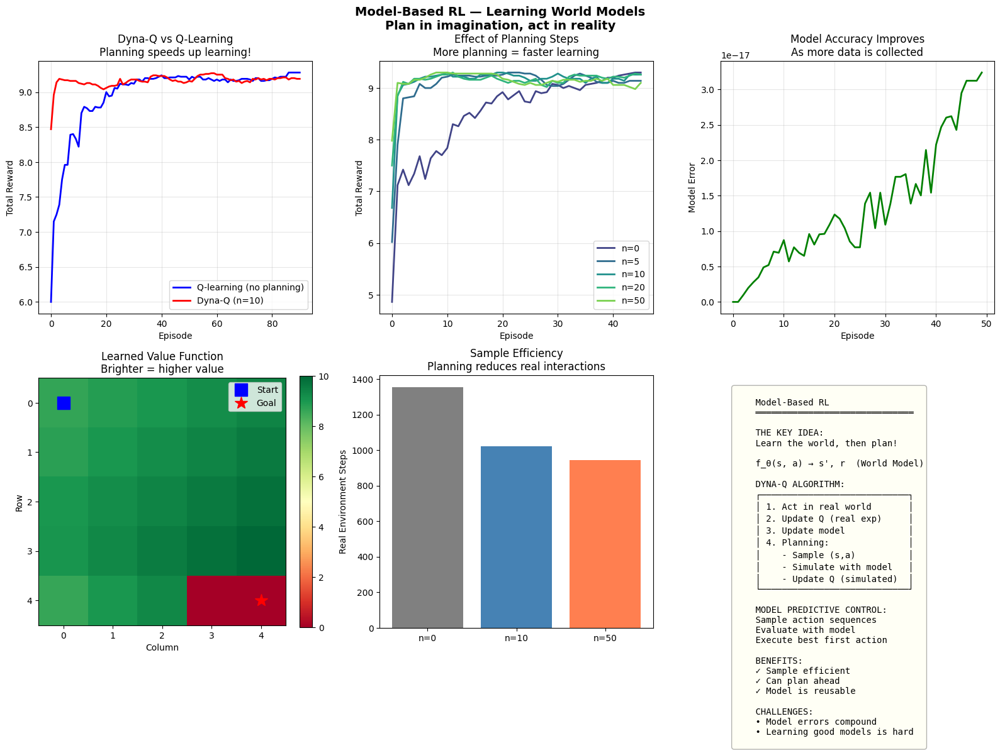
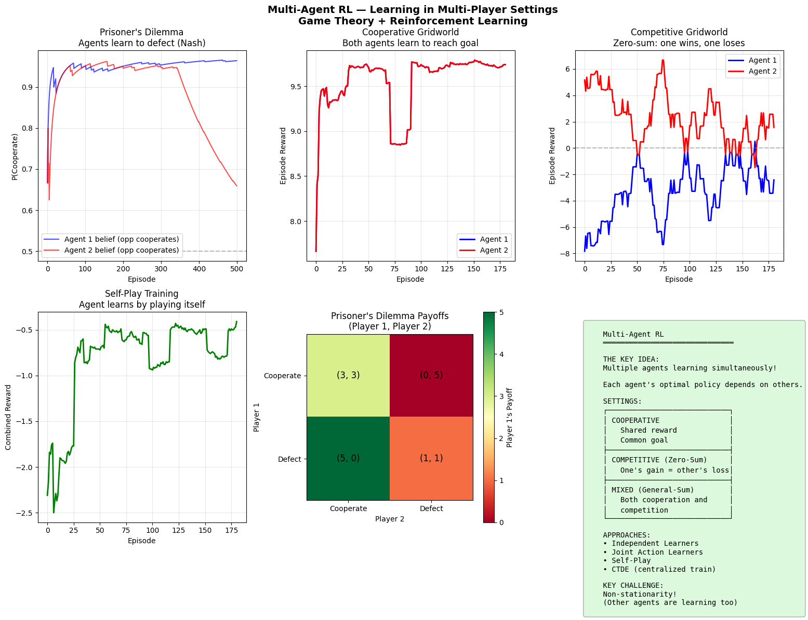

# Phase 7: Reinforcement Learning — Learning from Interaction

> **Philosophy**: No labels, just rewards. An agent learns by trial and error, discovering which actions lead to good outcomes through experience. The data depends on your actions—you must explore to learn.

---

## The Big Picture

Unlike supervised learning (labels) or unsupervised learning (patterns), RL learns from **interaction**:

```
Agent → Action → Environment → Reward + Next State → Agent → ...
```

The agent must:
1. **Explore**: Try new things to discover what works
2. **Exploit**: Use what it knows to get reward
3. **Learn long-term**: Sacrifice now for future gain

```
SUPERVISED:                     REINFORCEMENT:
(x, y) pairs given              Only rewards (often delayed)
i.i.d. data                     Data depends on actions
Learn mapping                   Learn behavior
```

### The Evolution of RL

```
Bandits → Q-Learning → DQN → Policy Gradient → Actor-Critic → PPO → SAC
   ↓           ↓         ↓          ↓              ↓           ↓     ↓
 Simple     Tabular    Deep      Direct       Best of       Stable  Max
 explore    values    values    policy       both worlds   trust   entropy
```

---

## RL Fundamentals & Bandits

### The Exploration-Exploitation Dilemma



**This is THE fundamental RL problem.**

What you're seeing:
- **Arms/actions**: Different choices with unknown rewards
- **Exploration**: Trying uncertain options
- **Exploitation**: Going with the best known

Key observations:
1. **Pure exploitation**: Misses better options
2. **Pure exploration**: Never uses what you learn
3. **Balance**: ε-greedy, UCB, Thompson Sampling

### Multi-Armed Bandits

The simplest RL setting: no state, just pick actions and receive rewards.



**Watch how different strategies explore.**

| Strategy | How It Works | Character |
|----------|--------------|-----------|
| **ε-greedy** | Random with prob ε | Simple, constant exploration |
| **UCB** | Optimism under uncertainty | Explores uncertain arms |
| **Thompson** | Sample from belief | Bayesian, probability matching |

### Regret: The Cost of Learning



**Regret measures learning efficiency.**

Regret = (Best arm's reward) × T - (Your total reward)

What you're seeing:
- **Y-axis**: Cumulative regret over time
- **Good algorithms**: Sublinear regret (flattens)
- **Bad algorithms**: Linear regret (never learns)

### Exploration Strategies in Action


**UCB: "Optimism in the face of uncertainty"**

UCB adds an exploration bonus:
```
UCB(a) = Q(a) + c × sqrt(ln(t) / N(a))
              ↑                  ↑
         Value estimate    Uncertainty bonus
```

Actions tried fewer times get higher bonus → automatic exploration!


**Thompson Sampling: Sample from your beliefs**

Maintain posterior distribution over each arm's mean. Sample from posteriors, act greedily on samples.

---

## Q-Learning — Tabular Value Learning

### The Bellman Equation

The foundation of value-based RL:

```
V(s) = max_a [R(s,a) + γ × V(s')]

"Value of state = best immediate reward + discounted future value"
```

### Q-Learning Update

```
Q(s,a) ← Q(s,a) + α × [r + γ × max_a' Q(s',a') - Q(s,a)]
                        ↑__________TD target__________↑
```

Learn Q-values from experience, without knowing the environment!

### The Reality Check: Q-Learning


**Watch Q-values converge to optimal.**

What you're seeing:
- **Grid world**: Agent navigates to goal
- **Q-values**: Learned value of each (state, action)
- **Policy**: Arrows show best action per state

### Q-Values in Action


**The Q-table tells the full story.**

- **High Q-value**: Good to take this action here
- **Low Q-value**: Bad idea
- **Arrows**: Greedy policy from Q-values

### Learning Dynamics



**Watch performance improve with experience.**

Key observations:
1. **Early**: Random exploration, low reward
2. **Middle**: Learning patterns, improving
3. **Late**: Convergent, near-optimal behavior

### Effect of Hyperparameters


**Learning rate α: how fast to update**
- Too low: Learn slowly
- Too high: Unstable, oscillate


**Discount γ: how much to care about future**
- γ ≈ 0: Myopic, only immediate reward
- γ ≈ 1: Far-sighted, plan ahead


**Exploration ε: how much to explore**
- Low ε: Exploit more, may miss better
- High ε: Explore more, slower convergence

---

## DQN — Deep Q-Learning

### The Breakthrough

Replace Q-table with neural network: Q_θ(s, a)

```
Input: State s (e.g., game pixels)
Output: Q-values for all actions
```

### The Three Tricks



**DQN's innovations made deep RL work.**

1. **Experience Replay**: Store transitions, sample randomly
   - Breaks correlation between consecutive samples
   - Reuses experience

2. **Target Network**: Separate network for TD target
   - Fixes moving target problem
   - Stabilizes learning

3. **Frame Stacking**: Stack recent frames as input
   - Single frame lacks velocity information
   - Makes state Markovian

---

## Policy Gradient — Direct Policy Optimization

### The Core Idea

Instead of learning Q-values, directly optimize the policy!

```
π_θ(a|s) = probability of action a in state s
```

### The Policy Gradient Theorem


```
∇J(θ) = E[∇log π_θ(a|s) × R]

"Increase probability of actions that led to high reward"
```

### REINFORCE Algorithm

```
1. Sample trajectory: s₀, a₀, r₀, s₁, a₁, r₁, ...
2. Compute returns: Gₜ = Σ γᵏ rₜ₊ₖ
3. Update: θ ← θ + α × Σₜ ∇log π(aₜ|sₜ) × Gₜ
```

### Baseline Reduces Variance



**Subtracting a baseline dramatically reduces variance!**

```
∇J = E[∇log π(a|s) × (R - b)]

b = baseline (e.g., average return)
```

The baseline doesn't change the expected gradient but reduces variance.

### Policy Evolution



**Watch the policy improve over training.**

What you're seeing:
- **Early**: Random actions, exploring
- **Middle**: Learning good actions
- **Late**: Converged policy

---

## Actor-Critic Methods

### The Best of Both Worlds



**Combine policy gradient (actor) with value learning (critic).**

```
Actor:  π_θ(a|s) — the policy
Critic: V_φ(s) — value estimate

Advantage: A(s,a) = Q(s,a) - V(s) ≈ r + γV(s') - V(s)
```

Update actor with advantage instead of raw return → lower variance!

### A2C/A3C

- **A2C**: Advantage Actor-Critic
- **A3C**: Asynchronous version (multiple workers)

Multiple workers explore in parallel, share gradients.

---

## PPO — Proximal Policy Optimization

### The Problem: Policy Collapse

Large policy updates can be catastrophic—you can fall off a cliff and never recover.

### The Solution: Clipped Objective


```
L(θ) = E[min(r_t(θ) × A, clip(r_t(θ), 1-ε, 1+ε) × A)]

where r_t(θ) = π_θ(a|s) / π_old(a|s)
```

**Clip prevents too-large updates:**
- If advantage > 0: Don't increase ratio beyond 1+ε
- If advantage < 0: Don't decrease ratio below 1-ε

### Why PPO Dominates

1. **Stable**: Clipping prevents catastrophic updates
2. **Simple**: No complex trust region computation (unlike TRPO)
3. **Effective**: State-of-art on many benchmarks
4. **Multiple epochs**: Can reuse data (unlike vanilla PG)

---

## SAC — Soft Actor-Critic

### Maximum Entropy RL


**Maximize reward AND entropy (exploration).**

```
J(π) = E[Σ r(s,a) + α × H(π(·|s))]
                      ↑
              Entropy bonus
```

Why entropy bonus?
1. Encourages exploration
2. Prevents premature convergence
3. More robust policies
4. Multiple solutions averaged

### Key SAC Ideas

- **Soft Q-function**: Includes entropy in value
- **Automatic temperature**: Learns α to balance reward/entropy
- **Off-policy**: Uses replay buffer efficiently

---

## Model-Based RL

### Learn a World Model



**Instead of model-free trial-and-error, learn the dynamics!**

```
Model: f(s, a) → s', r

Then: Plan using the learned model
```

### Dyna-Q: Best of Both

1. Experience real environment
2. Update Q with real experience
3. ALSO update Q with simulated experience from model
4. More planning = faster learning (if model is good)

### The Model Error Problem

Model errors compound over long horizons! Solutions:
- Short planning horizons
- Model ensembles (uncertainty)
- Mix real and simulated experience

---

## Multi-Agent RL

### When There Are Multiple Learners



**Game theory meets RL.**

Settings:
- **Cooperative**: Shared reward, common goal
- **Competitive**: Zero-sum, adversarial
- **Mixed**: Both cooperation and competition

### The Non-Stationarity Problem

From agent A's view:
- Environment includes other agents
- Other agents are learning (changing!)
- Environment is non-stationary

### Approaches

1. **Independent Learners**: Ignore others, treat as noise
2. **Centralized Training, Decentralized Execution (CTDE)**
3. **Self-Play**: Agent plays against itself

---

## Inverse RL — Learning Rewards from Behavior

### The Idea


**Given expert demonstrations, recover the reward function.**

Why?
- Reward engineering is hard
- Experts show WHAT, not HOW TO REWARD

### GAIL: Generative Adversarial Imitation

```
Generator: Policy tries to match expert
Discriminator: Distinguishes expert vs policy

Policy learns to fool discriminator = imitate expert
```

---

## When to Use What

| Scenario | Best Choice | Why |
|----------|-------------|-----|
| **Discrete actions, small state** | Q-Learning | Simple, guaranteed convergence |
| **High-dim state (images)** | DQN | Neural function approximation |
| **Continuous actions** | PPO or SAC | Policy methods handle continuous |
| **Stability matters** | PPO | Clipping prevents collapse |
| **Sample efficiency matters** | SAC | Off-policy, entropy exploration |
| **Have environment model** | Model-Based | Plan, don't just react |
| **Have expert demos** | GAIL/IRL | Learn reward from behavior |

---

## Key Takeaways

### 1. Exploration is Essential
Without exploration, you can't discover better strategies. The exploration-exploitation tradeoff is fundamental.

### 2. Value vs Policy
- **Value-based** (DQN): Learn Q(s,a), derive policy
- **Policy-based** (PG): Learn π(a|s) directly
- **Actor-Critic**: Learn both, use value to reduce variance

### 3. Stability is Hard
Deep RL is notoriously unstable. Tricks like target networks, experience replay, and clipping are essential.

### 4. Sample Efficiency Varies
- On-policy (PPO): Need fresh samples
- Off-policy (SAC, DQN): Can reuse old data
- Model-based: Can simulate, very efficient

### 5. RL is Different
- Data depends on policy (non-i.i.d.)
- Reward may be delayed
- Exploration required
- No ground truth labels

---

## Running the Code

```bash
# Run individual algorithms
python algorithms/rl_fundamentals.py  # Bandits
python algorithms/q_learning.py
python algorithms/dqn.py
python algorithms/policy_gradient.py
python algorithms/actor_critic.py
python algorithms/ppo.py
python algorithms/sac.py
python algorithms/model_based_rl.py
python algorithms/multi_agent_rl.py
python algorithms/inverse_rl.py

# Each script will:
# 1. Train an agent
# 2. Visualize learning curves
# 3. Show policy/value evolution
```

---

## What's Next?

**Phase 8: Graph Learning** — Data isn't always grids (images) or sequences (text). Many real-world systems are graphs: social networks, molecules, knowledge bases. Graph Neural Networks learn on arbitrary topology, passing messages between connected nodes to build representations.

The key insight: the structure IS the data—who connects to whom matters as much as individual features.
