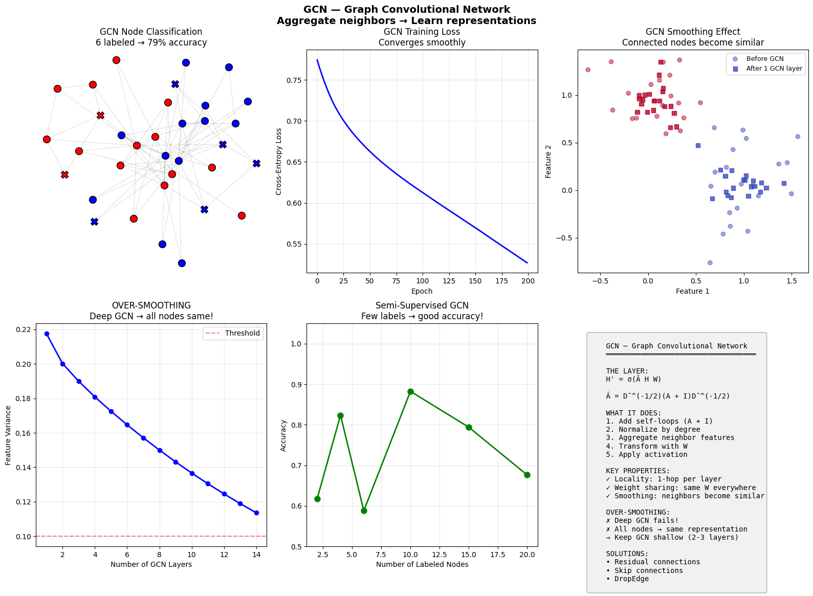
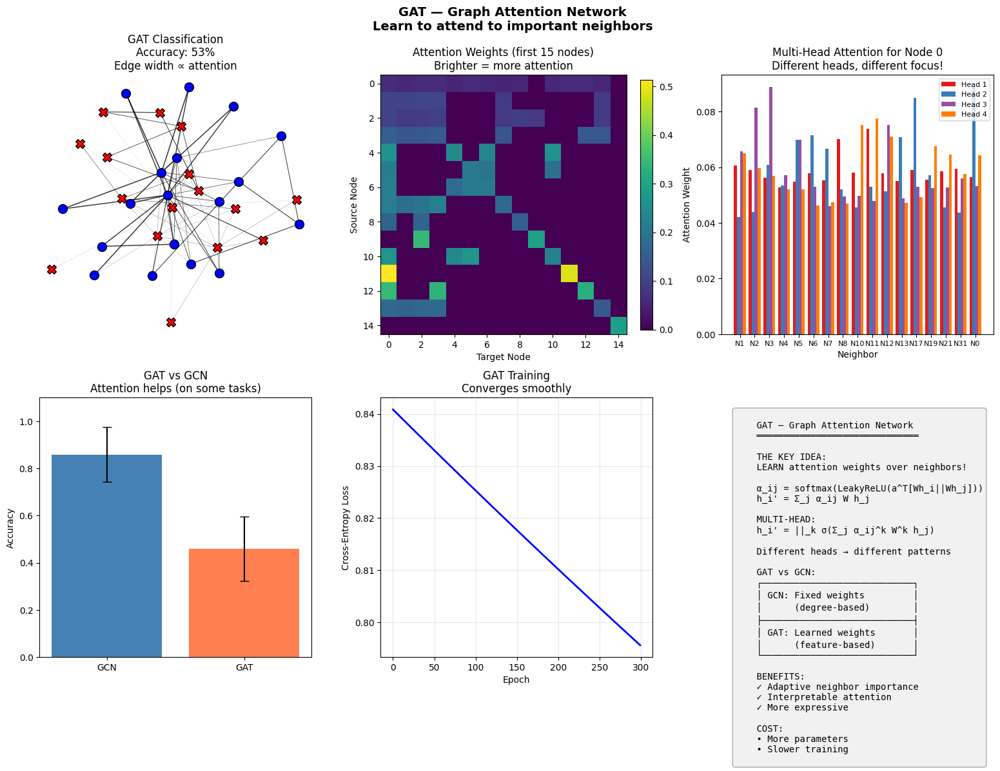
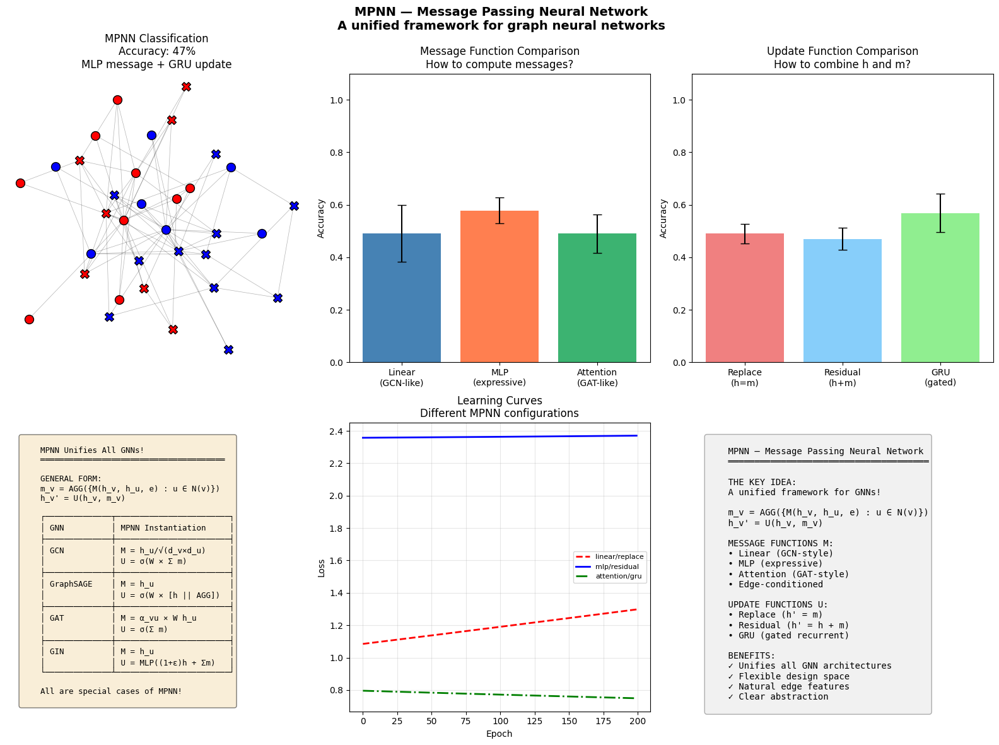
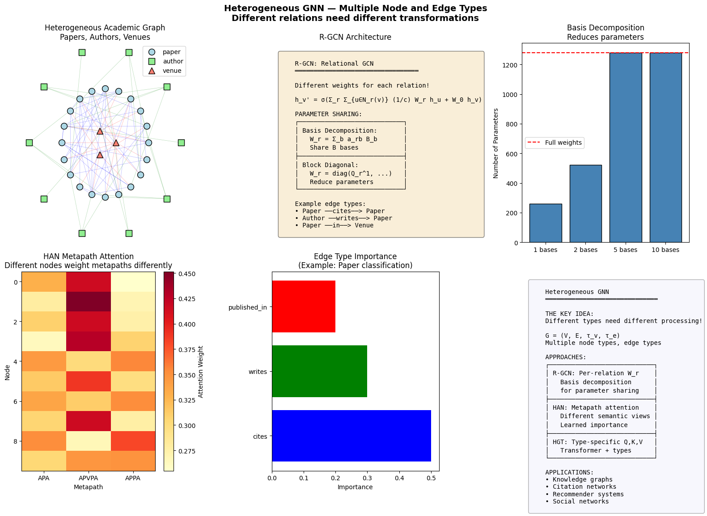

# Phase 8: Graph Learning — When Structure Is Data

> **Philosophy**: When entities have relationships—social networks, molecules, knowledge graphs—the structure IS the data. Graph Neural Networks learn representations that respect and exploit this relational structure.

---

## The Big Picture

Images are grids. Text is sequences. But many real-world systems are **graphs**:

- **Social networks**: Users connected by friendships
- **Molecules**: Atoms connected by bonds
- **Citation networks**: Papers connected by citations
- **Knowledge graphs**: Entities connected by relations

Standard architectures fail on graphs:
- MLPs ignore structure entirely
- CNNs assume grids (fixed neighbors)
- RNNs assume sequences (fixed order)

**Graphs have no fixed size, no fixed order!**

```
Image:  Fixed 2D grid       → CNN
Text:   Fixed sequence      → RNN/Transformer
Graph:  Variable structure  → GNN
```

### The Core Insight

All GNNs share one key idea: **aggregate information from neighbors**

```
h_v = f(x_v, AGGREGATE({h_u : u ∈ neighbors(v)}))

"A node's representation depends on its features AND its neighbors"
```

---

## Graph Fundamentals

### What's a Graph?


```
G = (V, E)
V = nodes (entities)
E = edges (relationships)

Node features: X ∈ R^(n × d)
Adjacency matrix: A ∈ {0,1}^(n × n)
```

**What you're seeing:**
- **Nodes**: Entities with features
- **Edges**: Connections between entities
- **Graph structure**: The topology that makes this different from tabular data

### Graph Tasks

| Task | Predict | Example |
|------|---------|---------|
| **Node classification** | Label per node | User's interests |
| **Link prediction** | Edge existence | Will they connect? |
| **Graph classification** | Label per graph | Molecule toxicity |

---

## GCN — Graph Convolutional Network

### The Core Idea

**Convolution on graphs** via the graph Laplacian:

```
H' = σ(Ã H W)

where à = D^(-1/2)(A + I)D^(-1/2)
```

**What this does**: Each node aggregates features from its neighbors (and itself).

This is **SMOOTHING**—connected nodes become more similar!

### The Reality Check: GCN



**Watch how information propagates through the graph.**

What you're seeing:
- **Before GCN**: Random node colors (features)
- **After GCN layers**: Connected nodes have similar colors
- **Classification boundary**: Emerges from structure + features

Key observations:
1. **Local propagation**: Each layer spreads information one hop
2. **Smoothing effect**: Neighbors become similar
3. **Classification**: Similar nodes get similar predictions

### Why Add Self-Loops?

```
Without self-loop: A node's own features can be washed out
With self-loop:    A node retains its own information
```

The (A + I) adds self-loops—nodes include themselves in aggregation.

### The Over-Smoothing Problem

**Deep GCNs make all nodes look the same!**

```
Layer 1: See 1-hop neighborhood
Layer 2: See 2-hop neighborhood
Layer k: See k-hop neighborhood
Too deep: See entire graph → Everything converges
```

This is why GCNs are typically shallow (2-3 layers).

---

## GraphSAGE — Inductive Learning

### The Key Innovation

GCN learns weights per graph position. GraphSAGE learns a **generalizable aggregation function**.


```
h_v = σ(W × CONCAT(h_v, AGG({h_u : u ∈ N(v)})))
```

**Aggregator options:**
- **Mean**: Average neighbor features
- **Pool**: Max-pool after MLP
- **LSTM**: Sequence over neighbors (order shouldn't matter!)

### Why GraphSAGE > GCN?

| GCN | GraphSAGE |
|-----|-----------|
| Transductive (fixed graph) | **Inductive** (new nodes OK) |
| Full neighborhood | **Sampled** neighborhood |
| Full-batch | **Mini-batch** training |

GraphSAGE can handle unseen nodes and scales to huge graphs!

---

## GAT — Graph Attention Network

### The Core Idea

**Not all neighbors are equally important!** Learn attention weights.



```
h_i' = σ(Σ_j α_ij W h_j)

where α_ij = softmax_j(LeakyReLU(a^T [Wh_i || Wh_j]))
```

**What you're seeing:**
- **Edge thickness**: Attention weights (thicker = more important)
- **Attention heads**: Different heads focus on different relationships
- **Learned importance**: The model decides which neighbors matter

### Multi-Head Attention

Like Transformers—multiple attention heads:

```
h_i' = ||_{k=1}^K σ(Σ_j α_ij^k W^k h_j)
```

Different heads can capture different types of relationships.

### GAT vs GCN

| GCN | GAT |
|-----|-----|
| Fixed weights (degree-based) | **Learned** weights (attention) |
| All neighbors equal | Neighbors weighted by relevance |
| Fewer parameters | More parameters, more expressive |

---

## GIN — Graph Isomorphism Network

### The Core Idea

Make GNNs **maximally expressive**—as powerful as the Weisfeiler-Lehman test!


```
h_v = MLP((1 + ε) × h_v + Σ_{u∈N(v)} h_u)
```

**The (1 + ε) term** distinguishes a node's own features from its neighbors.

### Why SUM Aggregation?

| Aggregation | Expressiveness | Problem |
|-------------|---------------|---------|
| **SUM** | Maximal | Different multisets → different sums |
| **MEAN** | Limited | {1,1,1} and {1} give same mean |
| **MAX** | Limited | Loses all but maximum |

**GIN uses SUM** for maximum expressiveness—it can distinguish graphs that MEAN/MAX cannot!

---

## MPNN — Message Passing Framework

### The Unified View

All GNNs fit into one framework:



```
Message:  m_v = Σ_{u∈N(v)} M(h_v, h_u, e_vu)
Update:   h_v' = U(h_v, m_v)
```

**Instantiations:**
- **GCN**: M = h_u / sqrt(d_v × d_u), U = σ(W × sum)
- **GAT**: M = α_vu × W h_u, U = σ(sum)
- **GIN**: M = h_u, U = MLP((1+ε)h_v + sum)

### Edge Features

Many graphs have edge attributes (bond type, distance, etc.)

```
M(h_v, h_u, e_vu)  ← Edge features naturally incorporated!
```

---

## Graph Pooling — Hierarchical Graphs

### The Problem

How to go from node representations to **graph** representation?


**Simple pooling:**
- **SUM**: Σ_v h_v (size-sensitive)
- **MEAN**: Average (size-invariant)
- **MAX**: Salient features only

**Hierarchical pooling:**
```
Graph → Cluster → Smaller Graph → ... → Final embedding
```

### DiffPool

Learn soft cluster assignments:
```
S = softmax(GNN(A, X))    # Cluster assignments
X' = S^T X                 # Cluster features
A' = S^T A S               # Cluster adjacency
```

End-to-end differentiable graph coarsening!

---

## Heterogeneous GNNs

### Multiple Node/Edge Types



Real graphs often have **different types**:
- Knowledge graphs: (entity, relation, entity)
- Citation: (paper, cites, paper), (author, writes, paper)

**Relational GCN (R-GCN):**
```
h_v' = σ(Σ_r Σ_{u∈N_r(v)} W_r h_u / c_r + W_0 h_v)
```

Different weights for different relation types!

### The Parameter Explosion

|relations| × d × d parameters per layer!

**Solutions:**
- Basis decomposition: W_r = Σ_b a_rb B_b
- Block diagonal matrices

---

## Temporal GNNs

### Graphs That Change


Real graphs evolve:
- Edges appear/disappear
- Node features change
- New nodes join

**Approaches:**
1. **Discrete**: Snapshots G₁, G₂, ..., Gₜ
2. **Continuous**: Events (u, v, t, type)

### Temporal Graph Networks (TGN)

```
Memory:    s_i(t) = GRU(s_i(t-), message)
Embedding: h_i(t) = f(s_i(t), neighbor_info)
```

Nodes maintain **memory** of their interaction history!

---

## Graph Transformer

### Full Attention on Graphs


**Apply Transformer attention to graphs**—attend to ALL nodes, not just neighbors.

### The Challenge

Transformers are permutation-equivariant—need to encode structure!

**Solutions:**
1. **Positional encodings**: Laplacian eigenvectors, random walk
2. **Structural encodings**: Degree, centrality
3. **Attention bias**: Add structure to attention scores

```
Attention = softmax(QK^T/√d + B) V
                              ↑
                    Structure bias
```

### When to Use Graph Transformer

| Scenario | Use |
|----------|-----|
| **Small-medium graphs** (< 5k nodes) | Graph Transformer (full attention) |
| **Long-range dependencies** | Graph Transformer |
| **Large graphs** (> 100k nodes) | Traditional GNN (sparse) |
| **Local patterns dominate** | GCN/GAT sufficient |

---

## Algorithm Comparison

| Algorithm | Key Idea | Expressiveness | Scalability |
|-----------|----------|----------------|-------------|
| **GCN** | Spectral convolution | Moderate | Good |
| **GraphSAGE** | Sampling + aggregation | Moderate | Excellent |
| **GAT** | Learned attention | Good | Good |
| **GIN** | WL-test powerful | Maximum | Good |
| **Graph Transformer** | Full attention | Maximum | Limited |

### Expressiveness Hierarchy

```
GIN = WL test > GCN > Mean aggregation

Graph Transformer can exceed WL (with proper encodings)
```

---

## When to Use What

| Scenario | Best Choice | Why |
|----------|-------------|-----|
| **First try, any graph** | GCN or GAT | Simple, effective |
| **Huge graphs** | GraphSAGE | Sampling, mini-batch |
| **Need max expressiveness** | GIN | Provably powerful |
| **Heterogeneous relations** | R-GCN or HAN | Type-aware |
| **Dynamic graphs** | TGN | Temporal memory |
| **Long-range matters** | Graph Transformer | Full attention |
| **Graph classification** | GIN + pooling | Expressive + readout |

---

## Key Takeaways

### 1. Aggregate From Neighbors
All GNNs share this core: a node's representation = its features + neighbor info. The differences are in HOW to aggregate.

### 2. Over-Smoothing Limits Depth
Repeated smoothing → all nodes converge. GNNs are typically shallow (2-4 layers), unlike CNNs or Transformers.

### 3. Attention Learns Importance
GAT and Graph Transformer learn which neighbors/nodes matter. This is more expressive than fixed weights.

### 4. Expressiveness Has Limits
Standard GNNs can't distinguish all graphs. GIN achieves the WL-test limit. Graph Transformers can go beyond with proper encodings.

### 5. Structure IS Data
In graph learning, topology is as important as features. A node's role in the network (central? bridge? peripheral?) defines its meaning.

---

## Running the Code

```bash
# Run individual algorithms
python algorithms/graph_fundamentals.py
python algorithms/gcn.py
python algorithms/graphsage.py
python algorithms/gat.py
python algorithms/gin.py
python algorithms/mpnn.py
python algorithms/graph_pooling.py
python algorithms/hetero_gnn.py
python algorithms/temporal_gnn.py
python algorithms/graph_transformer.py

# Each script will:
# 1. Build the architecture from scratch
# 2. Train on graph data
# 3. Visualize learned representations
```

---

## Conclusion: The Full Journey

You've now covered the complete ML landscape:

| Phase | Paradigm | Key Insight |
|-------|----------|-------------|
| **1. Foundations** | Basic models | Different assumptions → different failures |
| **2. Bayesian** | Uncertainty | Knowing what you don't know |
| **3. Trees/Ensembles** | Combining models | Many weak → one strong |
| **4. Neural Networks** | Learned features | Depth + data + compute |
| **5. Generative** | Creating data | Model the distribution |
| **6. Uncertainty** | Honest confidence | Calibrate, conformal, adapt |
| **7. Reinforcement** | Learning from interaction | Explore to exploit |
| **8. Graph** | Relational data | Structure is information |

**The meta-lesson**: Every algorithm makes assumptions. Understanding those assumptions tells you when it will work—and when it will fail.

Happy learning!
