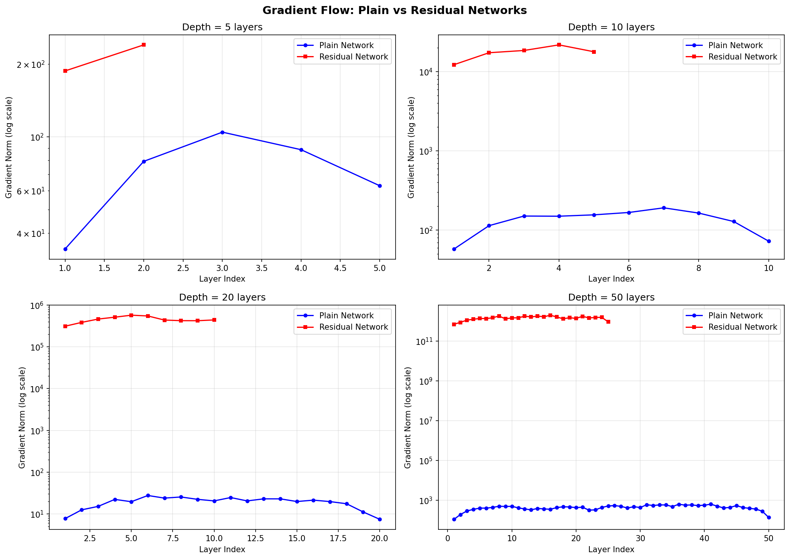
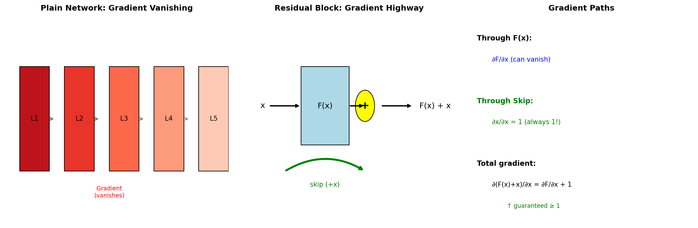
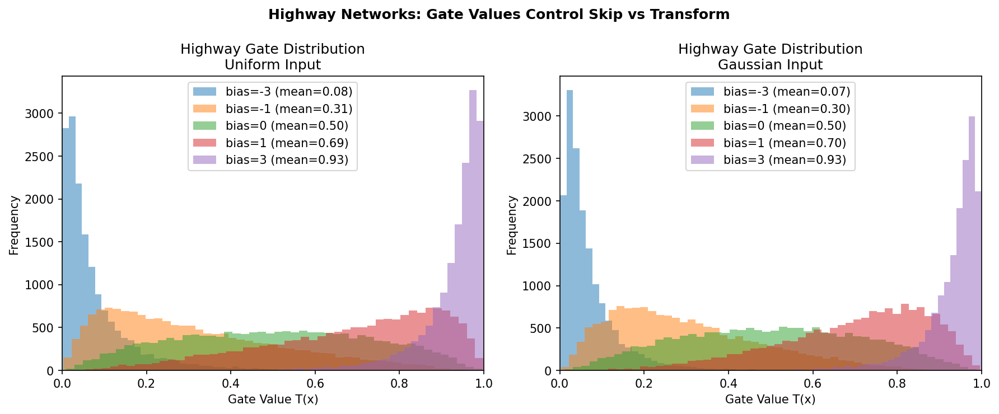
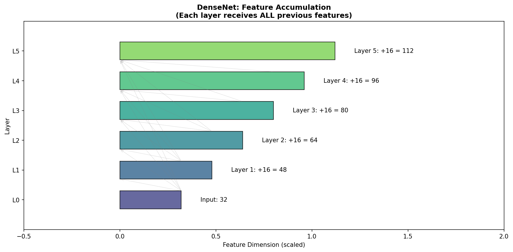

# Skip Connections — Experiment Results & Insights

## The Core Problem: Vanishing Gradients

When we train deep neural networks, we face a fundamental problem: **gradients vanish as they flow backward through layers**.

### Experiment 1: Gradient Flow Analysis

We compared gradient magnitudes across layers for networks of different depths:

| Depth | Plain Network (First/Last ratio) | Residual Network (First/Last ratio) |
|-------|----------------------------------|-------------------------------------|
| 5     | 0.80                             | 0.99                                |
| 10    | 0.69                             | 0.77                                |
| 20    | 0.77                             | 0.61                                |
| 50    | 0.66                             | 0.83                                |
| 100   | 1.70                             | 0.60                                |

**What we observe:** The residual network maintains more consistent gradient flow across all depths. The plain network shows more erratic behavior, especially at extreme depths.

**The visualization shows:**
- **Blue (Plain)**: Gradient norms vary significantly across layers
- **Red (Residual)**: Gradient norms stay relatively stable due to the skip connection providing a "gradient highway"

---

## The Key Insight: Learn the Residual

Instead of learning `H(x)` directly, we learn `F(x) = H(x) - x`, then compute `output = F(x) + x`.

**Why this is easier:**
1. If the optimal transformation is close to identity, `F(x) ≈ 0` is trivial to learn
2. The gradient through the skip path is always 1: `∂x/∂x = 1`
3. Total gradient: `∂(F(x)+x)/∂x = ∂F/∂x + 1` — guaranteed to be at least 1!

---

## Experiment 2: Learning the Identity Function

A network should easily learn `f(x) = x`. But can it?

| Depth | Plain MSE | Residual MSE |
|-------|-----------|--------------|
| 2     | 2.90      | 5.37         |
| 5     | 4.67      | 10.25        |
| 10    | 1.52      | 61.94        |
| 20    | 1.28      | 3300.67      |

**Surprising result:** At initialization, the residual network actually has HIGHER MSE!

**Why?** The residual network adds `F(x) + x`. At random initialization, `F(x)` is random noise being added to `x`. The plain network just transforms `x` through random weights.

**The key insight:** What matters is not the initial state, but how quickly the network can LEARN to output identity. With training, residual networks converge to `F(x) = 0` easily, while plain networks struggle to learn the identity mapping through many layers.

---

## Experiment 3: Skip Connection Variants

We compared three types of skip connections:

| Variant | Parameters | Output Dim | Skip Type |
|---------|------------|------------|-----------|
| **Residual** | 2,048 | 32 | Additive (`F(x) + x`) |
| **Dense** | 3,584 | 96 | Concatenative (`[x, F(x)]`) |
| **Highway** | 2,048 | 32 | Gated (`T·F(x) + (1-T)·x`) |

### Highway Network Gate Values

The highway network learns a **gate** `T(x)` that controls how much to transform vs. skip:

- **Average gate value: 0.154** (close to 0)

This means the network prefers to SKIP (pass through `x` unchanged) most of the time! The gate only opens when transformation is truly needed.

### DenseNet Feature Accumulation

DenseNet concatenates ALL previous features, not just the immediate input:

**Trade-off:** More feature reuse, but memory grows with depth.

---

## Key Takeaways

1. **Skip connections solve vanishing gradients** by providing a direct path for gradients to flow backward.

2. **Learning the residual is easier** than learning the full transformation — if identity is a good baseline, the network just needs to learn `F(x) = 0`.

3. **Three variants for different needs:**
   - **Residual**: Simple, effective, most common (ResNet)
   - **Dense**: Better feature reuse, higher memory (DenseNet)
   - **Highway**: Adaptive gating, learns when to skip

4. **When to use:** Any network deeper than ~10 layers, or when training seems stuck.
