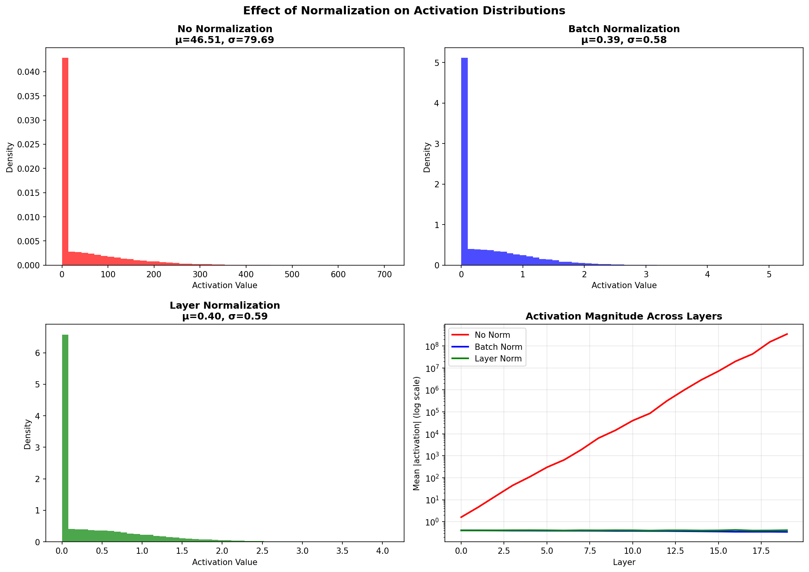
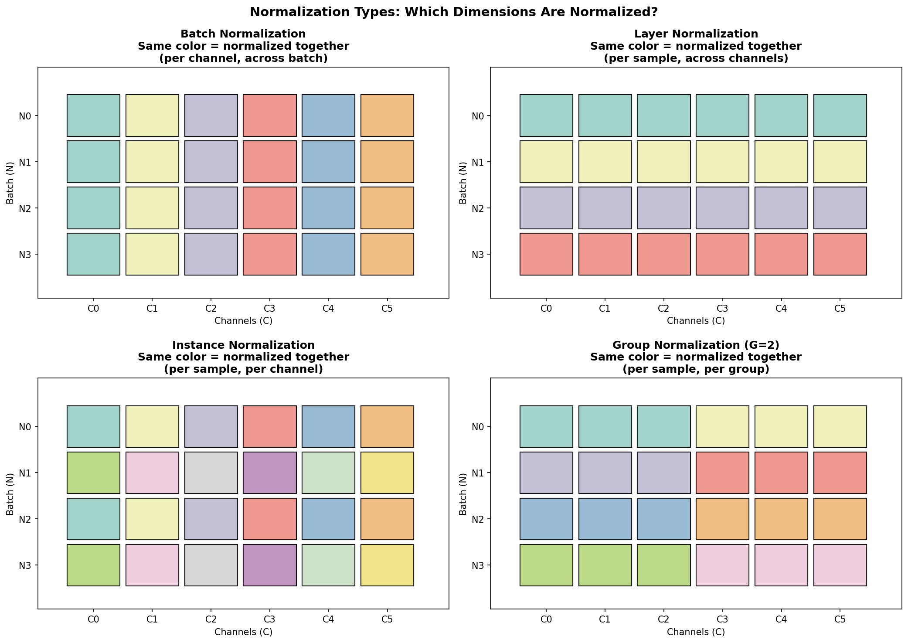

# Normalization — Experiment Results & Insights

## The Core Problem: Activation Explosion

Without normalization, activations can **explode** as they pass through layers.

### Experiment 1: Activation Statistics Across Layers

We tracked activation standard deviation through a 10-layer network:

| Layer | No Norm (σ) | BatchNorm (σ) | LayerNorm (σ) |
|-------|-------------|---------------|---------------|
| 0     | 2.37        | 0.58          | 0.58          |
| 1     | 7.27        | 0.58          | 0.59          |
| 2     | 20.78       | 0.58          | 0.60          |
| 3     | 62.10       | 0.59          | 0.59          |
| 4     | 220.86      | 0.59          | 0.61          |
| 5     | 608.31      | 0.58          | 0.59          |
| 6     | 2,031.71    | 0.60          | 0.62          |
| 7     | 5,858.96    | 0.59          | 0.60          |
| 8     | 14,969.75   | 0.59          | 0.60          |
| 9     | **46,932.86** | 0.61        | 0.57          |

**The story is dramatic:**
- **Without normalization:** Activations grow from σ=2.4 to σ=46,933 — a **20,000x explosion!**
- **With normalization:** Activations stay stable around σ≈0.58 throughout the network

**The bottom-right plot tells the whole story:** On a log scale, you can see:
- **Red line (No Norm):** Exponential growth, reaching 10⁹ by layer 20
- **Blue & Green (BatchNorm/LayerNorm):** Flat lines, stable activations

---

## Understanding the Different Types

The key question: **What dimensions do we normalize over?**

**Reading the visualization:**
- Same color = normalized together (share the same μ and σ)
- Different colors = independent normalization

### Batch Normalization
- **Normalize:** Across batch, per channel
- **Same color in columns:** All batch samples for one channel are normalized together
- **Best for:** CNNs with large batches (≥32)
- **Problem:** Depends on batch statistics — behaves differently in training vs inference

### Layer Normalization
- **Normalize:** Across channels, per sample
- **Same color in rows:** Each sample is normalized independently
- **Best for:** Transformers, RNNs, or when batch size varies
- **Advantage:** Same behavior in training and inference

### Instance Normalization
- **Normalize:** Per sample, per channel (just spatial dimensions)
- **Every cell is different color:** Complete independence
- **Best for:** Style transfer (removes "style" encoded in statistics)

### Group Normalization
- **Normalize:** Per sample, per group of channels
- **Compromise:** Between Layer Norm and Instance Norm
- **Best for:** CNNs with small batches where BatchNorm fails

---

## Experiment 2: Pre-Norm vs Post-Norm

Where should normalization go?

**Post-Norm (original):** `x → Layer → Norm → Activation`
**Pre-Norm (modern):** `x → Norm → Layer → Activation`

| Layer | Post-Norm (σ) | Pre-Norm (σ) |
|-------|---------------|--------------|
| 0     | 0.59          | 1.01         |
| 1     | 0.59          | 1.00         |
| 2     | 0.57          | 0.94         |
| 3     | 0.57          | 0.95         |
| 4     | 0.56          | 1.02         |

**Observation:** Pre-Norm maintains activations closer to σ=1.0, while Post-Norm compresses them to σ≈0.58.

**Modern practice:** Pre-Norm is preferred in Transformers because:
1. More stable gradients at initialization
2. Easier to train very deep networks
3. Used in GPT, LLaMA, and most modern LLMs

---

## When to Use What

| Method | Use When | Real-World Example |
|--------|----------|-------------------|
| **BatchNorm** | CNNs, batch ≥ 32 | ResNet, VGG |
| **LayerNorm** | Transformers, RNNs | BERT, GPT, LLaMA |
| **InstanceNorm** | Style transfer | Neural style transfer |
| **GroupNorm** | CNNs, small batch | Detection (YOLO on edge) |
| **RMSNorm** | LLMs (simpler) | LLaMA 2, Gemma |

---

## Key Takeaways

1. **Without normalization, activations explode** — growing by 20,000x over 10 layers in our experiment.

2. **Normalization = center to μ=0, scale to σ=1**, then learn the optimal distribution via γ and β.

3. **Different methods normalize different dimensions** — the choice depends on your architecture and batch size.

4. **BatchNorm needs large batches** because it relies on batch statistics to estimate population statistics.

5. **LayerNorm is batch-independent** — essential for Transformers and when batch sizes vary.
