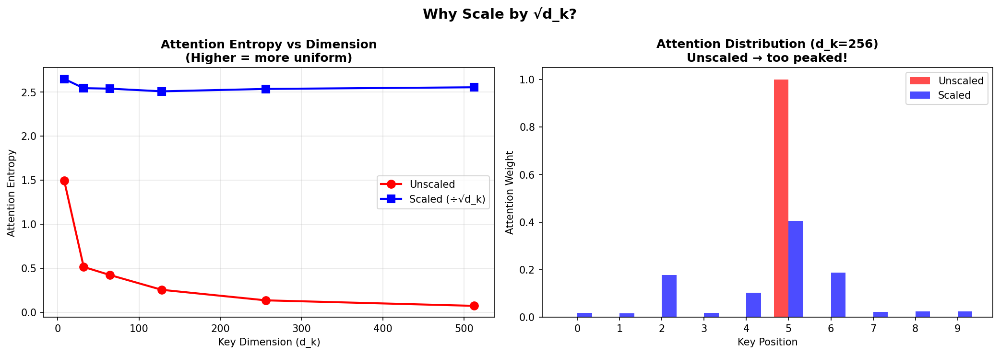
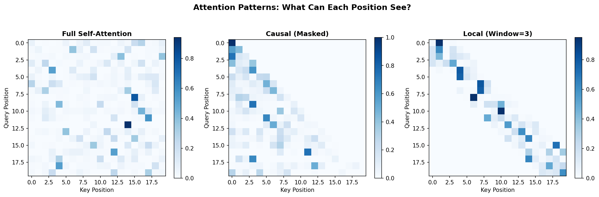

# Attention Mechanisms — Experiment Results & Insights

## The Core Problem: Fixed Operations Don't Know What's Important

Traditional neural networks apply the same operations everywhere:
- Convolutions: same filter across all positions
- RNNs: same weights for all timesteps

**The attention insight:** Let the model LEARN what to focus on.

---

## The Formula

```
Attention(Q, K, V) = softmax(QK^T / √d_k) × V
```

- **Query (Q):** What am I looking for?
- **Key (K):** What does each position offer?
- **Value (V):** What information to extract?
- **√d_k:** The crucial scaling factor

---

## Experiment 1: Why Scale by √d_k?



| d_k  | Unscaled Entropy | Scaled Entropy |
|------|------------------|----------------|
| 8    | 1.50             | 2.65           |
| 32   | 0.51             | 2.55           |
| 64   | 0.42             | 2.54           |
| 128  | 0.25             | 2.51           |
| 256  | 0.13             | 2.54           |
| 512  | 0.07             | 2.56           |

**The visualization tells the story:**

**Left panel:** Entropy (how spread out attention is) vs dimension
- **Red (Unscaled):** Entropy CRASHES as dimension increases → attention becomes a one-hot vector
- **Blue (Scaled):** Entropy stays stable → healthy attention distribution

**Right panel:** Actual attention weights at d_k=256
- **Red (Unscaled):** Almost all weight on position 5 (~100%)
- **Blue (Scaled):** Weight distributed across relevant positions

**Why does this happen?**
- Dot products grow with dimension: `q·k ∝ √d_k` for random vectors
- Large dot products → extreme softmax → one position dominates
- Dividing by √d_k keeps values in a reasonable range

**Without scaling:** Gradients vanish for non-dominant positions. The model can't learn!

---

## Experiment 2: Attention Patterns



Three fundamental attention patterns:

### Full Self-Attention (left)
- Every position can attend to every other position
- Used in: BERT encoders, vision transformers
- Cost: O(n²) — quadratic in sequence length

### Causal/Masked Attention (middle)
- Position i can only see positions ≤ i
- The triangular pattern: lower triangle filled, upper triangle masked
- Used in: GPT, autoregressive generation
- Essential for: "Don't peek at the future"

### Local Attention (right)
- Only attend within a window (here, window=3)
- The diagonal band pattern
- Used in: Longformer, BigBird for long sequences
- Trade-off: O(n×w) instead of O(n²), but loses global context

---

## Experiment 3: Multi-Head Diversity

| Num Heads | Avg Head Similarity |
|-----------|---------------------|
| 1         | 1.00                |
| 2         | 0.12                |
| 4         | 0.17                |
| 8         | 0.19                |

**What this shows:**
- Single head: trivially similar to itself (1.0)
- Multiple heads: learn DIFFERENT patterns (similarity drops to ~0.12-0.19)

**Why multiple heads matter:**
- Different heads can capture different relationships
- Head 1: syntactic dependencies ("subject-verb")
- Head 2: semantic similarity ("synonyms")
- Head 3: positional patterns ("adjacent words")

**The multi-head formula:**
```
MultiHead(Q, K, V) = Concat(head_1, ..., head_h) W^O
where head_i = Attention(Q W_i^Q, K W_i^K, V W_i^V)
```

---

## Self-Attention vs Cross-Attention

| Type | Q from | K, V from | Use Case |
|------|--------|-----------|----------|
| Self-Attention | Sequence X | Same X | Within-sequence patterns |
| Cross-Attention | Sequence X | Different Y | Between-sequence patterns |

**Self-Attention examples:**
- BERT: Each word attends to all words in the sentence
- ViT: Each patch attends to all patches in the image

**Cross-Attention examples:**
- Machine translation: Decoder attends to encoder outputs
- Image captioning: Text attends to image features
- Stable Diffusion: Text conditions image generation

---

## Key Takeaways

1. **Attention = dynamic, learned weighting** — the model decides what's relevant

2. **Scaling by √d_k is essential** — without it, attention collapses to one-hot

3. **Query-Key-Value is the framework:**
   - Query asks a question
   - Keys provide matching criteria
   - Values provide the answer

4. **Multi-head = multiple experts** — each head learns different patterns

5. **Masking controls information flow:**
   - Full: bidirectional (BERT)
   - Causal: autoregressive (GPT)
   - Local: efficient long sequences

6. **Self vs Cross attention:**
   - Self: within one sequence
   - Cross: between two sequences

