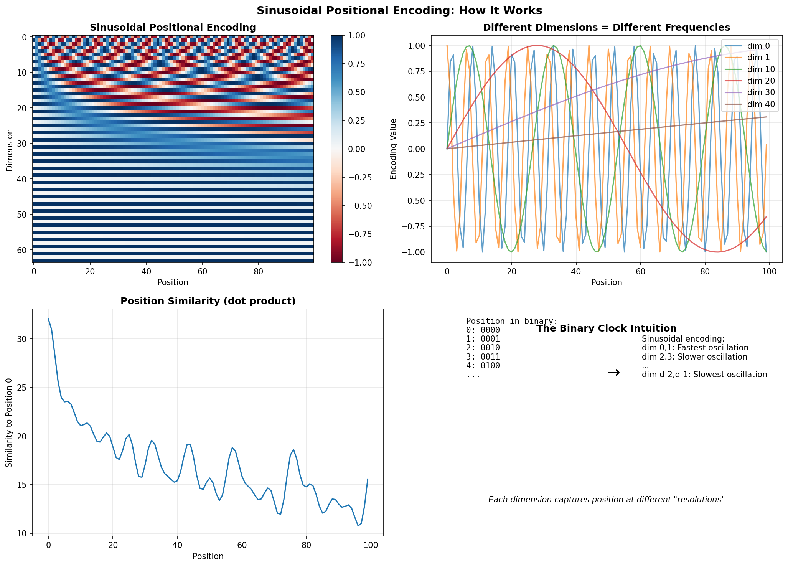

# Positional Encoding — Experiment Results & Insights

## The Core Problem: Attention Can't See Order

Attention is **permutation-equivariant** — it treats input as a SET, not a SEQUENCE.

```
"The cat sat on the mat"
"mat the on sat cat The"
```

To pure attention, these look IDENTICAL! The model has no idea which word comes first.

**Positional encoding injects position information.**

---

## Sinusoidal Encoding: The Classic Approach



**The formula:**
```
PE(pos, 2i)   = sin(pos / 10000^(2i/d))
PE(pos, 2i+1) = cos(pos / 10000^(2i/d))
```

**The visualization explains it:**

**Top-left (Heatmap):** Each row is a position, each column is a dimension
- Notice the wave patterns — different frequencies for different dimensions
- Position 0 looks different from position 50

**Top-right (Individual dimensions):**
- dim 0 (blue): Fast oscillation
- dim 10 (orange): Medium oscillation
- dim 40 (red): Slow oscillation

**Bottom-left (Similarity):** Dot product between position 0 and other positions
- Nearby positions are more similar
- Similarity oscillates and decreases with distance

**Bottom-right (The Binary Clock Intuition):**
- Like binary counting: dim 0 is the "ones" place (fast), dim d-1 is highest place (slow)
- Each dimension captures position at a different "resolution"

---

## Experiment 1: Length Extrapolation

| Sequence Length | Sinusoidal | Learned | ALiBi |
|-----------------|------------|---------|-------|
| 100             | ✓          | ✓       | ✓     |
| 200             | ✓          | ✗       | ✓     |
| 500             | ✓          | ✗       | ✓     |
| 1000            | ✓          | ✗       | ✓     |

**The critical finding:**

- **Learned positions FAIL beyond training length** — they simply don't have embeddings for positions > max_len
- **Sinusoidal extrapolates perfectly** — the formula works for any position
- **ALiBi extrapolates well** — the linear bias pattern continues naturally

**This is why modern LLMs use RoPE or ALiBi instead of learned positions!**

---

## Experiment 2: Absolute vs Relative Position

**Absolute position:** "This is position 47"
- Simple: just add position embedding to token embedding
- Problem: "word at position 5" vs "word at position 1005" — very different encodings even if context is similar

**Relative position:** "This is 3 positions after that"
```
Relative position matrix (5×5):
[[ 0 -1 -2 -3 -4]
 [ 1  0 -1 -2 -3]
 [ 2  1  0 -1 -2]
 [ 3  2  1  0 -1]
 [ 4  3  2  1  0]]
```

**Why relative is often better:**
- "The cat sat" has the same internal structure at position 0 or position 1000
- Translation invariance: patterns are the same regardless of absolute position
- Used in: Transformer-XL, T5, RoPE

---

## Experiment 3: RoPE Relative Position Property

| Distance | Score Std |
|----------|-----------|
| 1        | 3.83      |
| 2        | 3.68      |
| 3        | 4.57      |

**RoPE (Rotary Position Embedding):**
- Encodes position by ROTATING the embedding vectors
- The dot product between rotated vectors depends only on RELATIVE position
- No explicit relative position matrix needed — emerges from the math!

**The genius of RoPE:**
```
q_m · k_n = f(x_m, x_n, m-n)
           ^^ depends only on relative position (m-n)
```

**Used in:** LLaMA, GPT-NeoX, PaLM, Mistral — basically all modern LLMs

---

## ALiBi: The Simplest Solution

**Attention with Linear Biases:**
```
Attention = softmax(QK^T - m × |i-j|)
```

Just subtract a linear penalty based on distance!
- No learned parameters for position
- No complex rotation math
- Excellent extrapolation

**The bias pattern:**
```
Position 0 attends to position 5: penalty = 5m
Position 0 attends to position 10: penalty = 10m
```
Farther positions get lower attention — a natural recency bias.

**Used in:** BLOOM, MPT

---

## Comparison Summary

| Method | Extrapolation | Parameters | Complexity | Used In |
|--------|---------------|------------|------------|---------|
| Sinusoidal | ✓ Excellent | 0 | Simple | Original Transformer |
| Learned | ✗ None | O(L×d) | Simple | BERT, GPT-2 |
| Relative | ✓ Good | O(L) | Medium | T5, Transformer-XL |
| RoPE | ✓ Excellent | 0 | Medium | LLaMA, Mistral, GPT-NeoX |
| ALiBi | ✓ Excellent | h scalars | Simple | BLOOM, MPT |

---

## Key Takeaways

1. **Attention needs position information** — without it, order is invisible

2. **Sinusoidal encoding is simple and extrapolates** — but may not be optimal

3. **Learned positions are flexible but don't extrapolate** — limited to training length

4. **Relative position is often better than absolute** — translation invariance matters

5. **RoPE is the modern standard:**
   - Rotation encodes position
   - Dot product gives relative position
   - Used in most state-of-the-art LLMs

6. **ALiBi is the simplest effective method:**
   - Just linear attention bias
   - No extra parameters
   - Excellent extrapolation

7. **The choice matters for long sequences:**
   - If you need to handle sequences longer than training, avoid learned positions
   - RoPE and ALiBi are the go-to choices

