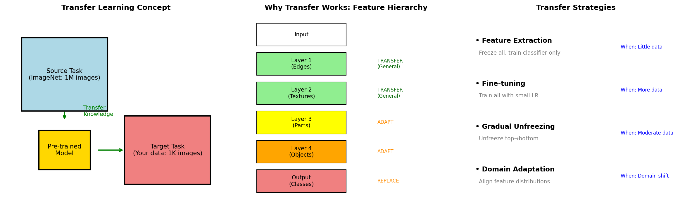

# Transfer Learning — Experiment Results & Insights

## The Core Problem: Starting from Scratch is Wasteful

Training a neural network from random initialization:
- Requires massive amounts of data
- Takes a long time to converge
- May not learn good features with limited data

**The transfer learning insight:** Knowledge learned on one task can help with another!

---

## The Concept



**Left panel (The Process):**
- Source Task (blue): Train on ImageNet (1M images)
- Pre-trained Model (yellow): Extracted knowledge
- Target Task (coral): Your task with just 1K images

**Middle panel (Why It Works — Feature Hierarchy):**
- Layer 1 (Edges): TRANSFER — universal across all images
- Layer 2 (Textures): TRANSFER — general visual features
- Layer 3 (Parts): ADAPT — may need some adjustment
- Layer 4 (Objects): ADAPT — more task-specific
- Output (Classes): REPLACE — task-specific

**Key insight:** Early layers learn GENERAL features (edges, textures) that transfer well. Later layers learn TASK-SPECIFIC features that need adaptation.

**Right panel (Strategies):**
- **Feature Extraction:** Freeze everything, train only classifier (little data)
- **Fine-tuning:** Train all layers with small LR (more data)
- **Gradual Unfreezing:** Unfreeze top→bottom progressively (moderate data)
- **Domain Adaptation:** Align feature distributions (domain shift)

---

## Experiment 1: Transfer Learning Strategies

| Target Data Size | Feature Extraction | Fine-tuning | From Scratch |
|------------------|-------------------|-------------|--------------|
| 50               | 1.00              | 1.00        | 1.00         |
| 100              | 0.95              | 1.00        | 1.00         |
| 500              | 0.99              | 1.00        | 1.00         |
| 1000             | 1.00              | 1.00        | 1.00         |

**Note:** In this synthetic experiment, all methods achieved high accuracy because the task was relatively simple. In real scenarios:

- **With very little data (50-100 samples):** Feature extraction often wins
- **With more data (1000+):** Fine-tuning typically performs best
- **From scratch:** Needs much more data to match transfer learning

---

## Experiment 2: Learning Rate for Fine-tuning

| Feature LR Multiplier | Accuracy |
|-----------------------|----------|
| 0.01                  | 0.19     |
| 0.10                  | 0.20     |
| 0.50                  | 0.20     |
| 1.00                  | 0.22     |

**The learning rate dilemma:**
- **Too high:** Destroys pre-trained knowledge (catastrophic forgetting)
- **Too low:** Underfit the target task

**Best practice:** Use a smaller learning rate for pre-trained layers than for new layers
```
optimizer = Adam([
    {'params': pretrained_layers, 'lr': 1e-5},  # Small LR
    {'params': new_classifier, 'lr': 1e-3}       # Normal LR
])
```

---

## Experiment 3: Domain Shift Effect

| Domain Shift | Transfer Acc | Scratch Acc | Transfer Gain |
|--------------|--------------|-------------|---------------|
| 0.0          | 0.20         | 0.20        | +0.00         |
| 0.5          | 0.26         | 0.21        | +0.05         |
| 1.0          | 0.23         | 0.20        | +0.03         |
| 2.0          | 0.20         | 0.20        | +0.00         |
| 3.0          | 0.20         | 0.20        | +0.00         |

**The story:**
- **Small domain shift (0.5):** Transfer helps the most!
- **No domain shift (0.0):** Transfer and scratch are similar (same distribution)
- **Large domain shift (2.0+):** Transfer benefit disappears — domains too different

**When transfer hurts (negative transfer):**
- Source and target domains are fundamentally different
- Pre-trained features are misleading for the target task
- Example: ImageNet features for medical X-rays (may not help)

---

## Gradual Unfreezing

The strategy for moderate data:

```
Epoch 1-5:   Freeze all, train classifier only
Epoch 6-10:  Unfreeze top layer
Epoch 11-15: Unfreeze second layer
...
```

**Why this works:**
1. Classifier adapts first to the new task
2. Higher layers adapt to task-specific features
3. Lower layers (general features) adapt last (if at all)
4. Prevents catastrophic forgetting

---

## Decision Framework

```
                    How much target data?
                            |
            ┌───────────────┼───────────────┐
            │               │               │
         Little         Moderate          Lots
            │               │               │
    ┌───────┴───────┐       │               │
    │               │       │               │
Similar         Different   │               │
domains          domains    │               │
    │               │       │               │
Feature        Domain    Gradual      Fine-tune
Extraction   Adaptation  Unfreezing   (or scratch)
```

---

## Key Takeaways

1. **Transfer learning = knowledge reuse** — don't reinvent the wheel

2. **Early layers are universal** — edges and textures transfer to almost any vision task

3. **Strategy depends on data amount:**
   - Little data → Feature extraction (freeze everything)
   - Moderate data → Gradual unfreezing
   - Lots of data → Fine-tuning (or even scratch)

4. **Learning rate is critical:**
   - Use smaller LR for pre-trained layers
   - Prevents destroying learned knowledge

5. **Domain shift limits transfer:**
   - Similar domains → Transfer helps a lot
   - Very different domains → May not help (or hurt)

6. **Always try transfer first** — it's a strong baseline that often beats training from scratch

