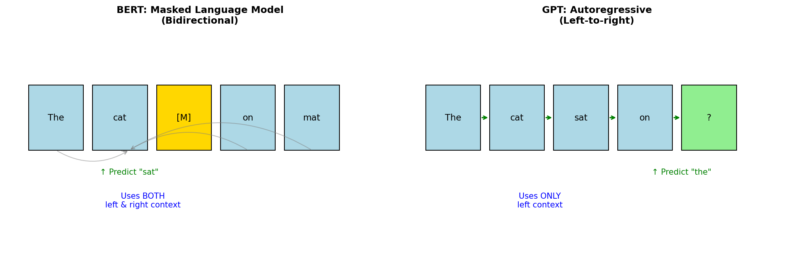

# Self-Supervised Learning — Experiment Results & Insights

## The Core Problem: Labels are Expensive

Supervised learning needs labeled data:
- Human annotation is slow and costly
- Some domains lack experts for labeling
- We have VASTLY more unlabeled data than labeled

**The self-supervised insight:** Create supervision from the data itself!

---

## The Two Paradigms: BERT vs GPT



**BERT (Masked Language Model):**
- Input: "The cat [M] on mat"
- Task: Predict the masked word → "sat"
- Uses BOTH left and right context (bidirectional)
- Good for: Understanding, classification, QA

**GPT (Autoregressive):**
- Input: "The cat sat on"
- Task: Predict the next word → "the"
- Uses ONLY left context (left-to-right)
- Good for: Generation, completion, conversation

**The fundamental trade-off:**
- BERT: Better understanding (sees full context)
- GPT: Better generation (natural left-to-right)

---

## Experiment 1: Masking Probability Effect

| Mask Probability | Loss |
|------------------|------|
| 0.05             | 2.77 |
| 0.15             | 4.38 |
| 0.30             | 4.60 |
| 0.50             | 4.62 |

**The story:**
- **Low masking (5%):** Easy task → low loss, but less learning signal
- **High masking (50%):** Hard task → high loss, but might be too hard
- **Sweet spot (15%):** BERT's original choice — enough challenge without being impossible

**Why 15%?**
- Enough tokens masked to provide learning signal
- Enough context remaining to make prediction possible
- Empirically validated across many experiments

---

## Experiment 2: Pretext Tasks for Vision

**Rotation Prediction:** Accuracy = 0.29
- Rotate image by 0°, 90°, 180°, 270°
- Predict which rotation was applied
- Forces model to understand object orientation

**Jigsaw Puzzle:** 100 permutations
- Divide image into patches
- Shuffle patches
- Predict the original arrangement
- Forces model to understand spatial relationships

**Context Prediction:** 64 training pairs
- Given a patch, predict neighboring patch
- Forces model to understand local structure

---

## Experiment 3: Representation Quality

| Metric | Value |
|--------|-------|
| Intra-cluster distance | 0.141 |
| Inter-cluster distance | 0.129 |
| Ratio (higher = better) | 0.91 |

**What this measures:**
- **Intra-cluster:** How tight are examples from the same class?
- **Inter-cluster:** How far apart are different classes?
- **Ratio < 1:** Classes overlap — not ideal for downstream tasks

**Good self-supervised representations:**
- Cluster same-class examples together (small intra-cluster)
- Separate different classes (large inter-cluster)
- Transfer well to downstream tasks

---

## The Major Approaches

### 1. Masked Prediction (BERT, MAE)
```
Input:  "The [MASK] sat on the [MASK]"
Target: Predict "cat" and "mat"
```
- Randomly mask parts of input
- Predict the masked parts
- Works for: Language (BERT), Images (MAE), Audio

### 2. Autoregressive (GPT)
```
Input:  "The cat sat"
Target: Predict "on"
```
- Predict next token given previous tokens
- Natural for generation
- Works for: Language (GPT), Music, Code

### 3. Contrastive (SimCLR, CLIP)
```
Same image, different augmentations → similar embeddings
Different images → different embeddings
```
- Learn by comparing positive and negative pairs
- No reconstruction needed
- Works for: Images, Vision-Language

### 4. Pretext Tasks (Rotation, Jigsaw)
```
Input:  Rotated image
Target: Rotation angle (0°, 90°, 180°, 270°)
```
- Design tasks that require understanding the data
- No labels needed — task is self-generated
- Works for: Images (older approaches)

---

## The Evolution

```
2013: Word2Vec (word embeddings)
        ↓
2018: BERT (bidirectional language understanding)
        ↓
2018: GPT (autoregressive language generation)
        ↓
2020: SimCLR/MoCo (contrastive visual learning)
        ↓
2021: CLIP (vision-language alignment)
        ↓
2022: MAE (masked autoencoders for vision)
        ↓
2023+: Foundation models (GPT-4, LLaMA, etc.)
```

---

## Why Self-Supervised Representations Transfer

The pretext task forces the model to learn:
1. **Structure:** How elements relate to each other
2. **Semantics:** What makes things similar/different
3. **Context:** How parts fit into the whole

These are exactly what downstream tasks need!

**Example:** Predicting masked words requires:
- Understanding grammar (structure)
- Understanding meaning (semantics)
- Understanding context (context)

→ All useful for classification, QA, etc.

---

## Key Takeaways

1. **Self-supervision = free labels from data structure**
   - No human annotation needed
   - Unlimited training signal

2. **BERT vs GPT is the fundamental trade-off:**
   - BERT: Bidirectional → better understanding
   - GPT: Autoregressive → better generation

3. **Masking probability matters:**
   - 15% is the sweet spot for BERT-style models
   - Too low → easy task, little learning
   - Too high → impossible task, no learning

4. **Pretext tasks must require understanding:**
   - Trivial tasks → trivial features
   - Hard tasks → meaningful features

5. **This is the foundation of modern AI:**
   - GPT-4 = autoregressive pre-training + fine-tuning
   - BERT = masked pre-training → understanding
   - CLIP = contrastive vision-language → multimodal

6. **The future is self-supervised:**
   - More unlabeled data available
   - Better representations from pretext tasks
   - Less reliance on expensive human labels

