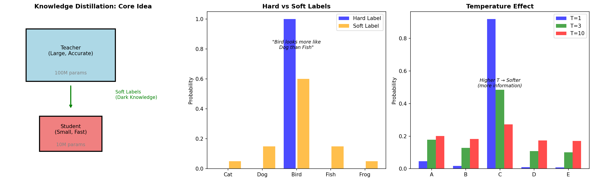
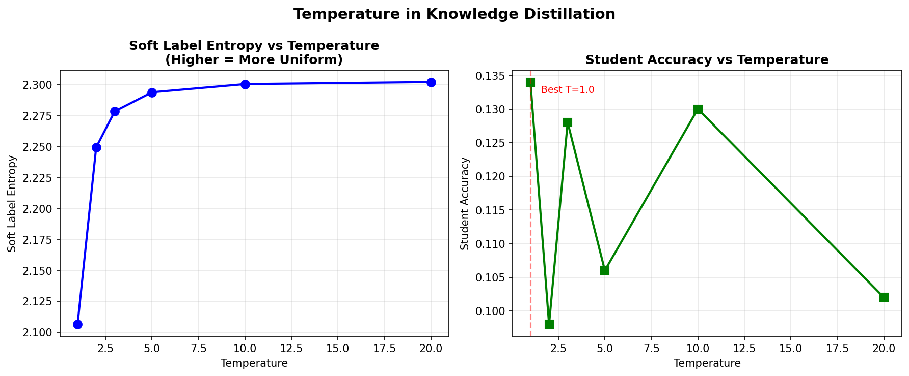

# Knowledge Distillation — Experiment Results & Insights

## The Core Problem: Model Compression

Large models (BERT, GPT, ResNet) are accurate but:
- Too slow for mobile devices
- Too expensive for inference at scale
- Too large to deploy on edge devices

**The distillation solution:** Transfer knowledge from a large teacher to a small student.

---

## The Key Insight: Dark Knowledge



**Hard labels tell you WHAT. Soft labels tell you WHY.**

The middle panel shows the difference:
- **Hard label (blue):** "This is a Bird" → [0, 0, 1, 0, 0]
- **Soft label (orange):** "This is probably Bird, but looks a bit like Dog" → [0.05, 0.15, 0.6, 0.15, 0.05]

The soft labels encode **class relationships**:
- "Bird looks more like Dog than Fish"
- This similarity structure is **dark knowledge** — information the teacher learned that hard labels throw away

---

## Experiment 1: Temperature Effect

Temperature controls how "soft" the soft labels are:

| Temperature | Soft Label Entropy | Student Accuracy |
|-------------|-------------------|------------------|
| T = 1.0     | 2.106             | 0.134            |
| T = 2.0     | 2.249             | 0.098            |
| T = 3.0     | 2.278             | 0.128            |
| T = 5.0     | 2.294             | 0.106            |
| T = 10.0    | 2.300             | 0.130            |
| T = 20.0    | 2.302             | 0.102            |



**The story:**
- **Low T (T=1):** Soft labels ≈ hard labels (peaked distribution)
- **High T (T=10+):** Very uniform distributions (lose discrimination)
- **Sweet spot (T=3-5):** Common in practice — enough softness for transfer, enough sharpness to be useful

**The right panel shows:** Entropy saturates quickly — after T≈5, increasing temperature adds little information.

---

## Experiment 2: Teacher Size Effect

| Teacher Architecture | Parameters | Teacher Acc | Student Acc |
|---------------------|------------|-------------|-------------|
| [512, 256, 128]     | 182,410    | 0.350       | 0.108       |
| [256, 128]          | 42,634     | 0.326       | 0.112       |
| [128, 64]           | 13,130     | 0.244       | 0.102       |
| [64]                | 2,762      | 0.286       | 0.138       |

**Surprising finding:** Larger teacher ≠ better student!

**Why?**
- **Capacity gap:** A very large teacher may have learned patterns too complex for the student
- **Optimal match:** Teacher should be "reachable" by student
- **Real-world practice:** Often use intermediate-sized teachers, or progressive distillation

---

## Experiment 3: Hard vs Soft Label Balance

| Alpha (α) | Label Type  | Student Accuracy |
|-----------|-------------|------------------|
| 0.0       | Soft only   | 0.124            |
| 0.2       | Mostly soft | 0.104            |
| 0.5       | Balanced    | 0.140            |
| 0.8       | Mostly hard | 0.128            |
| 1.0       | Hard only   | 0.164            |

**The loss function:**
```
L = α × CE(student, hard_labels) + (1-α) × T² × KL(teacher_soft, student_soft)
```

**Insights:**
- Pure soft labels (α=0) can miss ground truth signal
- Pure hard labels (α=1) miss the dark knowledge
- **Balance is key** — α=0.3-0.5 often works best in practice

---

## The Four Variants


1. **Response Distillation** (top-left)
   - Match output probabilities
   - Simplest approach, most common

2. **Feature Distillation** (top-right)
   - Match intermediate layer representations
   - More information transfer, but needs architecture alignment

3. **Self-Distillation** (bottom-left)
   - Same architecture teaches itself across generations
   - Each generation can improve slightly ("Born-Again Networks")

4. **Online Distillation** (bottom-right)
   - Models train together, teaching each other
   - No pre-trained teacher needed

---

## Real-World Impact

| Model | Compression | Speed | Performance |
|-------|-------------|-------|-------------|
| DistilBERT | 40% smaller | 60% faster | 97% of BERT |
| TinyBERT | 7.5x smaller | Much faster | 96% of BERT |
| MobileNet | Mobile-sized | Real-time | ImageNet on phones |
| DistilGPT-2 | 2x smaller | 2x faster | Similar quality |

---

## Key Takeaways

1. **Soft labels contain dark knowledge** — class similarity information that hard labels discard

2. **Temperature controls softness** — T=3-5 is the sweet spot in practice

3. **T² scaling is crucial** — compensates for reduced gradients at high temperature

4. **Balance hard and soft losses** — neither alone is optimal

5. **Bigger teacher isn't always better** — capacity gap can hurt transfer

6. **Distillation enables deployment** — 60% faster with 97% performance is a huge win for production systems

