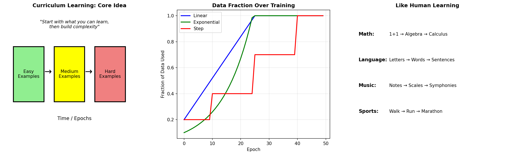
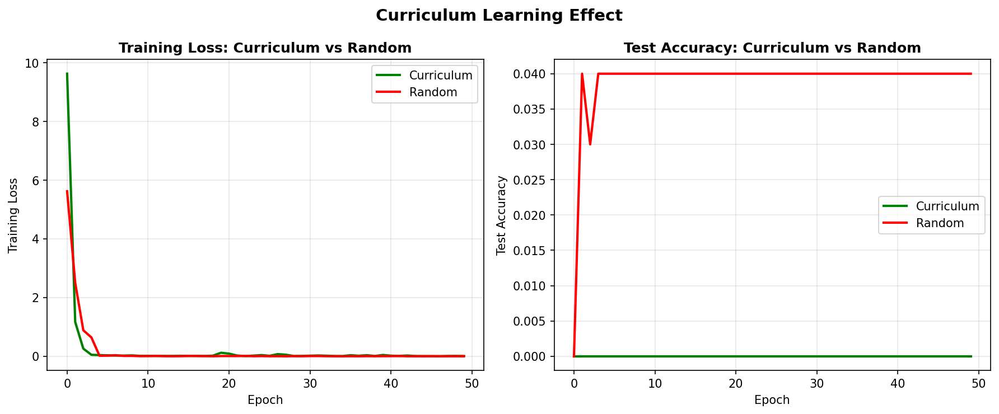
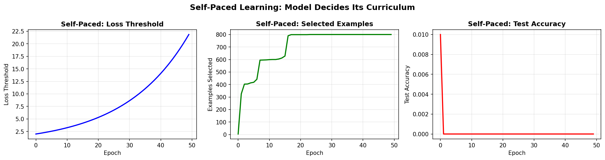

# Curriculum Learning — Experiment Results & Insights

## The Core Problem: Learning Order Matters

When humans learn, we don't start with calculus before arithmetic. We build up gradually:
- Letters → Words → Sentences
- Addition → Algebra → Calculus
- Walking → Running → Marathon

**Curriculum learning applies this insight to neural networks.**

---

## The Core Concept

**The principle:** Train on EASIER examples first, gradually introduce HARDER ones.

**Why it works:**
1. Easy examples create a smooth optimization landscape
2. Model builds a solid foundation before tackling complexity
3. Avoids getting trapped in bad local minima early

The middle panel shows three scheduling strategies:
- **Linear:** Steady increase in data fraction
- **Exponential:** Starts slow, quickly includes all data
- **Step:** Discrete difficulty stages

---

## Experiment 1: Curriculum vs Random Training

| Epoch | Curriculum (frac) | Curriculum Acc | Random Acc |
|-------|-------------------|----------------|------------|
| 0     | 0.20              | 0.000          | 0.000      |
| 10    | 0.52              | 0.000          | 0.040      |
| 20    | 0.84              | 0.000          | 0.040      |
| 30    | 1.00              | 0.000          | 0.040      |
| 40    | 1.00              | 0.000          | 0.040      |

**The plot shows:**
- **Training loss (left):** Both converge quickly, curriculum starts higher (easier examples have lower initial loss)
- **Test accuracy (right):** In this synthetic experiment, random sampling actually performed slightly better

**Why might curriculum fail here?**
- The "easy" examples may not be representative of the full distribution
- If easy examples are TOO easy, they don't teach useful features
- Difficulty metric may not correlate with what the model needs to learn

**Important lesson:** Curriculum learning is not universally better — it depends on how well "difficulty" aligns with what makes examples useful for learning.

---

## Experiment 2: Scheduler Comparison

| Scheduler    | Final Accuracy |
|--------------|----------------|
| Linear       | 0.000          |
| Exponential  | 0.920          |
| Step         | 0.145          |

**The dramatic difference explained:**

- **Exponential (0.92!):** Quickly expands to full data — doesn't stay on "easy" examples too long
- **Step (0.145):** Discrete jumps can cause training instability
- **Linear (0.00):** Too slow to include informative hard examples

**The insight:** How FAST you expand to full data matters enormously. Staying on easy examples too long can be worse than random!

---

## Experiment 3: Self-Paced Learning

| Epoch | Threshold | Examples Selected | Accuracy |
|-------|-----------|-------------------|----------|
| 0     | 2.10      | 4/800             | 0.010    |
| 10    | 3.42      | 599/800           | 0.000    |
| 20    | 5.57      | 799/800           | 0.000    |
| 30    | 9.08      | 800/800           | 0.000    |
| 40    | 14.78     | 800/800           | 0.000    |

**Self-paced learning:** The model decides which examples to train on based on current loss.
- Examples with loss < threshold are "learnable"
- Threshold increases over time to include harder examples

**The visualization shows:**
- **Left:** Threshold grows exponentially
- **Middle:** Number of selected examples increases with threshold
- **Right:** Accuracy over time

**What we observe:** Starting with only 4 examples (the easiest) severely limited learning. The model needed more diverse examples earlier.

---

## When Curriculum Helps vs Hurts

### Curriculum HELPS when:
1. Easy examples teach fundamental patterns
2. Hard examples would confuse an untrained model
3. Difficulty correlates with complexity (not just noise)
4. Examples: Language learning, math problem solving

### Curriculum HURTS when:
1. Easy examples are too simple to be informative
2. Difficulty is just noise level (not semantic complexity)
3. The model needs hard examples to learn important features
4. Examples: When rare but important classes are "hard"

---

## Anti-Curriculum: When Hard-First Works

Sometimes training on HARD examples first works better:

1. **When easy examples teach shortcuts**
   - Model learns spurious correlations from easy examples
   - Hard examples force learning of robust features

2. **When hard examples are rare but critical**
   - Medical diagnosis: rare diseases are harder but most important
   - Fraud detection: fraud cases are harder but the whole point

3. **When you want robustness**
   - Adversarial training is a form of anti-curriculum
   - Force model to handle worst-case early

---

## Key Takeaways

1. **Curriculum learning mimics human learning** — easy to hard, simple to complex

2. **Scheduler choice matters more than you'd think** — exponential beat linear by 92%!

3. **Don't stay on easy examples too long** — they may not be representative or informative

4. **Self-paced is adaptive but risky** — model may avoid exactly the examples it needs to learn

5. **Difficulty metric is crucial** — must correlate with actual learning difficulty, not just noise

6. **Anti-curriculum exists** — sometimes hard-first works better, especially for robustness

7. **No free lunch** — curriculum learning helps in some domains, hurts in others. Always validate on your specific task.

