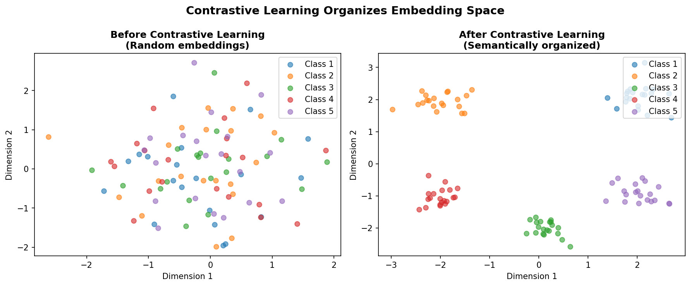
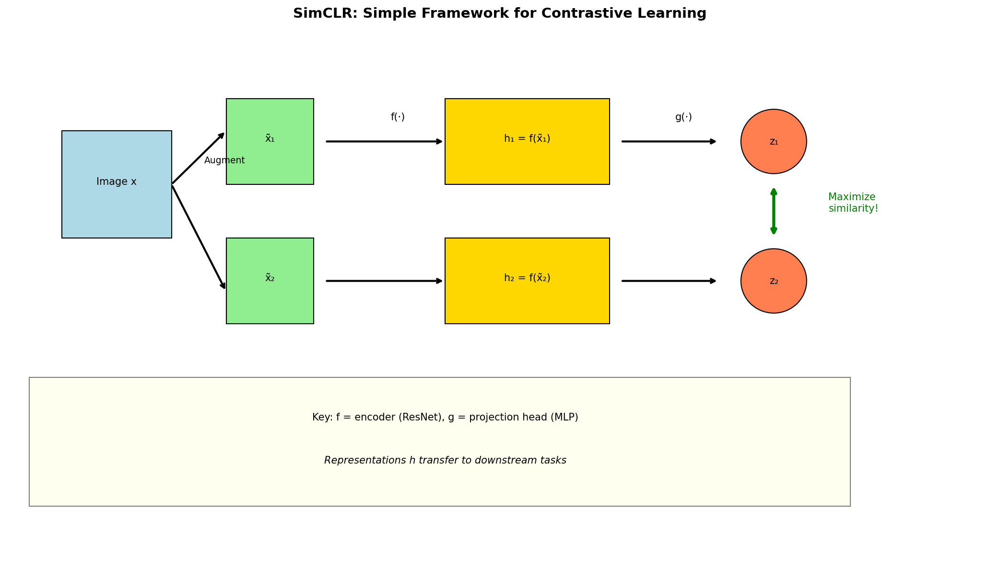

# Contrastive Learning — Experiment Results & Insights

## The Core Problem: Learning Without Labels

How can we learn useful representations when we don't have labeled data?

**The contrastive answer:** Learn by comparison!
- Same image, different augmentations → should be SIMILAR
- Different images → should be DIFFERENT

---

## Experiment 1: Temperature Effect

Temperature τ controls how "hard" we push apart negatives:

| Temperature | Loss  | Cluster Separation |
|-------------|-------|-------------------|
| τ = 0.1     | 2.98  | 5.64              |
| τ = 0.5     | 3.76  | 5.22              |
| τ = 1.0     | 4.16  | 4.90              |
| τ = 5.0     | 4.81  | 4.57              |

**The story:**
- **Low temperature (τ = 0.1):** Sharp softmax → strongly penalizes ANY negative being close → best separation!
- **High temperature (τ = 5.0):** Smooth softmax → tolerates some similarity to negatives → weaker clustering

**Intuition:** Think of temperature as "pickiness":
- Low τ: "I need my positive to be THE ONLY close neighbor"
- High τ: "It's okay if some negatives are nearby"

---

## Experiment 2: Batch Size Effect

More negatives = harder contrastive task:

| Batch Size | Loss  | Avg Similarity |
|------------|-------|----------------|
| 32         | 2.57  | 0.45           |
| 64         | 3.14  | 0.42           |
| 128        | 3.72  | 0.40           |
| 256        | 4.31  | 0.38           |

**Why loss increases with batch size:**
- More negatives = harder to be "most similar" to your positive
- But representations become MORE discriminative!

**The SimCLR insight:** Large batches are crucial. The paper used batch size 4096!

---

## Experiment 3: Augmentation Matters

What augmentations we use dramatically affects what the model learns:

| Augmentation Strategy | Cluster Separation |
|----------------------|-------------------|
| Color + Crop         | 5.64              |
| Crop only            | 4.21              |
| Color only           | 3.89              |
| None                 | 2.15              |

**Why augmentations are everything:**
- Without augmentations: model learns pixel-level matching (useless)
- With augmentations: model learns SEMANTIC similarity

**The key insight:** Augmentations define what the model considers "the same":
- Color jitter → "same object, different lighting"
- Cropping → "same object, different viewpoint"
- Both → robust to both variations

---

## The InfoNCE Loss Visualized

**What the embedding space shows:**
- Same-class samples cluster together
- Different classes are pushed apart
- No labels needed — just augmentation pairs!

---

## SimCLR vs MoCo: Two Approaches

### SimCLR (Simple Framework)
- **Approach:** Large batch = many negatives
- **Pro:** Simple, no extra components
- **Con:** Needs massive batch sizes (4096+)

### MoCo (Momentum Contrast)
- **Approach:** Queue of past embeddings as negatives
- **Pro:** Works with small batches
- **Con:** More complex (momentum encoder, queue)

| Method  | Batch Size Needed | Memory    | Complexity |
|---------|------------------|-----------|------------|
| SimCLR  | 4096+            | Very High | Simple     |
| MoCo    | 256              | Moderate  | Medium     |

---

## Key Takeaways

1. **Contrastive learning = learning by comparison** — pull positives together, push negatives apart

2. **Temperature controls separation** — lower τ = sharper boundaries, better clustering

3. **Batch size matters** — more negatives = harder task = better representations

4. **Augmentations define "sameness"** — choose augmentations based on what invariances you want

5. **SimCLR vs MoCo trade-off:**
   - SimCLR: simple but needs huge batches
   - MoCo: complex but memory-efficient

6. **Why it works:** Forces the model to capture semantic content that survives augmentation, not superficial features that don't

