# Time Series Forecasting — An Intuition-First Guide

> **Paradigm: TEMPORAL STRUCTURE**
> *"The past contains information about the future"*

This module provides a comprehensive, visual journey through time series forecasting. Each section builds on the previous one, taking you from raw data to making predictions—with intuition at every step.

---

## Table of Contents

1. [The Anatomy of a Time Series](#1-the-anatomy-of-a-time-series)
2. [The Memory Problem](#2-the-memory-problem)
3. [Exponential Smoothing: The Forgetting Curve](#3-exponential-smoothing-the-forgetting-curve)
4. [ARIMA: Predict from Past, Fix Mistakes](#4-arima-predict-from-past-fix-mistakes)
5. [The Forecasting Showdown](#5-the-forecasting-showdown)
6. [Statistical vs Deep Learning](#6-statistical-vs-deep-learning)
7. [Quick Reference](#7-quick-reference)

---

## 1. The Anatomy of a Time Series

**File:** `01_time_series_fundamentals.py`

### The Core Idea

Before you can forecast, you must understand what you're looking at. Every time series can be decomposed into:

```
Time Series = TREND + SEASONALITY + RESIDUAL
            = PREDICTABLE PART + UNPREDICTABLE PART
```

### Key Visualization: The Decomposition

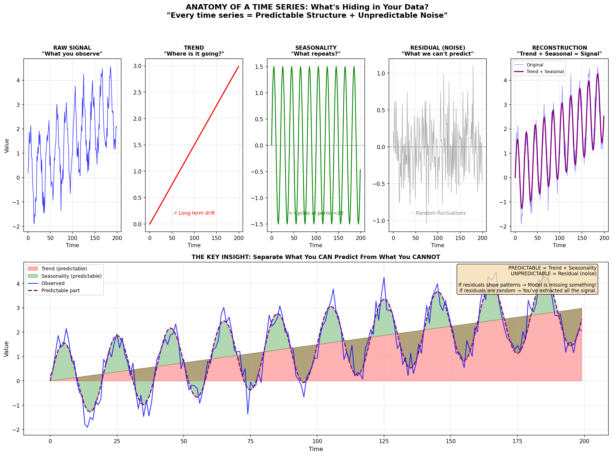

**What This Shows:**
- **Raw Signal**: What you observe
- **Trend**: Where is it going? (long-term drift)
- **Seasonality**: What repeats? (cycles at fixed intervals)
- **Residual**: What we can't predict (hopefully just noise)

### The Key Insight

> **Your model's job is to maximize the predictable part.**
>
> - If residuals show patterns → Your model is missing something!
> - If residuals are white noise → You've extracted all the signal.

### Stationarity: The Critical Assumption

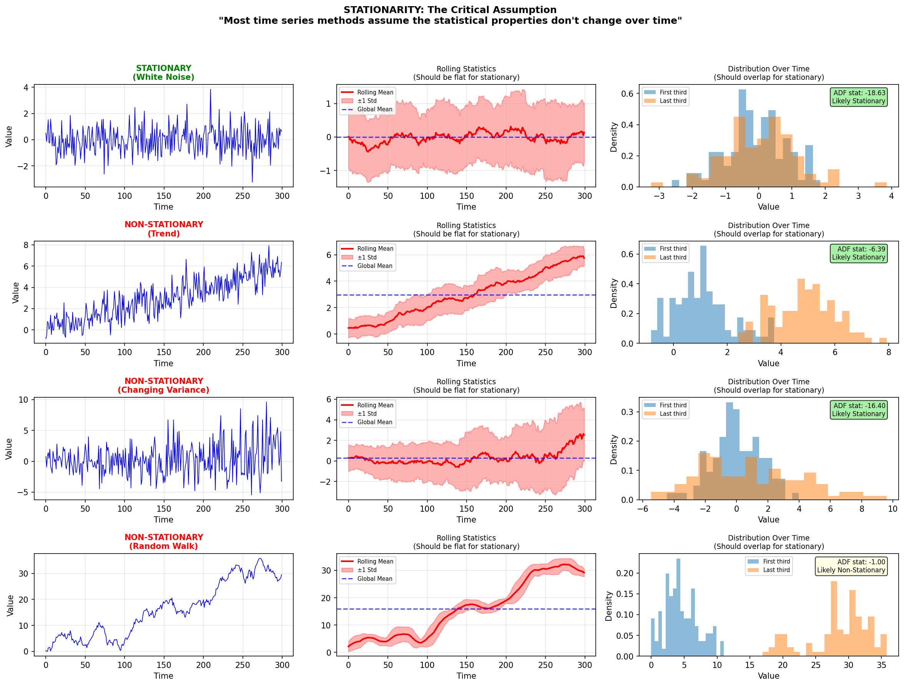

Most time series methods **assume stationarity**—that statistical properties don't change over time:
- Constant mean
- Constant variance
- Autocovariance depends only on lag, not time

**If your data isn't stationary, you must transform it first!**

### Differencing: The Cure for Non-Stationarity

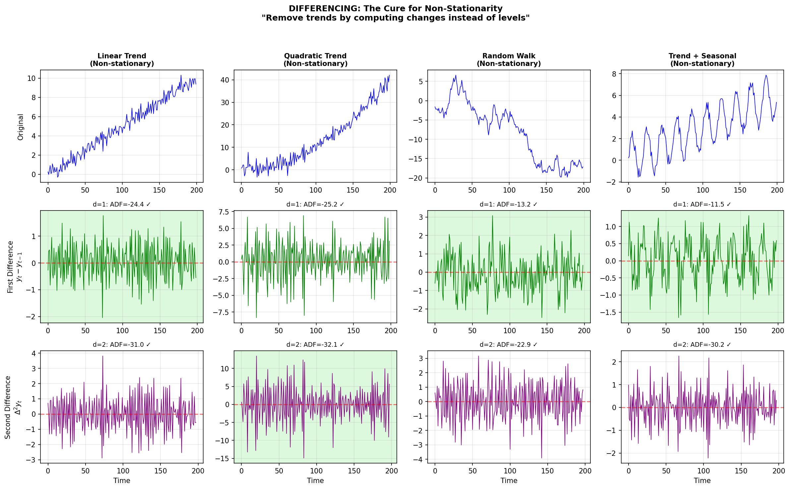

```python
# First difference removes linear trend
y_diff = y[1:] - y[:-1]

# Second difference removes quadratic trend
y_diff2 = y_diff[1:] - y_diff[:-1]
```

---

## 2. The Memory Problem

**File:** `02_autocorrelation.py`

### The Fundamental Question

> **"How far back should you look to predict the future?"**

This is THE central question in time series forecasting. Look back too little, you miss information. Look back too much, you're fitting noise.

### Key Visualization: The Memory Problem

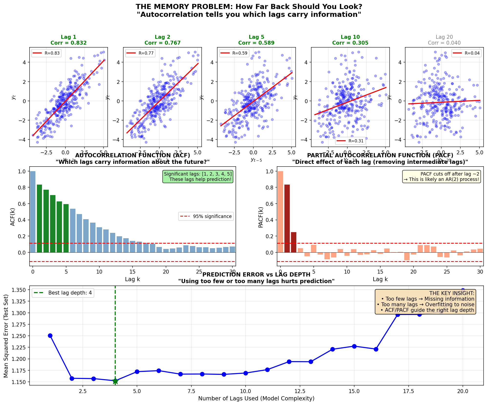

**What This Shows:**
- **Top Row**: Scatter plots of y_t vs y_{t-k} for different lags
- **Middle**: ACF and PACF revealing which lags carry information
- **Bottom**: Prediction error vs lag depth (finding the sweet spot)

### Autocorrelation Function (ACF)

```
ACF(k) = Corr(y_t, y_{t-k})
```

**"How much does knowing y at time t-k tell us about y at time t?"**

### Partial Autocorrelation Function (PACF)

```
PACF(k) = Corr(y_t, y_{t-k} | y_{t-1}, ..., y_{t-k+1})
```

**"What is the DIRECT effect of lag k, removing intermediate effects?"**

### ACF/PACF Patterns for Model Selection

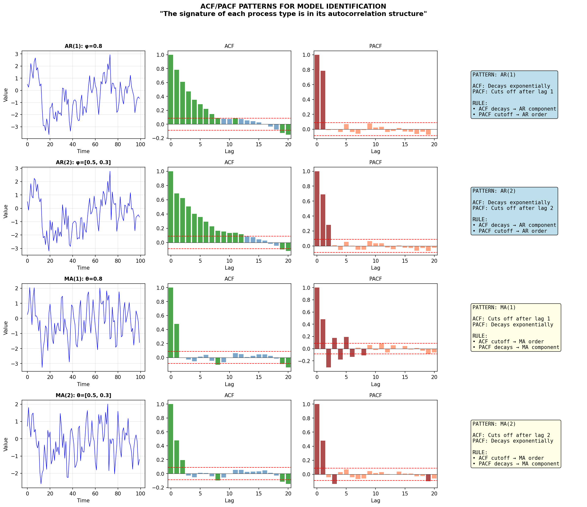

| Pattern | ACF | PACF | Model |
|---------|-----|------|-------|
| AR(p) | Decays | Cuts off at p | Use PACF to find p |
| MA(q) | Cuts off at q | Decays | Use ACF to find q |
| ARMA | Both decay | Both decay | Use information criteria |

### Detecting Seasonality

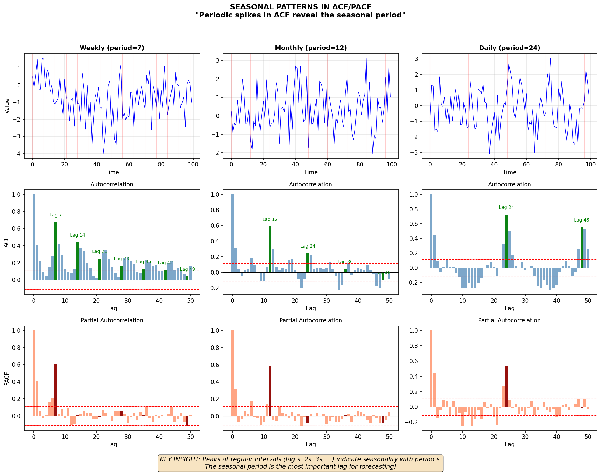

**Periodic spikes in ACF reveal the seasonal period!**

---

## 3. Exponential Smoothing: The Forgetting Curve

**File:** `03_exponential_smoothing.py`

### The Core Idea

> **"Recent observations matter more than distant ones."**

Weights decay exponentially:
```
weight(k) = α × (1-α)^k
```

### Key Visualization: The Forgetting Curve

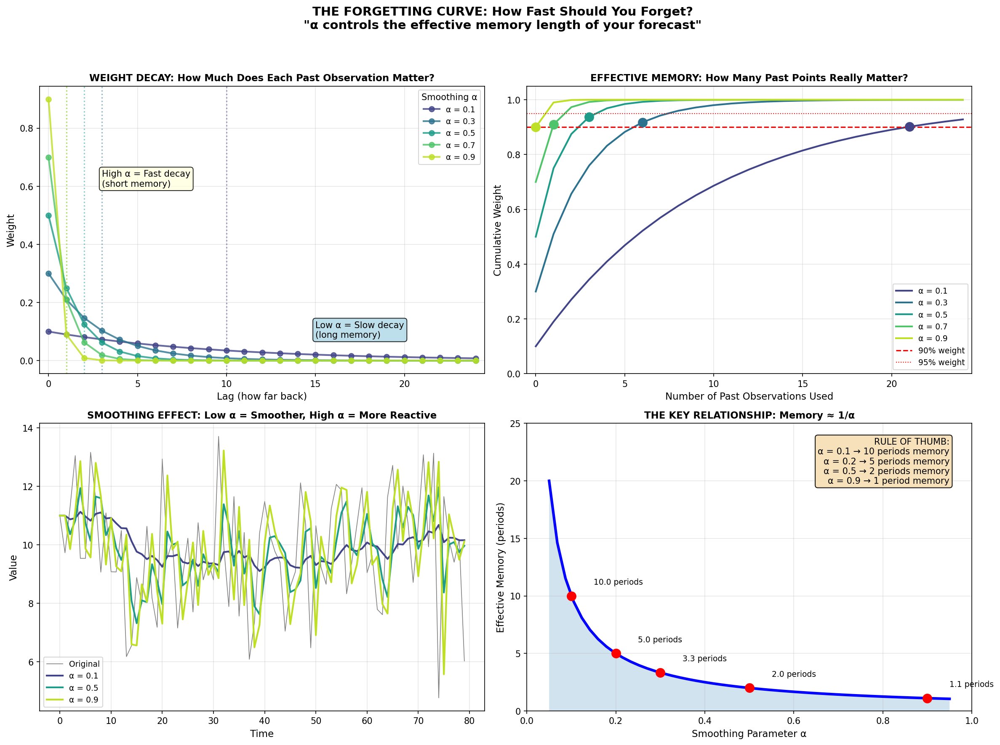

**THE critical parameter: α (smoothing constant)**

| α value | Memory | Behavior |
|---------|--------|----------|
| α → 0 | Long (~1/α periods) | Smooth but slow to react |
| α → 1 | Short (~1 period) | Reactive but noisy |

### The Rule of Thumb

```
Effective Memory ≈ 1/α

α = 0.1 → ~10 periods memory
α = 0.2 → ~5 periods memory
α = 0.5 → ~2 periods memory
```

### The Bias-Variance Tradeoff

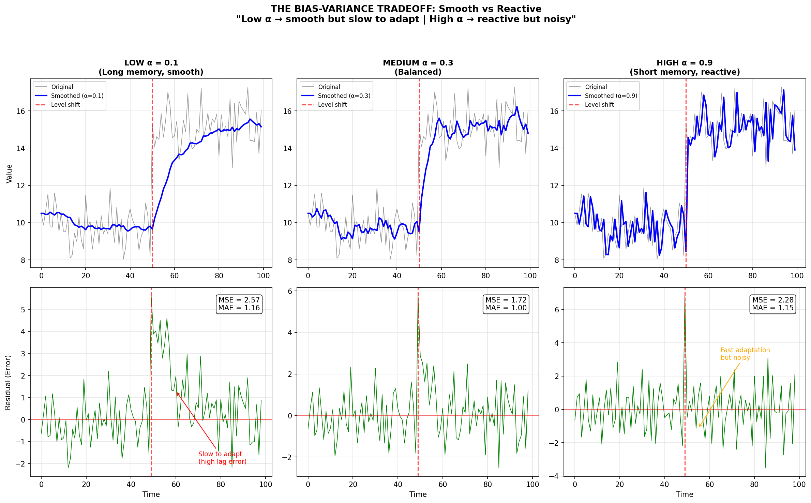

- **Low α**: Smooth but slow to adapt to changes
- **High α**: Reactive but noisy

### The Three Methods

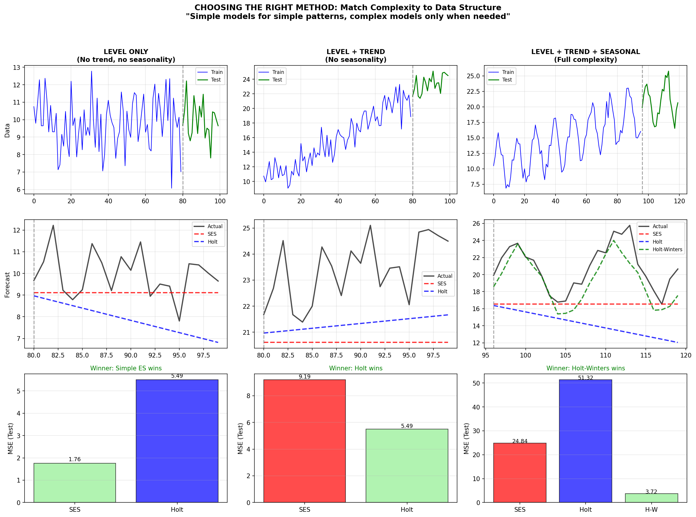

| Data Pattern | Best Method |
|--------------|-------------|
| Level only | Simple Exponential Smoothing (SES) |
| Level + Trend | Holt's Linear Method |
| Level + Trend + Seasonal | Holt-Winters |

---

## 4. ARIMA: Predict from Past, Fix Mistakes

**File:** `04_arima.py`

### The Three Components

**ARIMA(p, d, q)** combines three simple ideas:

#### AR (AutoRegressive): "Predict from your own past"

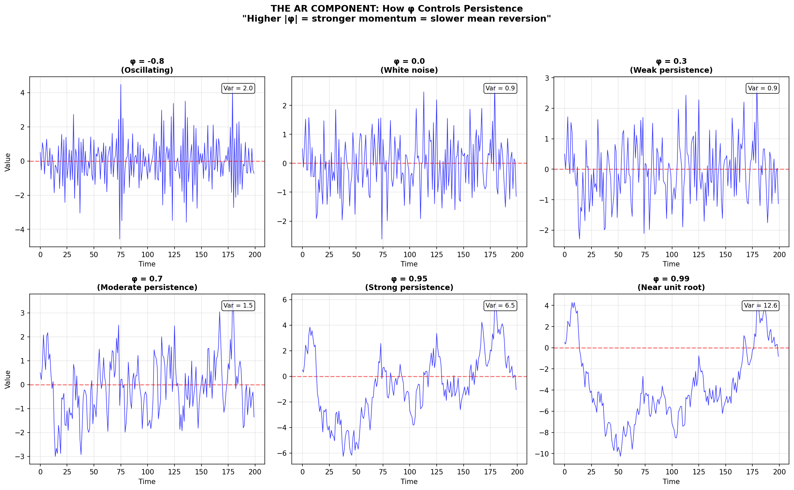

```
y_t = φ₁y_{t-1} + φ₂y_{t-2} + ... + φₚy_{t-p} + ε_t
```

**φ controls persistence:**
- |φ| close to 1 → Strong momentum (what goes up stays up)
- |φ| close to 0 → Quick mean reversion

#### I (Integrated): "Remove the trend first"

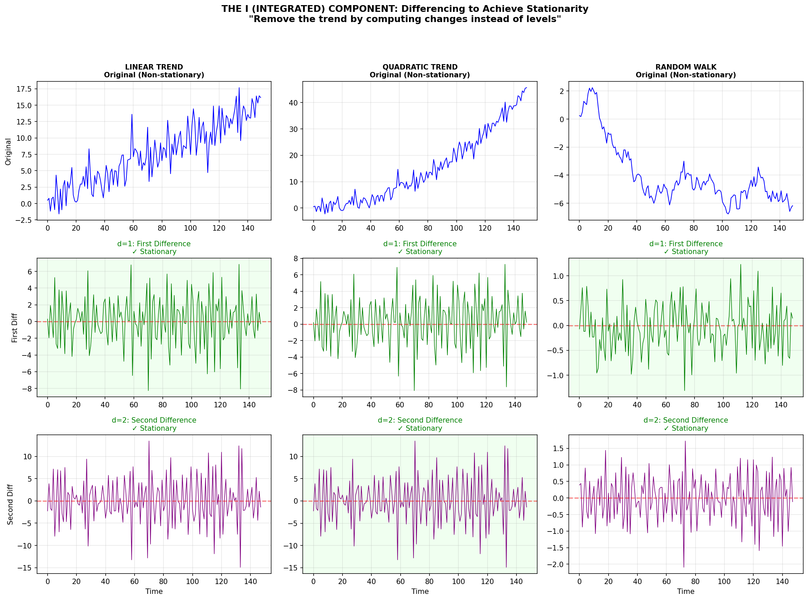

```
y'_t = y_t - y_{t-1}  (d=1, removes linear trend)
y''_t = y'_t - y'_{t-1}  (d=2, removes quadratic trend)
```

#### MA (Moving Average): "Learn from your mistakes"

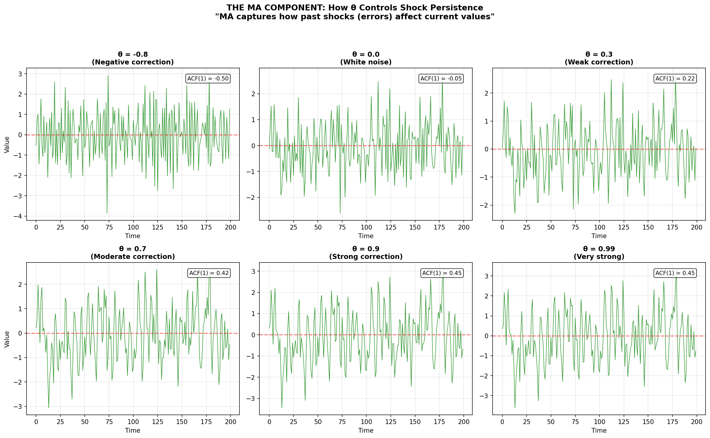

```
y_t = ε_t + θ₁ε_{t-1} + θ₂ε_{t-2} + ... + θqε_{t-q}
```

**"If I was wrong yesterday, adjust today."**

### Full ARIMA Dissection

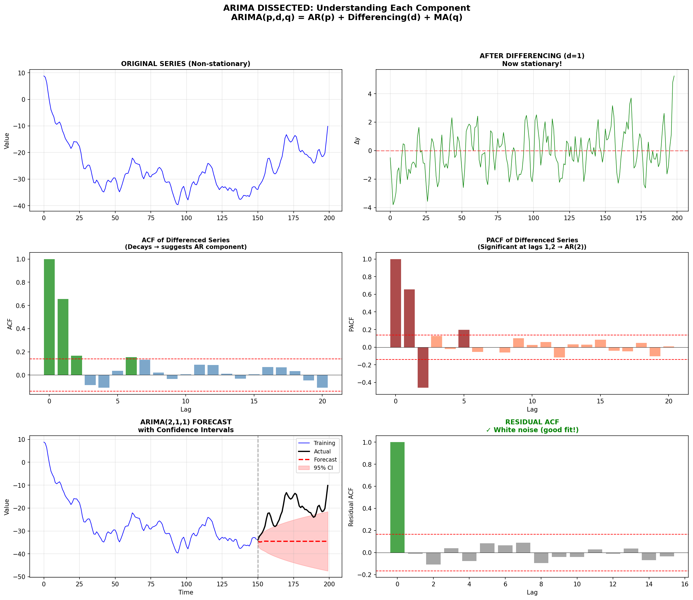

### The Box-Jenkins Method

1. **Identify**: Look at ACF/PACF to guess (p, d, q)
2. **Estimate**: Fit parameters using maximum likelihood
3. **Diagnose**: Check residuals (should be white noise!)
4. **Forecast**: Generate predictions with confidence intervals

### The Cone of Uncertainty

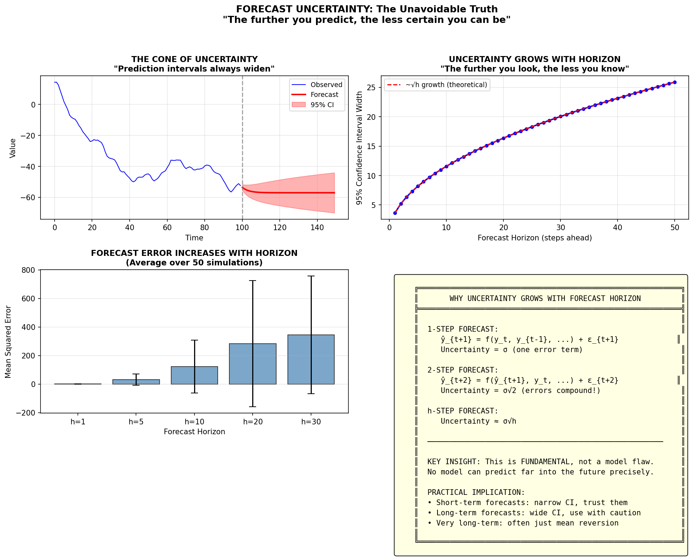

> **Critical Truth: Prediction intervals ALWAYS widen with horizon.**
>
> This is fundamental, not a model flaw!

```
Uncertainty at horizon h ≈ σ√h
```

---

## 5. The Forecasting Showdown

**File:** `05_forecasting_showdown.py`

### The Big Question

> **"Which method should I use?"**

**Answer: It depends on your data!**

### The Showdown Across Scenarios

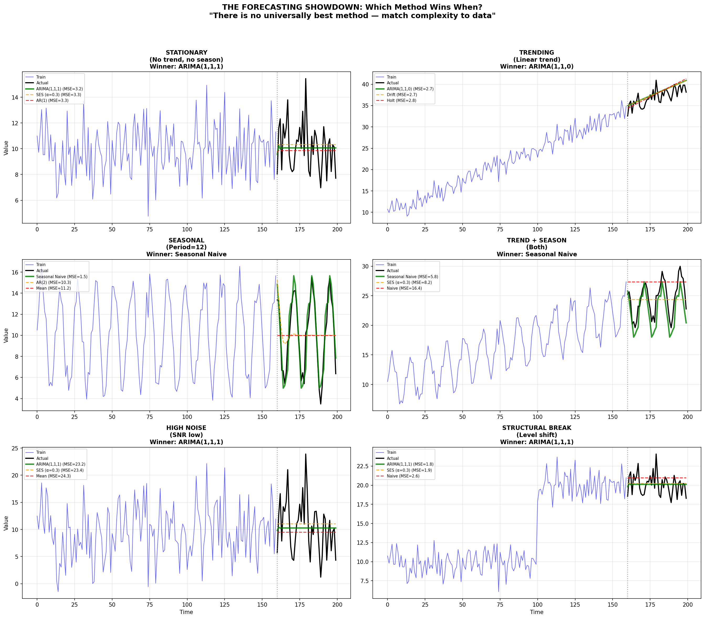

### Failure Modes: Where Each Method Breaks

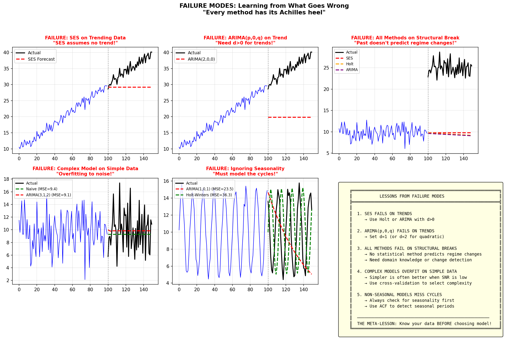

**Critical Lessons:**

| Failure | Why | Solution |
|---------|-----|----------|
| SES on trending data | SES assumes no trend | Use Holt or ARIMA(p,d>0,q) |
| ARIMA(p,0,q) on trend | Needs differencing | Set d=1 |
| All methods on structural break | Past doesn't predict regime changes | Need change detection |
| Complex model on simple data | Overfitting to noise | Use simpler methods |
| Non-seasonal on seasonal | Missing cycles | Use Holt-Winters or SARIMA |

### The Decision Tree

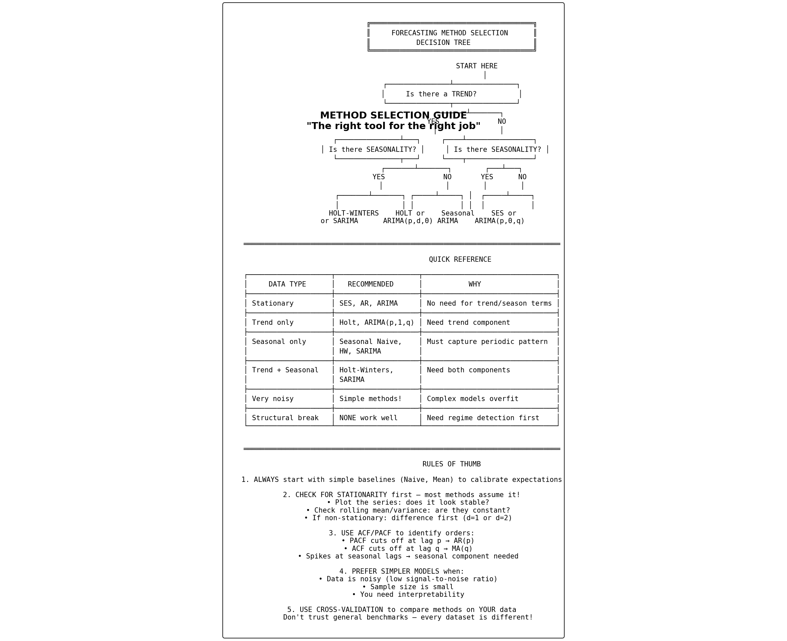

---

## 6. Statistical vs Deep Learning

**File:** `06_statistical_vs_deep_learning.py`

### The Surprising Truth

> **For univariate time series with < 1000 observations, STATISTICAL METHODS OFTEN WIN!**

### Why?

1. Deep learning needs **LOTS of data** to learn patterns
2. ARIMA/ES **encode domain knowledge** directly
3. Deep models can **overfit** on small samples
4. Statistical methods are **faster and interpretable**

### Head-to-Head Comparison

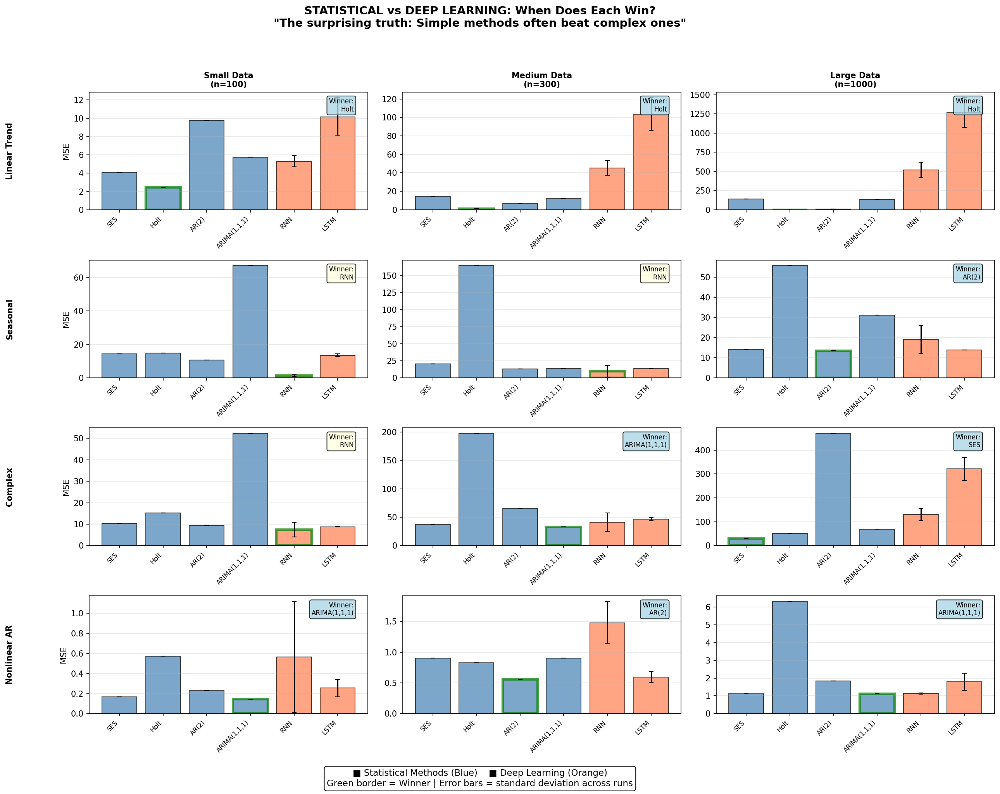

### How Sample Size Affects the Winner

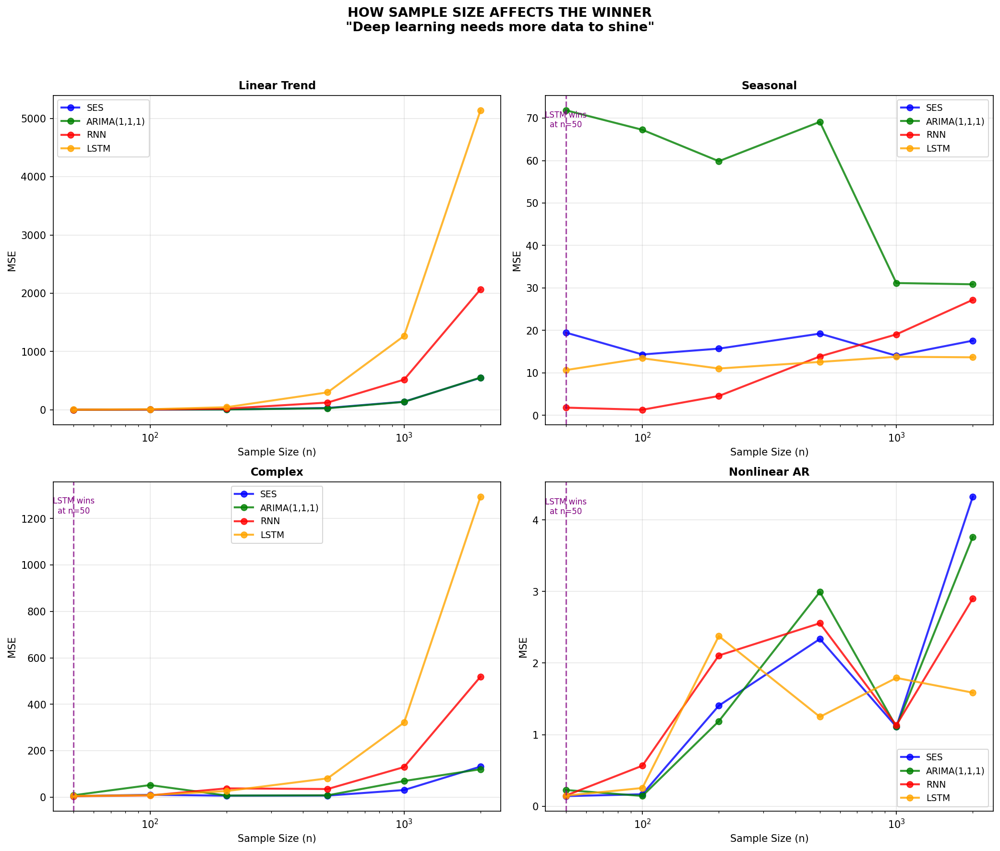

**The crossover point is typically around n=1000!**

### When to Use What

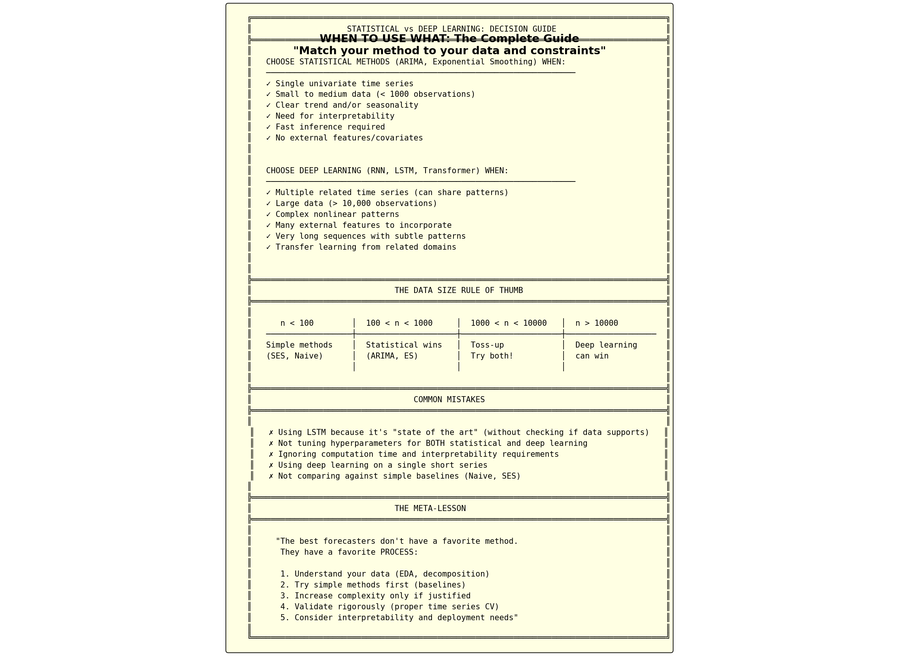

| Choose Statistical When | Choose Deep Learning When |
|------------------------|---------------------------|
| Single univariate series | Multiple related series |
| n < 1000 | n > 10,000 |
| Clear trend/seasonality | Complex nonlinear patterns |
| Need interpretability | Many external features |
| Fast inference required | Transfer learning scenarios |

### An Honest Benchmark

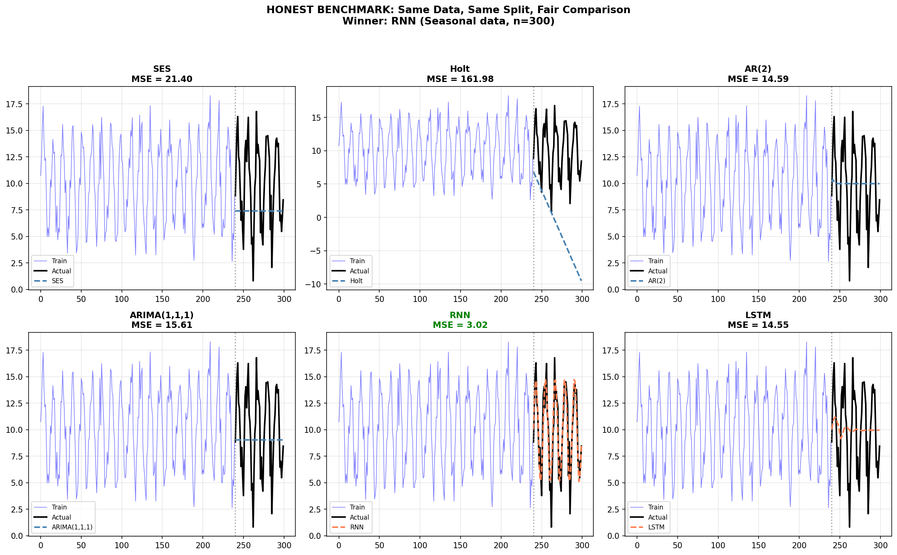

---

## 7. Quick Reference

### Method Selection Flowchart

```
START
  │
  ├─ Is there a TREND?
  │   ├─ YES → Is there SEASONALITY?
  │   │         ├─ YES → Holt-Winters or SARIMA
  │   │         └─ NO  → Holt or ARIMA(p,d>0,q)
  │   │
  │   └─ NO  → Is there SEASONALITY?
  │            ├─ YES → Seasonal Naive or SARIMA
  │            └─ NO  → SES or ARIMA(p,0,q)
  │
  └─ Is it very NOISY?
      └─ YES → Use simpler methods! Complex models overfit.
```

### Key Equations

| Method | Update Rule |
|--------|-------------|
| SES | ŷ_{t+1} = αy_t + (1-α)ŷ_t |
| AR(1) | y_t = φy_{t-1} + ε_t |
| MA(1) | y_t = ε_t + θε_{t-1} |
| ARIMA | Combines AR + Differencing + MA |

### Rules of Thumb

1. **Always start with simple baselines** (Naive, Mean)
2. **Check stationarity first** — most methods assume it
3. **Use ACF/PACF** to identify model orders
4. **Simpler is often better** when data is noisy
5. **Cross-validate** on YOUR data — don't trust general benchmarks
6. **Uncertainty grows** with forecast horizon — always!

---

## Files in This Module

| File | Topic | Key Visualizations |
|------|-------|-------------------|
| `01_time_series_fundamentals.py` | Decomposition, Stationarity | anatomy, stationarity, differencing |
| `02_autocorrelation.py` | Memory, ACF/PACF | memory problem, patterns, seasonal |
| `03_exponential_smoothing.py` | Forgetting Curve | weight decay, method comparison |
| `04_arima.py` | AR, I, MA | intuition, components, uncertainty |
| `05_forecasting_showdown.py` | Method Comparison | scenarios, failures, decision tree |
| `06_statistical_vs_deep_learning.py` | DL vs Traditional | comparison, sample size, guide |

---

## The Meta-Lesson

> **The best forecaster isn't the one who knows the fanciest method.**
> **It's the one who knows WHEN to use each method.**

Every method has its place:
- Simple methods for simple patterns
- Complex methods for complex patterns
- But complexity must be justified by the data!

**The process matters more than the method:**
1. Understand your data (EDA, decomposition)
2. Try simple methods first (baselines)
3. Increase complexity only if justified
4. Validate rigorously (proper time series CV)
5. Consider interpretability and deployment needs

---

*This module is part of the ML Algorithms repository — intuition-first implementations of machine learning algorithms.*
